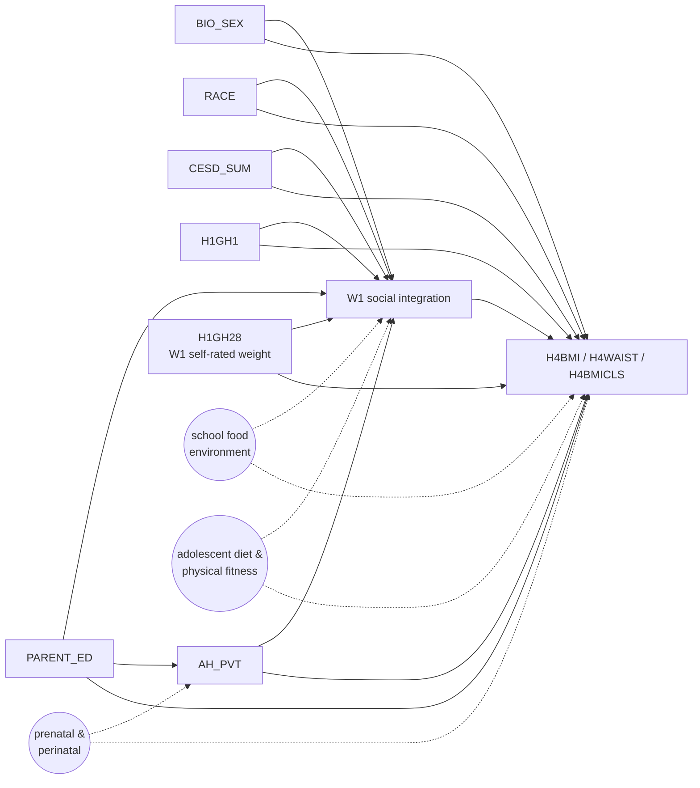

# DAG-CardioMet — W1 social integration → W4 cardiometabolic outcomes

**Used by:** [cardiometabolic-handoff](README.md) (`IDGX2 → H4WAIST`, `IDGX2 → H4BMI`, `IDGX2 → H4BMICLS`); cardiometabolic outcomes column of [multi-outcome-screening](../multi-outcome-screening/README.md). **Status:** planned (Task 16 formal estimation); to be locked in a working session before estimation runs.

## Distinguishing arrows from `DAG-Cog v1.0`

The base structure is the same as [`DAG-Cog v1.0`](../cognitive-screening/dag.md), with three cardiometabolic-specific changes:

1. **AHPVT becomes a general-ability confounder, not a baseline-cognition adjustment.** The outcome is BMI/waist/BMI-class, not cognition — so AHPVT is no longer "baseline" but rather a measured proxy for general childhood ability that may confound both peer position and adult metabolic health.
2. **Add `H1GH28` (W1 self-reported body weight) to L1.** A weight precursor likely confounds both adolescent peer position (peer status correlates with body composition) and adult BMI. Codebook label needs verification — see [TODO §A — outstanding uncertainty 7](../../TODO.md).
3. **Add unmeasured `SCHOOL FOOD ENVIRONMENT`** as a dashed arrow into both `SOC` and `Y`. School-level food access plausibly confounds both peer-network position (cafeteria as a social setting) and BMI accumulation.

## Diagram

## Adjustment set

`{BIO_SEX, RACE, PARENT_ED, CESD_SUM, H1GH1, AH_PVT, H1GH28}` = L0 + L1 (extended) + AHPVT.

For `H4BMICLS` (ordinal 1–6), use **ordered logit** rather than linear — see [methods.md §3 Ordered logit and interval regression](../../reference/methods.md#ordered-logit-and-interval-regression).

For `H4SBP` / `H4DBP`, additionally bring `H4TO*` anti-hypertensive medication flags into L1 — see [TODO §A9](../../TODO.md).

## Estimand wording (use verbatim in reports)

> Among Add Health respondents in saturated schools, conditional on demographics, parental education, W1 affective/somatic state, baseline general ability (AHPVT), and W1 self-reported body weight, a one-unit increase in `IDGX2` is associated with a β-unit change in adult `H4BMI` / `H4WAIST` / odds-class for `H4BMICLS`. The estimand is an ATE within saturated schools (no extrapolation outside that subpopulation).

## E-value sensitivity

Per [TODO §A7](../../TODO.md), each handoff pair reports an E-value column quantifying the minimum unmeasured-confounder strength that would explain the result away. Computed via `scripts/analysis/sensitivity.py:evalue` once that module is implemented.

## Index entry (in `reference/dag_library.md`)

> **DAG-CardioMet** *(planned)* — W1 social integration → W4 cardiometabolic outcomes (`H4BMI`, `H4WAIST`, `H4BMICLS`, `H4SBP`, `H4DBP`). Adjustment: L0+L1(extended)+AHPVT including `H1GH28`. Used by `cardiometabolic-handoff` and the cardiometabolic columns of `multi-outcome-screening`. → [`experiments/cardiometabolic-handoff/dag.md`](../../experiments/cardiometabolic-handoff/dag.md)

## Changelog
- **2026-04-27** — Migrated stub from `reference/dag_library.md` and elaborated. Diagram drafted; locking session pending.
