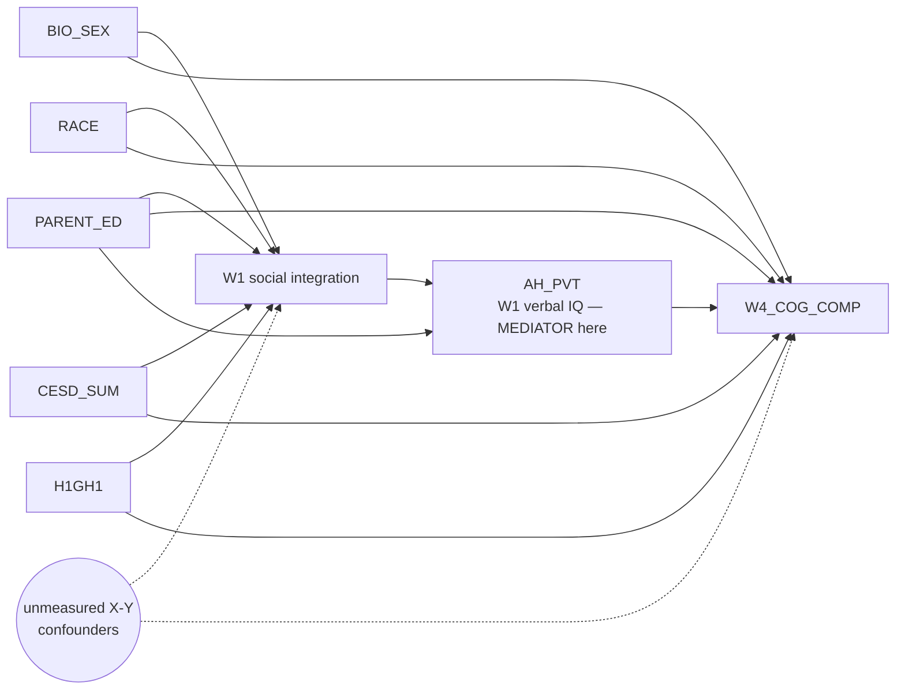

# DAG-Cog-FrontDoor — Front-door decomposition for the AHPVT mediator path

**Used by:** [cognitive-frontdoor](README.md). **Status:** planned (Task 16 sensitivity check, not primary identification).

## Purpose

The `DAG-Cog v1.0` (in [`../cognitive-screening/dag.md`](../cognitive-screening/dag.md)) treats `AH_PVT` as the W1 baseline cognitive measure and adjusts for it, producing a **trajectory-adjusted** β. This is the project's primary identification.

The front-door variant assumes the *strict mediator reading*: that adolescent social integration causally moves verbal IQ measurably (`SOC → AHPVT → W4_COG_COMP`), with no direct `SOC → W4_COG_COMP` arrow. Under that reading, the trajectory adjustment **blocks** the very effect we want to measure. The front-door criterion identifies the X → Y effect through a fully mediating M when back-door adjustment fails.

This DAG is a **sensitivity bound** quantifying how much the trajectory β would shift under that mediator interpretation — not a load-bearing alternative model.

## Diagram

## Front-door identification (3-step formula)

Per Pearl (2009) §3.3.2, with M = `AH_PVT`:

1. **M | X model**: regress `AH_PVT` on `SOC` adjusting for `{BIO_SEX, RACE, PARENT_ED, CESD_SUM, H1GH1}` (everything except AHPVT itself).
2. **Y | M, X model**: regress `W4_COG_COMP` on `AH_PVT` and `SOC`, adjusting for the same back-door set.
3. **Combine via mediator formula**:

   E[Y | do(SOC = x)] = Σ_m P(M = m | SOC = x) · Σ_{x'} E[Y | M = m, SOC = x'] · P(SOC = x')

For continuous M, this becomes an integral; in practice we use a parametric specification or g-computation.

## Required structural conditions

- **(i) Full mediation** — no direct `SOC → Y` arrow. **In this dataset this is implausible.** Many channels of social integration → cognition are non-IQ-mediated (stress, sleep, brain plasticity). The front-door is reported as a sensitivity bound *under the strict reading*, not a faithful causal model.
- **(ii) No `SOC → M` confounding** — covered by adjusting for `{BIO_SEX, RACE, PARENT_ED, CESD_SUM, H1GH1}` in step 1.
- **(iii) No `M → Y` confounding** — would need any unmeasured factor that affects both AHPVT and W4 cognition to be absorbed. Implausible-but-not-impossible.

## Estimand wording (use verbatim in reports)

> Under the strict-mediator reading of `AH_PVT` (in which adolescent social integration causally moves verbal IQ, which then drives W4 cognition with no direct integration → cognition path), the front-door point estimate is the indirect effect of W1 social integration on W4 cognition operating through W1 verbal IQ. Reported as a **bound** on how much the `DAG-Cog v1.0` trajectory β would shift if this reading were correct.

## Outputs

A small "shift table" comparing trajectory β (from `DAG-Cog v1.0`) to front-door β (this DAG), per shortlisted exposure. If the bound is small (β shifts < 20%), the trajectory framing dominates; if large (> 50%), both estimates should be reported with explicit caveats.

## Index entry (in `reference/dag_library.md`)

> **DAG-Cog-FrontDoor** — Front-door decomposition treating `AH_PVT` as a mediator of `SOC → cognition`. Sensitivity bound on the `DAG-Cog v1.0` trajectory β. Used by `cognitive-frontdoor`. → [`experiments/cognitive-frontdoor/dag.md`](../../experiments/cognitive-frontdoor/dag.md)

## Changelog
- **2026-04-27** — Migrated from `reference/dag_library.md` stub. Reframed as sensitivity check per the 2026-04-25 trajectory-framing decision in the research journal.
