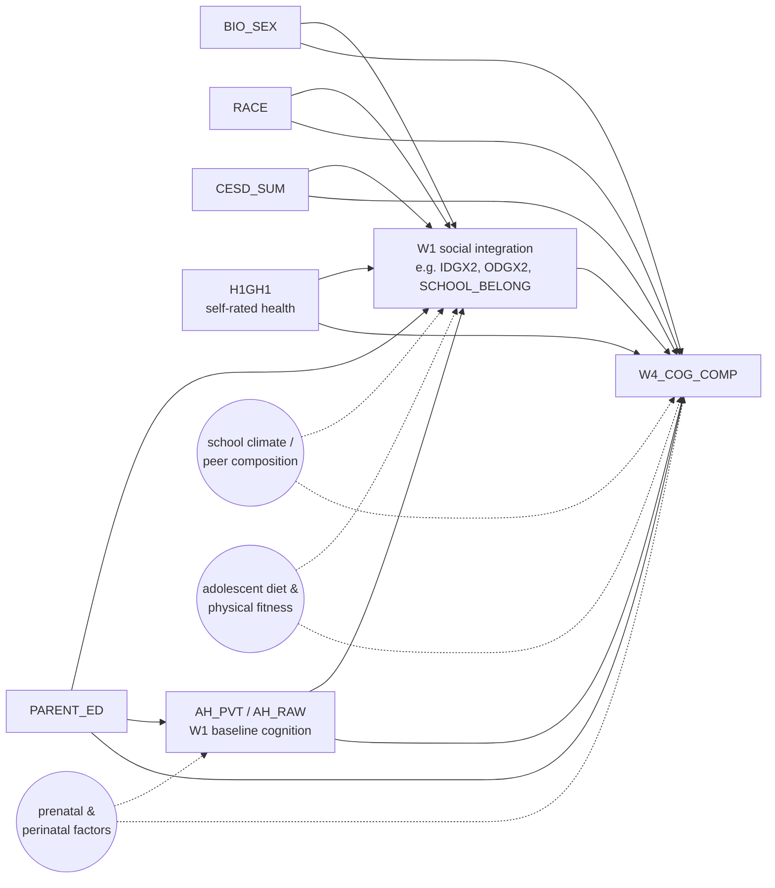

# DAG-Cog v1.0 — W1 social integration → W4 cognitive outcome

**Used by:** [cognitive-screening](README.md) (24 exposures × `W4_COG_COMP`); the cognitive-outcome column of [multi-outcome-screening](../multi-outcome-screening/README.md). **Date locked:** 2026-04-25.

**Adjustment set (sufficient under back-door criterion):** `{BIO_SEX, RACE, PARENT_ED, CESD_SUM, H1GH1, AH_PVT}` = L0 + L1 + AHPVT. Conditioning on this set closes every back-door path from `SOC` to `Y` *that runs through measured variables*; the dashed arrows from `SCHOOL`, `PRENATAL`, `DIET` are the explicit unmeasured-confounder set whose absence is assumed.

**Adjustment-set tiers used in the screen:**

| Tier | Variables | Identification role |
|---|---|---|
| L0 | `BIO_SEX`, `RACE`, `PARENT_ED` | Demographics; minimum acceptable |
| L0+L1 | + `CESD_SUM`, `H1GH1` | Blocks W1 affective / somatic state |
| L0+L1+AHPVT | + `AH_PVT` (or `AH_RAW`) | **Primary spec.** Trajectory-adjusted estimand for cognitive outcomes |
| L_partner *(placeholder)* | `BIO_SEX`, `H1GI1M` | Mirrors partner's `dataset_eda.ipynb` Cell 21 (as of 2026-04-27). Used for direct comparability with partner's parallel pipeline. **Subject to update once partner pushes refined covariate list** — see [TODO §A23](../../TODO.md). |

**Why each measured covariate is in the set:**

| Variable | Closes which back-door |
|---|---|
| `BIO_SEX`, `RACE` | Demographic → both adolescent peer position AND adult cognition |
| `PARENT_ED` | Family SES → both adolescent social integration AND adult cognition; also feeds AHPVT (parental education raises childhood verbal exposure) |
| `CESD_SUM`, `H1GH1` | W1 affective and somatic state confounds peer position AND cognitive trajectory |
| `AH_PVT` | **Baseline cognition.** Conditioning on it converts the regression into an approximate change-from-baseline estimand. See the [trajectory caveats in methods.md §1](../../reference/methods.md#1-identification-assumptions-and-target-estimand). |

**Estimand wording (use verbatim in reports):**

> Among Add Health respondents in saturated schools (for network-derived exposures) or the full W1 in-home cohort (for non-network exposures), conditional on baseline W1 verbal IQ, demographics, and W1 affective/somatic state, a one-unit increase in *X* is associated with a β-unit change in W4 cognition relative to its baseline-predicted level.

**Known weak points (load-bearing assumptions):**

- Construct mismatch: AHPVT is *vocabulary*, `W4_COG_COMP` is fluid memory + working memory. Trajectory-β is "trajectory under a vocabulary-anchored baseline."
- Unmeasured `SCHOOL`: school climate / peer composition could confound network position AND cognitive outcomes. Sensitivity tested via the [saturation-balance](../saturation-balance/) experiment.
- Unmeasured `PRENATAL` and `DIET`: feed both the AHPVT baseline and adult cognition; partly absorbed by AHPVT itself. Cannot be cleanly separated in public-use data.
- The cleaner [negative-control-battery](../negative-control-battery/) is the planned test of the unmeasured-confounder assumption. The current `HEIGHT_IN` D2 is contaminated and not load-bearing.

**Variants:**

- `DAG-Cog-FrontDoor` — see [cognitive-frontdoor/dag.md](../cognitive-frontdoor/dag.md). Adds the strict-mediator-of-AHPVT alternative (`SOC → AHPVT → Y` direct), used to *quantify the trajectory caveat* via a front-door decomposition. **Sensitivity check, not primary.**
- `DAG-Cog-Saturated` — same DAG, restricted population to within-saturated-schools; used to make the within-saturated estimand explicit in plots. Quantified by [saturation-balance](../saturation-balance/dag.md).

**Index entry (in `reference/dag_library.md`):**

> **DAG-Cog v1.0** — W1 social integration → W4 cognitive outcome. Adjustment: L0+L1+AHPVT (=`{BIO_SEX, RACE, PARENT_ED, CESD_SUM, H1GH1, AH_PVT}`); trajectory-adjusted estimand. Used by `cognitive-screening` and the cognitive-outcome column of `multi-outcome-screening`. → [`experiments/cognitive-screening/dag.md`](../../experiments/cognitive-screening/dag.md)

## Changelog
- **2026-04-27** — Migrated from `reference/dag_library.md` per the per-experiment-DAG convention. Added `L_partner` tier (placeholder = `{BIO_SEX, H1GI1M}`) for partner-comparable analysis. Cross-references updated.
- **2026-04-25** — DAG drafted with the user; v1.0 locked.
