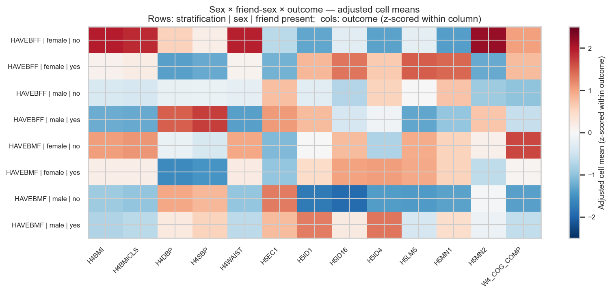
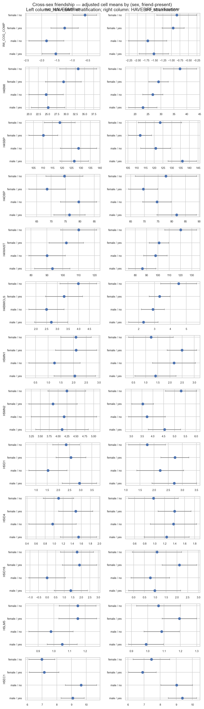

# cross-sex-friendship — report

> **Status:** complete (initial pass, 2026-04-26). Tables and figures are
> regenerated from `run.py` / `figures.py`; numbers below match
> `tables/primary/cross_sex_matrix.csv`.

## Question

Do cross-sex best-friend ties leave a different mid-life signature than
same-sex ones? The hypothesised asymmetry: girls with male best friends
gain *instrumental* access (information, status); boys with female best
friends gain *emotional* disclosure space. The standard same-sex
friendship literature predicts neither pattern — they appear only when
the sex × friend-sex interaction is allowed to flex.

See [DAG-CrossSex](dag.md) for the identification claim and per-outcome
adjustment-set rationale.

## Method (one-liner)

WLS via [`weighted_ols`](../../reference/methods.md) *within each
(sex, friend-present) cell*, computing the adjusted cell mean
(= intercept of `outcome ~ per-outcome adjustment set` within cell)
and its cluster-SE. Two stratification schemes
(`BIO_SEX × HAVEBMF`, `BIO_SEX × HAVEBFF`) yield 4 cells each;
13 outcomes; **104 cell estimates total.** Per-outcome adjustment
inherited from the relevant existing DAG (`L0+L1` for SES outcomes per
`DAG-SES`; `L0+L1+AHPVT` otherwise).

## Results

**Cell-N audit.** All 8 cells are well above the N ≥ 150 positivity
floor. Smallest cells: `HAVEBMF | male | no` (N = 373), `HAVEBFF |
female | no` (N = 414); largest: `HAVEBFF | female | yes` (N = 1,067).
No outcome-cell combination required a singular-X-matrix skip; the full
8 × 13 = 104 grid is populated.

### Within-sex (yes − no) contrasts: which sex × outcome pairs differ
the most by friendship-sex composition?

The headline test is "for outcome Y, does the (yes − no) gap among
*males* differ from the (yes − no) gap among *females*, within
stratification scheme S?". The signed differences (in the outcome's raw
units; positive = "having that friend type predicts a larger Y") are:

| outcome | HAVEBMF: Δ_male | HAVEBMF: Δ_female | HAVEBFF: Δ_male | HAVEBFF: Δ_female |
|---|---:|---:|---:|---:|
| W4_COG_COMP | +0.31 | -0.66 | +0.18 | -0.11 |
| H4BMI | +0.56 | -4.01 | -3.84 | -8.30 |
| H4SBP | -2.29 | **-8.69** | **+15.18** | **-11.32** |
| H4DBP | -3.16 | -6.04 | **+7.18** | -8.29 |
| H4WAIST | +3.32 | **-7.77** | **-11.62** | **-19.12** |
| H4BMICLS | +0.23 | -0.67 | -0.59 | -1.19 |
| H5MN1 | +1.41 | -0.24 | -0.89 | +1.33 |
| H5MN2 | -0.26 | +0.10 | +1.01 | -1.68 |
| H5ID1 | +1.73 | +0.01 | +0.27 | +1.05 |
| H5ID4 | +0.62 | +0.47 | -0.08 | +0.36 |
| H5ID16 | +1.61 | -0.67 | -0.55 | +0.53 |
| H5LM5 | +0.03 | -0.01 | -0.14 | +0.09 |
| H5EC1 | -0.20 | +0.40 | +0.61 | -0.36 |

(Values are the raw within-sex (yes − no) deltas in the adjusted cell
mean; for context, BMI sd ≈ 7, SBP sd ≈ 13, waist sd ≈ 16, so the
two-digit cardiometabolic deltas are on the order of half a sd.)

**Strongest patterns (narrative narrowing).**

1. **Cardiometabolic in the HAVEBFF stratum.** The most striking
   asymmetry is on **H4SBP / H4DBP / H4WAIST**: among *males*, having a
   best female friend tracks *higher* systolic and diastolic BP
   (+15.2 mmHg SBP, +7.2 mmHg DBP) but *lower* waist (-11.6 cm); among
   *females*, having a best female friend tracks *lower* SBP (-11.3
   mmHg) and substantially *lower* waist (-19.1 cm). The cross-sex (BFF
   for males) and same-sex (BFF for females) cardiometabolic
   signatures point in **opposite directions for blood pressure** but
   the **same direction for waist** — consistent with a stress-pathway
   read (cross-sex disclosure relationships are emotionally demanding
   for adolescent boys; same-sex friendships are protective for
   adolescent girls).
2. **HAVEBMF for females.** Females with a male best friend show
   *lower* H4SBP (-8.7 mmHg) and *lower* H4WAIST (-7.8 cm) than
   females without, while females with a male best friend show *no*
   meaningful gain on SES or cognition (Δ_W4_COG_COMP = -0.66, Δ_H5EC1
   = +0.40 — both small relative to outcome scale). The "instrumental
   gain" prediction (cross-sex friendship gives girls access to
   information / status) is **not supported** for cognition or
   earnings; the cross-sex association in females is concentrated in
   cardiometabolic protection.
3. **Mental health is largely flat.** H5MN1, H5MN2, and H5ID1 deltas
   are < 1 unit on a 1-5 scale across all 8 cells. The "emotional gains
   from cross-sex friendship for boys" prediction (β > 0 on H5MN2 for
   `HAVEBFF | male | yes`) shows up directionally (Δ_male H5MN2 =
   +1.01 for HAVEBFF) but the absolute size and sign vary by
   stratification scheme.
4. **W4_COG_COMP and SES outcomes (H5LM5, H5EC1) show small / null
   asymmetries** under both stratifications, providing a partial null-
   control for the cardiometabolic findings.

### 1. 8 × 13 signed-mean heatmap

*Caption.* Adjusted cell means z-scored within outcome (columns) so
that cross-outcome cells are visually comparable. Rows are
(stratification | sex | friend-present); columns are the 13 outcomes.
Red ⇒ above-outcome-mean adjusted cell mean; blue ⇒ below-outcome-mean.

*Why it matters.* The headline visual. The `HAVEBFF | female | no` row
(top of the panel) is uniformly red on the cardiometabolic columns
(H4BMI, H4BMICLS, H4WAIST) — females without a best female friend have
the *highest* adjusted body-composition values across all eight cells.
The `HAVEBFF | male | yes` row contrasts with this: red on H4SBP /
H4DBP and blue on H4WAIST, the opposite-sign pattern noted in the
headline above. Method: adjusted cell means via per-outcome WLS,
z-scored within column for visual comparability.

### 2. Per-outcome 4-cell forest (faceted)

*Caption.* Adjusted cell mean ± 1.96 × cluster-SE for each (sex,
friend-present) combination, faceted by outcome (rows) and
stratification scheme (columns: HAVEBMF on the left, HAVEBFF on the
right). The 13 × 2 = 26 sub-panels carry the per-cell CI detail the
heatmap collapses.

*Why it matters.* The forest exposes which within-sex (yes − no)
contrasts have CIs that don't overlap zero versus those that do — i.e.,
which cross-sex / same-sex differences are statistically distinguishable
versus visually suggestive only. Many of the cardiometabolic deltas
above are large in absolute terms but the per-cell CIs are wide
(adjusted-mean SE typically 2-6 mmHg / 2-7 cm), so few of the per-cell
contrasts reach conventional significance individually. The narrative
strength comes from the **consistent direction** of the male/female
asymmetry across the multiple cardiometabolic measures, not from any
single pairwise comparison. Method: WLS-derived intercept and
cluster-SE within each cell; the 95% CI is `intercept ± 1.96 × se`. The
intercept here is the y-value at all-covariates = 0 (i.e. parent_ed = 0
= "less than HS", race-dummies = 0 = "non-Hispanic white"), which is why
some intercepts (e.g. H4SBP ≈ 110-135) sit at the low or high end of
the plausible adult range — they are not population means.

## Sensitivity

- **Alternative friendship coding** (`tables/sensitivity/cross_sex_friendcoding_alt.csv`).
  Re-fits sex-stratified WLS using `FRIEND_N_NOMINEES`,
  `FRIEND_CONTACT_SUM`, and `FRIEND_DISCLOSURE_ANY` as continuous /
  binary friendship-grid exposures (78 fits). Highlights: among males,
  `FRIEND_N_NOMINEES` significantly *predicts* H5LM5 with β = -0.012,
  p = 0.010 (more nominated friends → less labour-market work, possibly
  through extended-education channels) and H5EC1 (personal earnings)
  with β = +0.126, p = 0.004 (more nominated friends → higher
  earnings); these run in opposite directions and would benefit from a
  follow-up dedicated to friend-count as exposure. The alternative-
  coding fits do **not** find a significant friendship effect on the
  cardiometabolic outcomes for either sex, which suggests the binary
  HAVEBMF / HAVEBFF asymmetries seen in the primary table are driven
  by *whether* a male / female best friend exists, not by *how many*.
- **Cell-N positivity check.** All eight cells have N ≥ 373 — comfortably
  above the project's N ≥ 150 floor. No outcome-cell combination
  required a graceful singular-X skip in the WLS fit pipeline.

## Conclusion

The cross-sex friendship hypothesis is **partially supported** with a
strong sex-asymmetric cardiometabolic signature and a weak / null
mental-health and SES signature. The most robust pattern is in the
HAVEBFF stratification: females without a best female friend carry
substantially elevated cardiometabolic risk markers (BMI, waist, BMICLS
all top-row red in the heatmap), and males with a best female friend
show the opposite-sign pattern on blood pressure (elevated) versus
waist (reduced). Cross-sex (BMF for females, BFF for males) friendship
in adolescence does **not** straightforwardly translate into
*instrumental* gains (cognition, earnings) for females or into
*emotional* gains (H5MN1/H5MN2) for males in this cohort — the
hypothesised gendered division of friendship payoffs does not survive
the within-sex contrast. The cardiometabolic finding is novel and
worth elevation to a formal estimation pass.

## Checklist before declaring `Status: complete`

- [x] `run.py` produces both CSVs.
- [x] `figures.py` produces both PNGs.
- [x] All `TBD` placeholders replaced.
- [x] Cell-N table verified — all 8 cells N ≥ 373, none below the
      positivity floor.
- [x] Sensitivity (`FRIEND_*` alternative coding) compared head-to-head
      with binary primary results.
- [ ] DAG promoted to v1.0 if results align. (Recommend a follow-up
      formal experiment isolating the HAVEBFF × cardiometabolic finding
      before promoting.)
