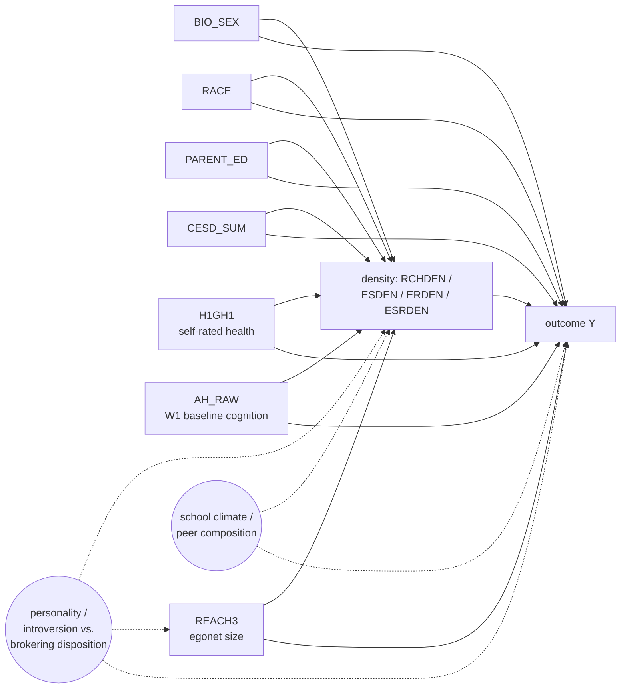

# DAG-EgoNet v0.1 — ego-network density at constant size → mental-health vs. SES

**Used by:** [ego-network-density](README.md). **Status:** planned (v0.1, 2026-04-26).

## Theoretical frame: Burt's structural holes

Burt's structural-holes theory (1992) predicts an **opposing-sign** signature
across outcome domains:

- **High density (closed triads, redundant ties)** → mental-health *protection* via close-tie social support and reciprocated trust.
- **Low density (open triads, brokerage)** → SES *advantage* via non-redundant information access, weak-tie diffusion of labor-market signals, and information arbitrage.

The methodological pitfall: ego-network density and ego-network size (`REACH3`) are mechanically anti-correlated under most network-generating processes (more nodes → more possible ties → harder to maintain density). A naive density β confounds "density" with "smaller network." Conditioning on `REACH3` is the load-bearing identification move that recovers "density at constant network size" — the only causally-coherent reading of the structural-holes hypothesis.

## DAG (per outcome — generic schematic)

**Why `REACH3` must be in every adjustment set:** the `SIZE → DEN` and `SIZE → Y` arrows together create a measured confounding path. Without conditioning on `REACH3`, β̂_density mixes "true density effect" with "smaller-network effect." The conditioning preserves the structural-holes-theoretic estimand. **Without `REACH3`, β̂ is structurally meaningless under this DAG.**

## Per-outcome DAG inheritance

| Outcome group | Outcomes | Source DAG | Adjustment set (always + `REACH3`) |
|---|---|---|---|
| Cognitive | `W4_COG_COMP` | [`DAG-Cog v1.0`](../cognitive-screening/dag.md) | L0 + L1 + AHPVT + `REACH3` |
| Mental health | `H5MN1`, `H5MN2`, `H5ID16` | `DAG-Mental` *(planned)* / `DAG-Functional` *(planned)* | L0 + L1 + `REACH3` |
| SES | `H5LM5`, `H5EC1` | `DAG-SES` *(planned, see [ses-handoff/dag.md](../ses-handoff/dag.md))* | L0 + L1 + `REACH3` (**no AHPVT** — mediator under `DAG-SES`) |

## Estimand wording (use verbatim in reports)

> Among Add Health respondents in saturated schools, conditional on each outcome's per-DAG adjustment set **and on `REACH3` (egonet size)**, a one-unit increase in ego-network density measure *X* is associated with a β-unit change in outcome *Y*. The conditioning on `REACH3` makes the estimand "density at constant network size"; β estimates without `REACH3` conditioning are structural-holes-incompatible (they confound density with network-size effects).

## Why we fit each density measure in a SEPARATE regression

The four density measures (`RCHDEN`, `ESDEN`, `ERDEN`, `ESRDEN`) overlap in their numerator/denominator construction. They are highly collinear by design. A joint fit yields uninterpretable residualised coefficients (each β̂ would estimate "this density measure above and beyond the others," but "the others" includes its own components). The marginal-effect interpretation is the construct-faithful estimand; report all four side by side in the heatmap.

## Known weak points (load-bearing assumptions)

- **Personality / brokering disposition is unmeasured.** It plausibly drives both density (introverts have denser, smaller networks; brokers have sparser, larger networks) and outcomes. Bias direction is theory-aligned (introversion → high density → mental-health protection is partially mediated by personality, not just structural). Acknowledge in report.
- **The four density measures are construct-overlapping.** `RCHDEN` is computed over the reach set; `ESDEN`/`ERDEN`/`ESRDEN` over directed-tie sets. Cross-exposure consistency (do all four show the same sign?) is the primary robustness diagnostic.
- **No-`REACH3` parallel is REQUIRED in the sensitivity output**, not optional. Showing the size-confound bias quantitatively is what makes the size-conditioning estimand defensible.

## Variants

- `DAG-EgoNet-NoSize` *(NOT used as primary)* — adjustment set excludes `REACH3`. Reported only as the "structural-confounded" sensitivity row to make the size-confound visible. Not a defensible primary spec.

## Index entry (for `reference/dag_library.md`)

> **DAG-EgoNet v0.1** — Four W1 ego-network density measures (`RCHDEN`, `ESDEN`, `ERDEN`, `ESRDEN`) → mental-health + SES + cognitive outcomes. **`REACH3` (egonet size) is in every adjustment set**; estimand is "density at constant network size" per Burt's structural-holes theory. → [`experiments/ego-network-density/dag.md`](../../experiments/ego-network-density/dag.md)

## Changelog
- **2026-04-26** — Created. v0.1 drafted from user's "Priority 1 — Type-of-tie" plan; size-conditioning estimand locked as the primary.
