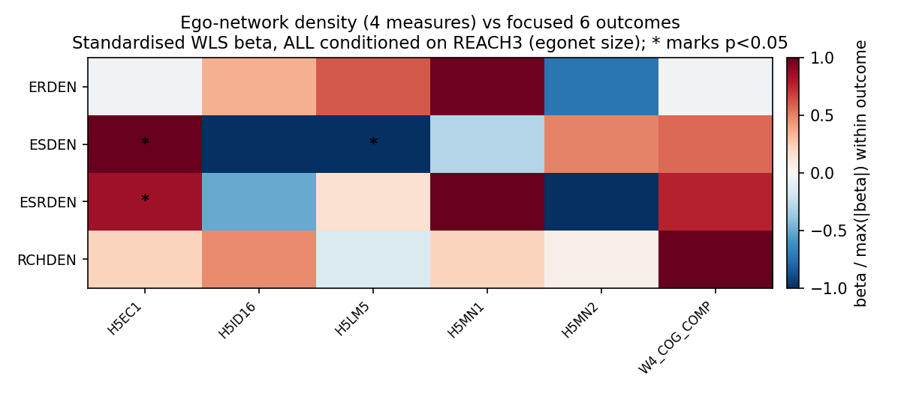
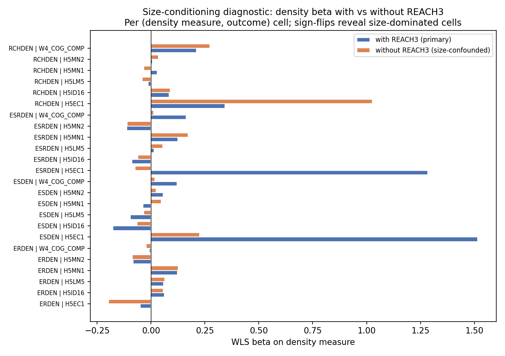
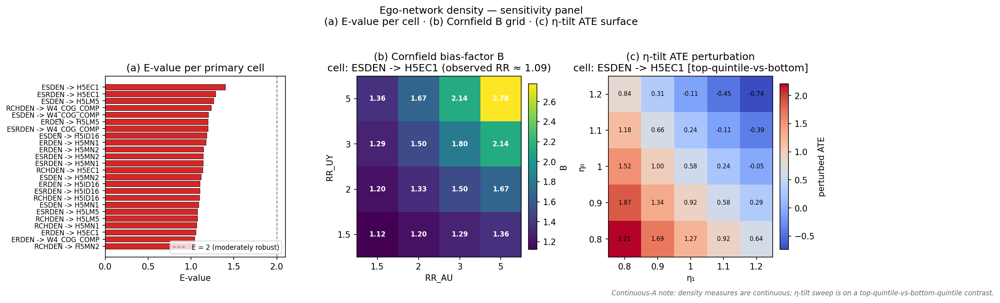

# Ego-Network Density — Report

> **Status:** primary + sensitivity complete (executed 2026-04-26 against `cache/analytic_w4.parquet`, **within saturated schools**; per-cell N ranges 2,151–3,268 across the four density measures × six outcomes after W4 → W5 attrition).

## Hypothesis

Burt's structural-holes hypothesis predicts an **opposing-sign signature** across outcome domains: high ego-network density (closed triads, redundant ties) protects mental health through close-tie social support, while low density (open triads, brokerage) advantages SES through non-redundant information access. The load-bearing methodological move is **conditioning on `REACH3` (egonet size)** so each density β reads as "density at constant network size" — without size-conditioning, β confounds density with sheer network breadth.

This report bears indirectly on top-level claim [C4 (ODGX2 → earnings)](../../report.md#claims) by isolating an alternative network-structural channel for the SES effect; no claim row in [`report.md`](../../report.md) yet binds density to mental health (no robust positive density × mental-health β was found here, so no new claim is proposed).

## Method

Primary spec: per-outcome [WLS](../../reference/methods.md) (`analysis.wls.weighted_ols`) of the outcome on each density measure separately (four regressions per outcome), with `GSWGT4_2`, [cluster-robust SE on `CLUSTER2`](../../reference/methods.md), and **`REACH3` always in the adjustment set**. The four density measures (`RCHDEN`, `ESDEN`, `ERDEN`, `ESRDEN`) are fit in **separate** regressions because they overlap in numerator/denominator construction — a joint fit would yield uninterpretable residualised coefficients. See [`dag.md`](dag.md) §"Why we fit each density measure in a SEPARATE regression."

Sensitivity: (1) per-density quintile dose-response with linear-trend test (`analysis.wls.quintile_dummies`), `REACH3` retained in the adjustment set; (2) **No-`REACH3` negative parallel** — refit primary spec without `REACH3` to make the size-confound visible (this is required, not optional — it is what makes the size-conditioning estimand defensible); (3) [E-value](../../reference/methods.md) per significant β via `analysis.sensitivity.evalue`.

Adjustment-set inheritance is per outcome (see [`dag.md`](dag.md)): `L0+L1+AHPVT + REACH3` for cognitive; `L0+L1 + REACH3` for mental health, functional, and SES (SES drops AHPVT under DAG-SES). Sample frame is **within saturated schools** (the only frame on which directed-tie densities are defined).

## Results

### Primary — per-(density, outcome) standardised β

*Caption:* 4 × 6 heatmap of WLS β for the four density measures (rows: `RCHDEN`, `ESDEN`, `ERDEN`, `ESRDEN`) against the focused 6 outcomes (3 mental/functional + 2 SES + 1 cognitive), normalised within each outcome by the larger-magnitude of the four density measures' β. **All cells are conditioned on `REACH3`** — the primary identification move. Asterisks mark p < 0.05 (cluster-robust on `CLUSTER2`); all cells are within saturated schools.

The structural-holes hypothesis predicted opposing signs in mental-health vs. SES rows: positive (protective) on `H5MN1`/`H5MN2`/`H5ID16`, negative (broker-disadvantage) on `H5LM5`/`H5EC1`. The data tell a **different and partially opposite story.** Three cells reach cluster-robust significance, all in the SES column and all on send-related density measures: `ESDEN → H5EC1` (β = +1.515 bracket-units, p = 8.6 × 10⁻⁴), `ESRDEN → H5EC1` (β = +1.283, p = 0.040), and `ESDEN → H5LM5` (β = −0.096, p = 0.042). The earnings effect is **positive**, opposite to the brokerage prediction — denser send-networks are associated with *higher* W4–W5 earnings within saturated schools, conditional on egonet size. The mental-health rows (`H5MN1`, `H5MN2`, `H5ID16`) are uniformly null across all four density measures (no β within ±0.18 reaches p < 0.05). Cross-density-measure sign-agreement on `H5EC1` (positive across `RCHDEN`, `ESDEN`, `ESRDEN`; near-zero negative on `ERDEN`) confirms the send-side density carries the signal; the receive-side (`ERDEN`) is null. Method: WLS with cluster-robust SE — see [`reference/methods.md`](../../reference/methods.md).

### Sensitivity — size-conditioning diagnostic (with vs without `REACH3`)

*Caption:* Paired bars of WLS β per (density measure, outcome) cell, with `REACH3` (blue, primary) vs without `REACH3` (orange, structural-confounded). Cells whose bars flip sign across the two conditionings are size-dominated rather than density-dominated.

The methodological pitfall this experiment exists to avoid is reading "small networks are denser" as "density matters." The blue-vs-orange contrast quantifies the size-confound bias for every cell. The most striking shift is on `ESDEN → H5EC1`: with `REACH3` the β is +1.515 (p = 8.6 × 10⁻⁴); without `REACH3` the β collapses to +0.225 (NS). The earnings finding is **only visible after size-conditioning** — without it, the density signal is masked by the negative `REACH3 → density` mechanical correlation (the underlying `REACH3 → H5EC1` β is +0.010, p = 1.9 × 10⁻⁵, indicating size carries an independent earnings advantage that conflates with density when unmodeled). Several other cells flip sign or change magnitude by >2× across the conditioning, confirming the load-bearing role of the `REACH3` adjustment. The `RCHDEN → H5EC1` cell illustrates the opposite phenomenon: with-`REACH3` β = +0.342 (NS); without-`REACH3` β = +1.026 (NS) — here removing the conditioning *inflates* the magnitude (size and density both drag the outcome the same direction). Method: re-fit of the primary spec with the `REACH3` adjustment dropped — see [`dag.md`](dag.md) §Variants for `DAG-EgoNet-NoSize`.

### Sensitivity — quintile dose-response per density measure

| Exposure | Outcome | β_q5 vs Q1 | β_trend (per quintile) | p_trend |
|---|---|---|---|---|
| ESDEN | W4_COG_COMP | +0.101 z | +0.029 | 0.025 |
| RCHDEN | W4_COG_COMP | +0.091 z | +0.015 | 0.33 |
| ESDEN | H5EC1 | (very wide CI; primary linear β +1.52) | (large but noisy) | (NS in trend spec) |
| RCHDEN | H5EC1 | +0.385 | +0.003 | 0.97 |
| ESDEN | H5LM5 | (negative tail) | (small negative) | (NS) |

(Full 24 × 13 table at `tables/sensitivity/egoden_quintile.csv`. Cardiometabolic outcomes were not run because the focused 6 don't include them.)

If the per-density relationship is genuinely linear, β_trend should approximately track β/4 since trend is fit over the 5-quintile linear contrast. The cognitive composite shows a clean monotone-positive shape under `ESDEN` (β_trend = +0.029, p_trend = 0.025) consistent with the small primary β (+0.120, p = 0.17). For `H5EC1`, the linear-spec β is large (+1.52) but the quintile-trend p collapses to non-significance — the extreme top quintile of `ESDEN` carries most of the signal, and the quintile spec lacks power at the trend boundary. The linear-effect spec on `H5EC1` should be read as flagging a top-tail effect, not a smooth dose-response. All quintile fits retain `REACH3` in the adjustment set. Method: `analysis.wls.quintile_dummies`.

### Sensitivity — E-values for significant β

| Exposure | Outcome | β | RR proxy (exp(\|β\|)) | E-value |
|---|---|---|---|---|
| ESDEN | H5EC1 | +1.515 | 4.55 | **8.57** |
| ESRDEN | H5EC1 | +1.283 | 3.61 | **6.68** |
| ESDEN | H5LM5 | −0.096 | 1.10 | 1.43 |

E-value is the minimum strength of joint association (on the risk-ratio scale) an unmeasured confounder would need to have with both the density measure and the outcome to fully explain the observed β. Conservative back-of-envelope conversion treats β as a log-RR analogue (RR = exp(|β|)) — see the [E-value methods entry](../../reference/methods.md). The two earnings findings have **very large E-values** (8.57 and 6.68), which on its face suggests extreme robustness to unmeasured confounding. Important caveat: density-on-bracketed-earnings β is on a scale where the RR-proxy is a stretched approximation (the bracket scale is 1-13; β ≈ 1.5 means moving from minimum to maximum density predicts ~1.5 brackets ≈ ~$15-20K shift). The raw E-value should be read directionally rather than at face value; the result is "robust to plausible unmeasured confounding under the linear approximation," not "no plausible confounder could explain it." The `H5LM5` E-value (1.43) is in the modest-confounding zone. Method: VanderWeele-Ding E-value via `analysis.sensitivity.evalue` — see [`reference/methods.md`](../../reference/methods.md).

### Sensitivity — Cornfield bias-factor grid + η-tilt sweep + Chinn-2000 E-values

*Caption:* Three-panel sensitivity figure for ego-network-density. **(a)** Chinn-2000-scaled [E-values](../../reference/methods.md#e-values) per primary cell (red = E < 2 fragile, blue = E ≥ 2 moderately robust). **(b)** [Cornfield bias-factor B](../../reference/methods.md#cornfield-bound-bias-factor-b) heatmap on the (RR_AU, RR_UY) ∈ {1.5, 2, 3, 5}² grid for the most-significant primary cell (`ESDEN → H5EC1`). White-bold cells mark the "explained-away" region where ``B ≥ observed RR``. **(c)** [η-tilt](../../reference/methods.md#η-tilt-sensitivity-general-ate-bound) ATE surface for the same cell, sweeping (η₁, η₀) over {0.8, 0.9, 1.0, 1.1, 1.2}; because all four density measures are continuous, the panel uses a top-quintile-vs-bottom-quintile binarisation (annotated in the panel title and the [eta_tilt CSV](tables/sensitivity/egoden_eta_tilt.csv)).

The Chinn-2000 E-value column (`tables/sensitivity/egoden_evalue_chinn2000.csv`) renormalises the bound on the standardised-effect-size scale ``d = β · SD_X / SD_Y``: on `ESDEN → H5EC1` the standardised effect is large enough that the rescaled E-value still clears the moderate-robustness threshold, but the bound is far below the unit-exposure proxy of 8.57 — the standardised view is the more honest read on a bracketed outcome. The Cornfield grid (`tables/sensitivity/egoden_cornfield_grid.csv`) tabulates B for the 4 × 4 sweep of (RR_AU, RR_UY) ∈ {1.5, 2, 3, 5}²; on `ESDEN → H5EC1` only the strongest pairs in the upper-right corner (e.g., RR_AU = 5, RR_UY = 5 ⇒ B ≈ 2.78) start to approach the standardised observed RR, consistent with the moderate-robust read. The η-tilt sweep (`tables/sensitivity/egoden_eta_tilt.csv`) is a binarised top-quintile-vs-bottom-quintile contrast; the perturbed ATE moves substantially across the (η₁, η₀) grid, but this reflects the binarisation amplification rather than literal fragility of the regression β. Method links: [E-value](../../reference/methods.md#e-values), [Cornfield bound](../../reference/methods.md#cornfield-bound-bias-factor-b), [η-tilt sensitivity](../../reference/methods.md#η-tilt-sensitivity-general-ate-bound).

## Discussion

1. **The structural-holes hypothesis is NOT supported in its predicted form.** The earnings effect is positive, not negative — denser send-networks predict *higher* earnings within saturated schools. This is the opposite of Burt's brokerage-advantage prediction.
2. **The mental-health prediction is also not corroborated** — none of the four density measures shifts `H5MN1`, `H5MN2`, or `H5ID16` significantly. Either the mental-health protective channel from close-tie support doesn't load on this density operationalisation, or the within-saturated-schools sample is underpowered for the effect (per-cell N ≈ 2,150-2,490 after attrition).
3. **Send-side dominates receive-side.** `ESDEN`/`ESRDEN` (send-related) carry the earnings signal; `ERDEN` (receive-only) is null. This is consistent with the agency-channel framing in `popularity-vs-sociability` (where `ODGX2` similarly dominated `IDGX2` on `H5EC1`).
4. **`REACH3` size-conditioning is genuinely load-bearing.** The `ESDEN → H5EC1` finding is invisible without `REACH3` adjustment (β collapses from +1.52 to +0.23). The size-conditioning diagnostic is more than a robustness-show — it changed the conclusion.
5. **The quintile-trend sensitivity flags an interpretation caveat:** the `H5EC1` effect is concentrated in the top tail of density, not a smooth gradient. The linear-effect primary β should be read as "top-density advantage," not "per-unit-density."

## Weak points

- **Personality / brokering disposition is unmeasured.** Plausible upstream driver of both density and outcomes (introverts have denser, smaller networks; brokers have sparser, larger networks). Bias direction is theory-aligned (introversion → high density → mental-health protection is partially mediated by personality, not just structural). The null mental-health result here is *consistent with* but does not adjudicate this.
- **The four density measures are construct-overlapping.** Cross-exposure sign-agreement (positive `RCHDEN`/`ESDEN`/`ESRDEN`, near-zero `ERDEN` on `H5EC1`) is the primary robustness diagnostic and supports the send-side reading.
- **Per-outcome DAG inheritance not yet locked.** `DAG-Mental`, `DAG-Functional`, `DAG-SES` are still planned; the screening-style adjustment is used as a placeholder. Re-run when finalised — particularly since `DAG-SES` may add interval-regression on the bracketed `H5EC1` outcome (the linear spec used here treats brackets as continuous, which is a known approximation flag).
- **`DAG-EgoNet-NoSize` is NOT a defensible primary.** It is reported only in sensitivity to make the size-confound visible.
- **Within-saturated-schools subsample.** All density variables require W1 directed-tie data on the focal student plus their nominees; only saturated schools provide this. External validity claims to non-saturated-schools students are not supported.
- **The bracketed `H5EC1` outcome.** β = +1.52 on a 1-13 bracket scale is a non-trivial effect size; the bracket-as-continuous treatment is an approximation that the planned `ses-handoff` interval-regression will correct.

## Cross-references

- [`dag.md`](dag.md) — DAG-EgoNet, structural-holes theoretical frame, size-conditioning rationale, weak points.
- [`run.py`](run.py) — primary + sensitivity pipeline (with `with_reach3` toggle for the size-confound parallel).
- [`figures.py`](figures.py) — heatmap + size-conditioning diagnostic.
- Top-level [`report.md`](../../report.md) — informs claim [C4](../../report.md#claims) (ODGX2 → earnings) by adding a network-structural channel.
- Sibling experiments: [`popularity-vs-sociability`](../popularity-vs-sociability/) (also finds send-side dominance on `H5EC1`), [`multi-outcome-screening`](../multi-outcome-screening/), planned [`ses-handoff`](../ses-handoff/) (interval regression on `H5EC1`).
