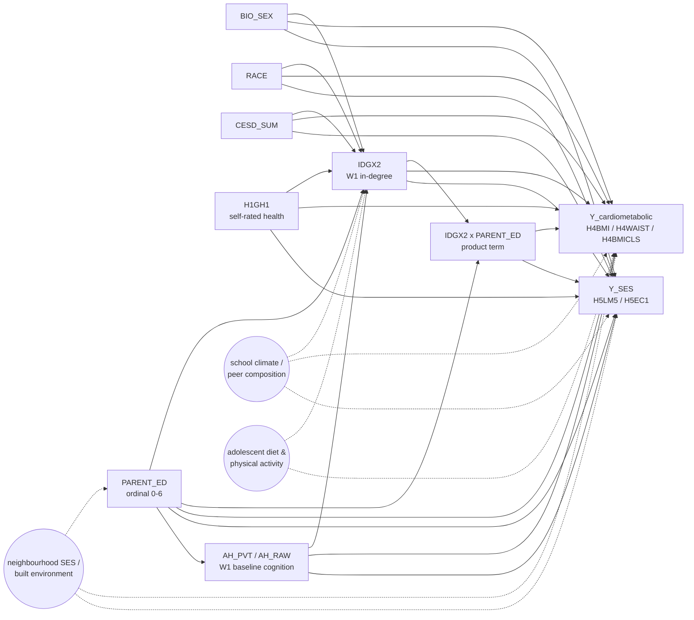

# DAG-EM-SES v0.1 — `IDGX2 × PARENT_ED` effect modification

**Used by:** [em-compensatory-by-ses](README.md). **Date locked:** TBD (scaffold).

## Adjustment set

Per-outcome:

- **Cardiometabolic outcomes** (`H4BMI`, `H4WAIST`, `H4BMICLS`): inherit `DAG-CardioMet` (planned in [cardiometabolic-handoff](../cardiometabolic-handoff/)). Pending lock-in, the screening-style L0+L1+AHPVT set is used as a placeholder.
- **SES outcomes** (`H5LM5`, `H5EC1`): inherit `DAG-SES` (planned in [ses-handoff](../ses-handoff/)). The methodologically-correct adjustment **drops AHPVT** (AHPVT lies on `SOC → AHPVT → educational credentialism → earnings`).

In **both** cases the design matrix adds one extra column: the explicit product `IDGX2 × PARENT_ED`. `PARENT_ED` is already in the adjustment set, which is what makes the interaction coefficient identifiable as the change in the conditional `IDGX2`-effect per unit `PARENT_ED`.

## Estimand

> **Interaction coefficient β_{IDGX2 × PARENT_ED}.** Among Add Health respondents in saturated schools, conditional on the per-outcome adjustment set, β_{IDGX2 × PARENT_ED} is the additive change in the marginal effect of a one-unit increase in W1 in-degree (`IDGX2`) per one-unit increase in parental education (`PARENT_ED`, 0–6 ordinal). Substantive prediction: β_{IDGX2 × PARENT_ED} differs from zero in the direction implied by the substitution hypothesis (positive for BMI / waist, negative for current-work / earnings).

The robustness contrast (matching) targets a **different but related estimand**:

> **Stratum-restricted matching ATE.** Within respondents in the bottom tertile of `PARENT_ED`, the bias-corrected nearest-neighbour matching ATE of "top-quintile `IDGX2`" vs "bottom-quintile `IDGX2`" on the chosen outcome, matching on `{BIO_SEX, RACE, CESD_SUM, H1GH1, AH_PVT}`. Local to the bottom-SES sub-cohort and to the contrast between the extreme tails of the popularity distribution.

## Weak points (load-bearing assumptions)

1. **Linearity of the interaction.** The WLS spec assumes `IDGX2 × PARENT_ED` is the right functional form. A genuine threshold effect (e.g. "popularity protects only below a critical SES level") will be misread as a linear trend. The quintile dose-response within each `PARENT_ED` tertile (sensitivity sub-analysis) is the diagnostic.
2. **No unmeasured effect modifier.** If a third variable `M` modifies the `IDGX2` effect *and* covaries with `PARENT_ED`, β_{IDGX2 × PARENT_ED} absorbs the spurious modification. School climate (already a suspected backdoor confounder) is the canonical worry: low-SES schools may differ in peer-norm pressure independent of family SES.
3. **`PARENT_ED` measurement scale.** Treated as a 0–6 ordinal in WLS (linear contribution); the matching contrast collapses to a tertile cut. Both choices are defensible but not equivalent.
4. **Outcome-specific DAG inheritance not yet locked.** `DAG-CardioMet` and `DAG-SES` are still planned in their respective handoff experiments; the screening-style adjustment is used as a placeholder. Re-run when the per-outcome DAGs are finalised.

## Variants

- `DAG-EM-SES-CardioOnly` — cardiometabolic outcomes only, `DAG-CardioMet` adjustment.
- `DAG-EM-SES-SESOnly` — SES outcomes only, `DAG-SES` adjustment, AHPVT dropped.

## Index entry (in `reference/dag_library.md`)

> **DAG-EM-SES v0.1** — `IDGX2 × PARENT_ED` effect modification on cardiometabolic + SES outcomes. Adjustment: per-outcome (`DAG-CardioMet` or `DAG-SES`) + explicit product term. Estimand: interaction coefficient β_{IDGX2 × PARENT_ED}. Used by `em-compensatory-by-ses`. → [`experiments/em-compensatory-by-ses/dag.md`](../../experiments/em-compensatory-by-ses/dag.md)

## Changelog

- **TBD** — v0.1 scaffold drafted; per-outcome DAG inheritance pending lock-in of `DAG-CardioMet` and `DAG-SES`.
