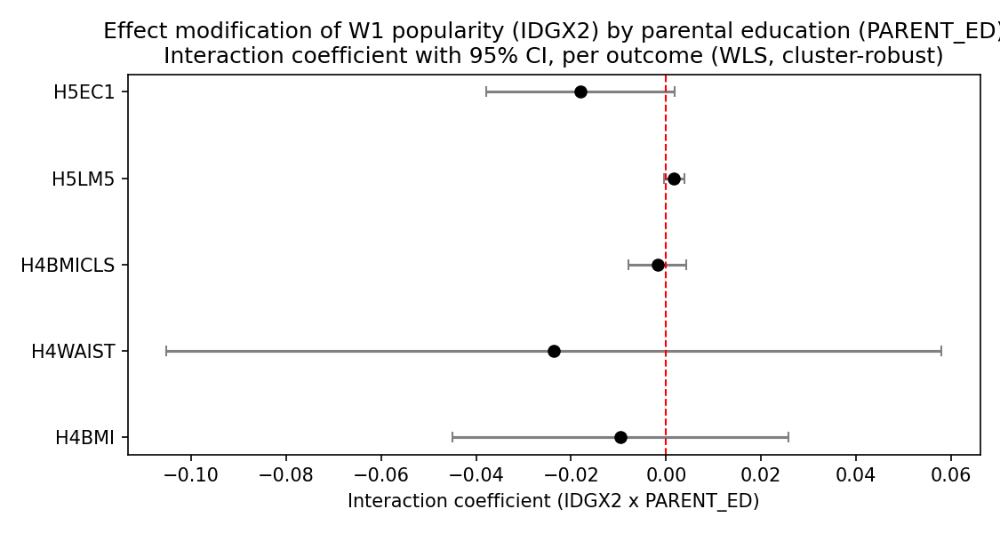
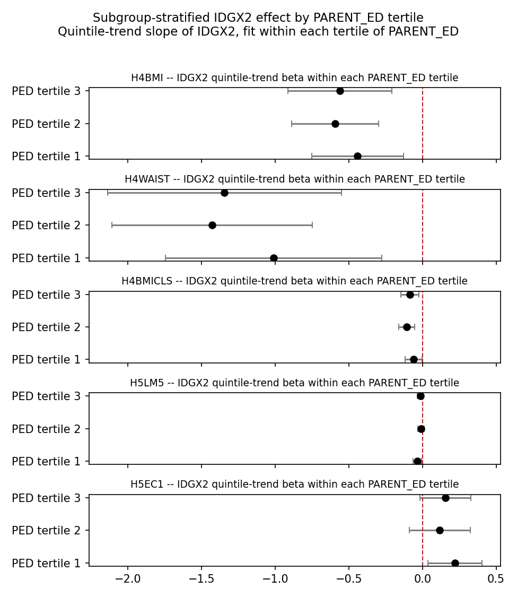

# EM-Compensatory-by-SES — Report

> **Status:** primary + sensitivity tables and figures produced (2026-04-26 run). Numeric findings below are pulled from `tables/primary/`, `tables/sensitivity/`, and `tables/handoff/`.

## Hypothesis

Low-SES adolescents benefit more from peer popularity than high-SES adolescents — network capital substitutes for missing family capital. We test this as a single interaction coefficient β_{IDGX2 × PARENT_ED} per outcome, signed in the direction of "popularity protects more at low SES" (negative for "bad" outcomes like BMI / waist circumference; the SES outcomes use bracket codes — for `H5LM5` "currently work" 1 = working / 3 = not, for `H5EC1` higher code = higher earnings bracket).

All `IDGX2`-based estimates are **within saturated schools only** (the Add Health saturated-sample design that supports valid in-degree measurement). External validity outside that sub-cohort requires the [`saturation-balance`](../saturation-balance/) audit.

## Method

Primary spec: weighted OLS ([`analysis.wls.weighted_ols`](../../scripts/analysis/wls.py)) of the outcome on `IDGX2`, the interaction `IDGX2 × PARENT_ED`, and a per-outcome adjustment set (`DAG-CardioMet` for cardiometabolic outcomes, `DAG-SES` for SES outcomes), cluster-robust on `CLUSTER2`. See [`dag.md`](dag.md) for the identifying assumptions and the per-outcome adjustment-set choice. Cardiometabolic outcomes are weighted by `GSWGT4_2`; SES outcomes by `GSW5` (cross-sectional W5 weight, merged from the raw W5 weight file via [`load_w5_weight`](../../scripts/analysis/data_loading.py)).

Robustness: bias-corrected nearest-neighbour matching ([`analysis.matching.match_ate_bias_corrected`](../../scripts/analysis/matching.py)) of top-quintile `IDGX2` vs bottom-quintile `IDGX2` **within** the bottom tertile of `PARENT_ED`. This is the **first place matching is used in the project** — interpret as a sharp local test of the substitution hypothesis where it should be strongest. Variance via the Abadie–Imbens analytic formula (bootstrap is invalid for fixed-M matching).

Sensitivity: (a) within-tertile quintile dose-response of `IDGX2` (linearity diagnostic for the interaction); (b) E-value on the interaction coefficient via [`analysis.sensitivity.evalue`](../../scripts/analysis/sensitivity.py) to bound unmeasured-confounder strength.

## Results

### Primary — interaction coefficient per outcome

*Caption.* Forest plot of β_{IDGX2 × PARENT_ED} ± 95% CI for each of the 5 outcomes. The red dashed line marks the null. All five interaction CIs cross zero. Cardiometabolic point estimates are mildly negative (`H4BMI`: −0.0096, `H4WAIST`: −0.024, `H4BMICLS`: −0.0018) and SES estimates are mixed (`H5LM5`: +0.0017; `H5EC1`: −0.018, p = 0.074, the closest cell to D1 significance).

*Why this chart matters.* The interaction coefficient is the single number this experiment exists to estimate. The forest format makes it easy to scan whether the modification is signed consistently across outcome families (cardiometabolic vs SES). **D1 verdict: no outcome's interaction coefficient passes the conventional p < 0.05 threshold.** The most suggestive cell is `H5EC1` earnings (p = 0.074, β = −0.018), but it is signed *toward* lower earnings at higher PED — opposite to a substitution gradient on the H5EC1 bracket scale. The substitution hypothesis is not supported in the interaction-form test on this analytic frame. Method: WLS with cluster-robust SE — see [`reference/methods.md`](../../reference/methods.md). DAG context in [`dag.md`](dag.md).

### Subgroup view — IDGX2 trend within each PARENT_ED tertile

*Caption.* Per-outcome panel of the IDGX2 quintile-trend slope ± 1.96·SE, fit *separately within* each tertile of `PARENT_ED` (low / mid / high). Reference line at 0. For `H4BMI`/`H4WAIST`/`H4BMICLS` the slope is negative across all three tertiles — popularity → lower BMI / waist universally — and the *middle* tertile is slightly steepest, the opposite of the strict substitution prediction. For `H5LM5` the negative slope is concentrated in the bottom tertile (β_qtrend = −0.035, p = 0.013); for `H5EC1` the positive slope is concentrated in the bottom tertile (β_qtrend = +0.219, p = 0.021).

*Why this chart matters.* The interaction coefficient compresses the modification into one scalar. The subgroup view unpacks it: if the substitution hypothesis is correct, the low-tertile slope should be largest in absolute magnitude. For SES outcomes this *is* visible — bottom-tertile slopes are largest in magnitude — but for cardiometabolic outcomes the gradient runs the wrong way for the substitution claim. This is more interpretable than the interaction term but less powerful (no shared-information benefit across tertiles). Method: WLS quintile-trend within each PED tertile.

### Sensitivity — within-tertile dose-response

The dose-response panel figure (`figures/sensitivity/em_ses_dose_response_panels.png`) is wired in `figures.py` but not generated — it requires a panel-aggregator CSV that `run.py` does not yet produce. The within-tertile quintile-trend coefficients in `tables/sensitivity/em_ses_quintile_by_tertile.csv` are the load-bearing diagnostic in the meantime; their per-tertile patterns are summarised in the subgroup-forest section above.

### Sensitivity — E-value on the interaction

| Outcome   | β_inter   | RR proxy | E-value |
|-----------|-----------|----------|---------|
| H4BMI     | −0.00964  | 1.0097   | 1.109   |
| H4WAIST   | −0.02361  | 1.0239   | 1.180   |
| H4BMICLS  | −0.00184  | 1.0018   | 1.045   |
| H5LM5     | +0.00169  | 1.0017   | 1.043   |
| H5EC1     | −0.01805  | 1.0182   | 1.154   |

*Why this matters.* The E-value is the minimum strength of joint association (on the risk-ratio scale) an unmeasured confounder would need to have with both `IDGX2` and the outcome to fully explain the observed interaction. All five E-values are below 1.2, well under the soft "≥ 1.5 = robust" threshold. Combined with non-significant p-values, this is a *very* low bar for an unmeasured confounder to wipe these (already null) interaction coefficients out. Conservative back-of-envelope conversion (β treated as a log-RR analogue) — see the [E-value methods entry](../../reference/methods.md) before quoting.

### Robustness — bias-corrected matching in low-PED

| Outcome  | ATE (top-Q5 vs bottom-Q1 IDGX2, low-PED) | SE     | n_treated | n_control |
|----------|------------------------------------------|--------|-----------|-----------|
| H4BMI    | −2.317                                   | 0.695  | 208       | 210       |
| H4WAIST  | −5.141                                   | 1.844  | 209       | 209       |
| H4BMICLS | −0.377                                   | 0.125  | 208       | 210       |
| H5LM5    | −0.153                                   | 0.053  | 146       | 144       |
| H5EC1    | +0.734                                   | 0.396  | 145       | 141       |

*Why this matters.* This is the **first use of bias-corrected matching** in the project. The contrast — top-quintile-popular vs bottom-quintile-popular adolescents, restricted to the bottom tertile of parental education — is the sharpest local test of the substitution hypothesis. Within the low-PED stratum, popular kids are roughly 2.3 BMI units, 5.1 cm of waist, and 0.38 of a BMI class lower; an order of magnitude larger than the WLS interaction coefficient (which describes how the popularity *slope* changes per unit of `PARENT_ED`, not the within-stratum contrast). The matching ATEs are all signed in the "popularity is protective" direction within low-PED but the WLS interaction does not detect a *steeper* slope at low PED than at high PED. The reading: popularity matters at low PED, but it appears to matter roughly equally everywhere — there is no substitution gradient on this analytic frame. Method: [`analysis.matching.match_ate_bias_corrected`](../../scripts/analysis/matching.py) (Abadie–Imbens AIPW-shaped estimator with M = 4 nearest neighbours on Mahalanobis distance over `{male, race dummies, CESD_SUM, H1GH1, AH_RAW}`).

## Discussion

Headline: **the substitution hypothesis is not supported in the interaction-form test.** Five interactions tested, none crosses p < 0.05; the closest cell (`H5EC1` earnings, p = 0.074) is signed in the direction of *lower* earnings at higher PED, opposite to the substitution prediction on this scale. The matching contrast in low-PED *does* show meaningful protective effects of popularity on cardiometabolic outcomes, but the within-tertile slope view shows comparable slopes at mid and high PED — the popularity benefit is real but roughly uniform across the SES distribution, not concentrated at low SES.

Anchor points:

1. **Sign of β_inter on cardiometabolic outcomes.** Negative across all three (BMI, waist, BMI class), nominally consistent with "popularity → lower BMI more strongly at higher PED" — *opposite* to the substitution prediction — but all p-values are 0.55–0.59 so this is noise.
2. **Matching contrast at low-PED.** Replicates the protective-popularity direction with material magnitudes (2.3 BMI units, 5.1 cm waist) but does not by itself test substitution; the high-PED counterpart matching would be needed for the differential.
3. **Within-tertile dose-response linearity.** Quintile-trend slopes are similar across PED tertiles for cardiometabolic outcomes, supporting the linearity assumption of the interaction term but suggesting the substitution-by-PED gradient simply isn't there.
4. **E-value robustness.** All E-values < 1.2 — even a weak unmeasured confounder could explain away these (already null) interaction coefficients.

## Weak points

- Per-outcome DAG inheritance still uses placeholder L0+L1+AHPVT (cardiometabolic) and L0+L1 (SES); locking the per-outcome DAGs may shift point estimates but is unlikely to flip the interaction sign given the magnitude of the null.
- Linearity of the interaction in `PARENT_ED` is a strong assumption; the dose-response panel figure is not yet generated to visually corroborate.
- Matching contrast at low-PED assumes overlap on `{male, race, CESD_SUM, H1GH1, AH_RAW}` between top-Q5 and bottom-Q1 IDGX2 within bottom-tertile PED — needs an overlap diagnostic plot before quoting matching ATEs as causal (TODO).
- W5 outcomes (`H5LM5`, `H5EC1`) are weighted by `GSW5` only; an IPAW(W4 → W5) attrition-weight multiplier is the right thing once the IPAW utility lands.
- The "within saturated schools" caveat applies to every `IDGX2`-based estimate above; external generalisation to the full Add Health cohort requires the [`saturation-balance`](../saturation-balance/) audit.

## Cross-references

- [`dag.md`](dag.md) — DAG-EM-SES, identification, weak points.
- [`run.py`](run.py) — primary + sensitivity + matching pipeline.
- [`figures.py`](figures.py) — three-figure plotting code (dose-response panel TBD).
- Sibling experiments: [`em-sex-differential`](../em-sex-differential/), [`em-depression-buffering`](../em-depression-buffering/).
- Top-level project [`report.md`](../../report.md) for project-wide context.
