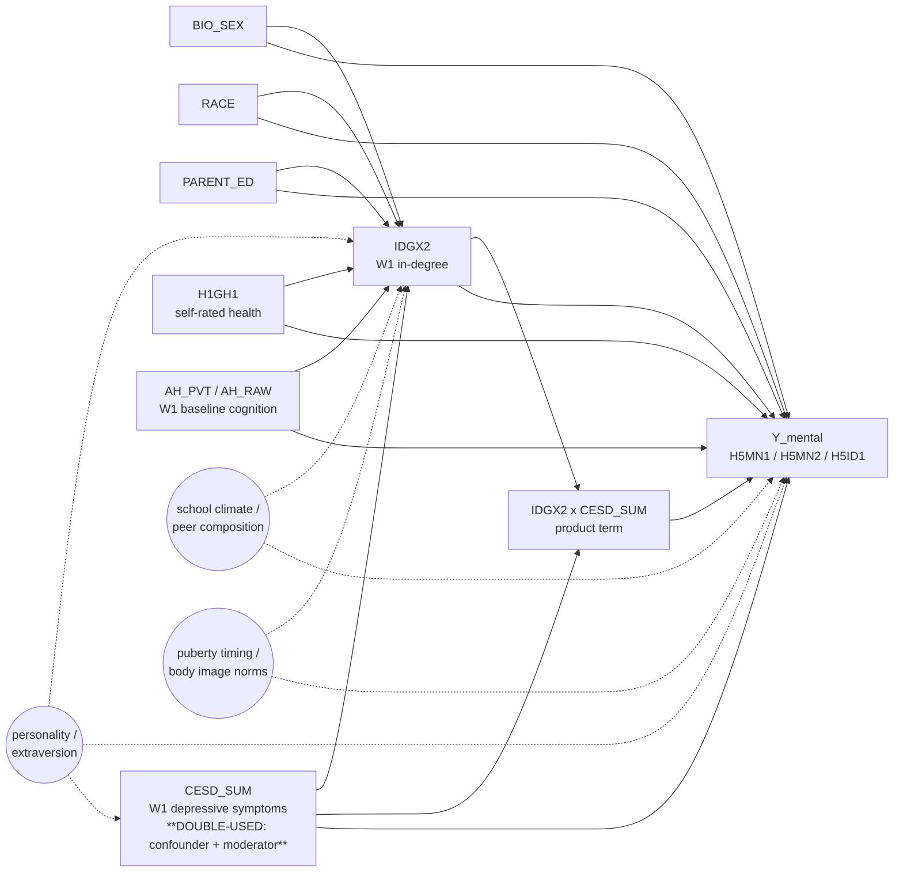

# DAG-EM-Dep v0.1 — `IDGX2 × CESD_SUM` effect modification (depression-buffering)

**Used by:** [em-depression-buffering](README.md). **Date locked:** TBD (scaffold).

## D9 collider check (CRITICAL — load-bearing for this experiment)

`CESD_SUM` enters the design in **two distinct roles**:

1. As an **L1 confounder** of the `IDGX2 → Y_mental` path. The `CESD → SOC` and `CESD → YMH` edges form a backdoor path that is closed by conditioning on `CESD_SUM` in the adjustment set. Under standard screening (`DAG-Mental` style L0+L1 adjustment), `CESD_SUM` is in the regression as a covariate.
2. As the **moderator** in the experiment's primary estimand `IDGX2 × CESD_SUM`. The buffering hypothesis is precisely the claim that the `IDGX2 → Y_mental` slope varies with `CESD_SUM`, so `CESD_SUM` needs to enter the design as the second factor of the product term.

Conditioning on a variable AND interacting it AND using it as a confounder *simultaneously* is fine in textbook linear cases — but only if the variable is **not itself downstream of a latent collider on a backdoor path**. The unmeasured `PERSONALITY` arrow `PERSONALITY -.-> CESD` raises a D9-style concern: if `PERSONALITY` also drives `IDGX2` and `Y_mental` (it does, both edges in our DAG), then `CESD` sits at the convergence of two arrows from `PERSONALITY` and from `IDGX2`'s upstream confounders, and conditioning on it can open a personality-mediated backdoor it would otherwise close. This is the **D9 collider check** the user feedback flagged.

**Mitigation: run TWO specs side-by-side per outcome.**

- **Spec (a) "conservative" — `CESD_SUM` in BOTH adjustment set AND moderator.** This is the screening-style choice; treats `CESD_SUM` as a confounder regardless of its moderator role. Most robust to the standard backdoor concern; vulnerable to the latent-personality D9 issue.
- **Spec (b) "clean" — `CESD_SUM` DROPPED from the main-effects adjustment set when used as the moderator.** This is the theoretically-preferred choice for the buffering estimand: the moderator-only role lets β_{IDGX2 × CESD_SUM} be interpreted without the L1-confounder double-use. Vulnerable to the standard backdoor concern (personality-mediated and otherwise) if the L0 adjustment alone (`{BIO_SEX, RACE, PARENT_ED, H1GH1, AH_RAW}`) doesn't fully d-separate `IDGX2` from `Y_mental`.

The report's interaction-coefficient forest shows both specs side-by-side; consistency across the two is the substantive defence of the buffering claim. Divergence between the two indicates the D9 issue is empirically real and the buffering claim is fragile to the choice.

## Adjustment set

Per outcome: inherits `DAG-Mental` from [multi-outcome-screening/dag.md](../multi-outcome-screening/dag.md) §`DAG-Mental` planned stub. Pending lock-in, the screening-style L0+L1 set is used as a placeholder.

- **Spec (a) conservative:** `{BIO_SEX, RACE, PARENT_ED, CESD_SUM, H1GH1}` + `IDGX2` + `CESD_SUM` + `IDGX2 × CESD_SUM`. (`CESD_SUM` appears twice: once as a covariate, once as the second factor of the product term. The interaction column is mathematically distinct from the covariate column.)
- **Spec (b) clean:** `{BIO_SEX, RACE, PARENT_ED, H1GH1}` + `IDGX2` + `CESD_SUM` + `IDGX2 × CESD_SUM`. (`CESD_SUM` appears only as the moderator main-effect and as the second factor of the product term; it is *not* in the adjustment-set covariates.)

`AH_RAW` is NOT in either spec — `DAG-Mental` excludes it pending the W1 self-rated-fitness proxy. This decision matches `popularity-vs-sociability` and the multi-outcome screen.

## Estimand

> **Interaction coefficient β_{IDGX2 × CESD_SUM}.** Among Add Health respondents in saturated schools, conditional on the per-outcome adjustment set, β_{IDGX2 × CESD_SUM} is the additive change in the marginal effect of a one-unit increase in W1 in-degree (`IDGX2`) per one-unit increase in W1 depressive symptoms (`CESD_SUM`, 0–57). Substantive prediction (popularity buffers depression): β_{IDGX2 × CESD_SUM} differs from zero in the buffering direction — for W5 outcomes where higher = better (e.g., `H5MN1` "currently feel in control"), β > 0 means popularity protects more for the depressed.

The robustness contrast (matching) targets a **stratum-restricted estimand**:

> **Stratum-restricted matching ATE.** Within respondents in the top tertile of `CESD_SUM` (the most-depressed third), the bias-corrected nearest-neighbour matching ATE of "top-quintile `IDGX2`" vs "bottom-quintile `IDGX2`" on the chosen outcome, matching on `{BIO_SEX, RACE dummies, PARENT_ED, H1GH1, AH_RAW}`. Local to the high-CESD sub-cohort and to the contrast between the extremes of the popularity distribution.

## Weak points (load-bearing assumptions)

1. **D9 / collider double-use of `CESD_SUM`** (above). The two-spec strategy is a mitigation, not a fix. If specs (a) and (b) diverge substantially, the buffering claim is fragile.
2. **Linearity of the interaction in `CESD_SUM`.** The WLS spec assumes `IDGX2 × CESD_SUM` is the right functional form. A genuine threshold effect (e.g., "buffering only kicks in above CESD = 20") will be misread as a linear trend. The within-tertile quintile dose-response is the diagnostic.
3. **`PERSONALITY` is unmeasured.** The latent-personality arrow is the canonical residual concern — extraversion plausibly drives all of `IDGX2`, `CESD_SUM`, and `Y_mental`. Bias direction depends on how extraversion's effect partitions across the three; not signable a priori.
4. **`CESD_SUM` measurement scale.** The 19-item sum (with reverse-scored items 4/8/11/15) is on a 0–57 scale; treated as continuous in WLS (linear contribution), tertile-cut for matching. Both choices are defensible but not equivalent.
5. **Mental-health weight switch.** The current scaffold uses `GSWGT4_2` for W5 outcomes (not strictly correct); switch to `GSW5 × IPAW(W4 → W5)` once the IPAW utility lands.
6. **Per-outcome DAG inheritance not yet locked.** `DAG-Mental` is still planned; placeholder L0+L1 used. Re-run when finalised.

## Variants

- `DAG-EM-Dep-Conservative` (spec a) — `CESD_SUM` in the L1 adjustment set AND as the moderator; screening-style choice.
- `DAG-EM-Dep-Clean` (spec b) — `CESD_SUM` dropped from L1 adjustment when used as the moderator; theoretically-preferred for the buffering estimand.

## Index entry (in `reference/dag_library.md`)

> **DAG-EM-Dep v0.1** — `IDGX2 × CESD_SUM` effect modification on W5 mental-health outcomes (`H5MN1`, `H5MN2`, `H5ID1`). Two specs side-by-side per outcome (D9 collider check on `CESD_SUM` double-use). Adjustment: per-outcome `DAG-Mental` (with or without `CESD_SUM` retained, per spec) + explicit product term. Estimand: interaction coefficient β_{IDGX2 × CESD_SUM}. Used by `em-depression-buffering`. → [`experiments/em-depression-buffering/dag.md`](../../experiments/em-depression-buffering/dag.md)

## Changelog

- **TBD** — v0.1 scaffold drafted; per-outcome `DAG-Mental` inheritance pending lock-in; D9 collider double-use documented as the load-bearing identification issue with the two-spec mitigation.
