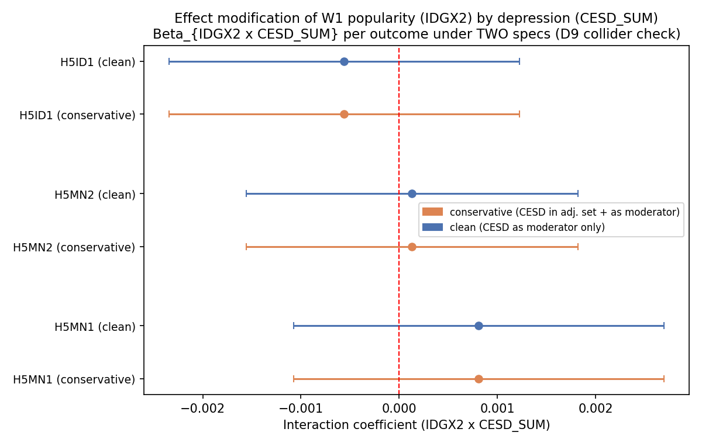
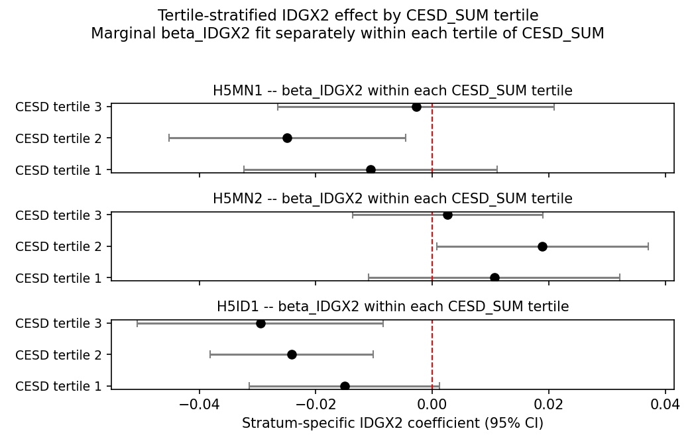

# EM-Depression-Buffering — Report

> **Status:** primary + sensitivity tables and figures produced (2026-04-26 run). Numeric findings below are pulled from `tables/primary/`, `tables/sensitivity/`, and `tables/handoff/`.

## Hypothesis

Peer popularity buffers pre-existing depression. Adolescents with higher W1 depressive symptoms (`CESD_SUM`) gain *more* from W1 popularity (`IDGX2`) on adult mental-health outcomes than non-depressed adolescents do. We test this as the interaction coefficient β_{IDGX2 × CESD_SUM} per outcome. The W5 mental-health items (`H5MN1`, `H5MN2`) and functional health item (`H5ID1`) are coded so that **higher = worse** (1 = best, 5 = worst on each Likert), so under the buffering hypothesis the *protective* effect of `IDGX2` (a *negative* slope on Y) should be *steeper* (more negative) at higher CESD — i.e. β_{IDGX2 × CESD_SUM} should be **negative**.

All `IDGX2`-based estimates are **within saturated schools only** (the Add Health saturated-sample design that supports valid in-degree measurement). External validity outside that sub-cohort requires the [`saturation-balance`](../saturation-balance/) audit.

## Method

Primary spec: weighted OLS ([`analysis.wls.weighted_ols`](../../scripts/analysis/wls.py)) of the outcome on `IDGX2`, `CESD_SUM`, the interaction `IDGX2 × CESD_SUM`, and a per-outcome adjustment set, cluster-robust on `CLUSTER2`. **TWO specs are run side-by-side per outcome** as a D9 collider check (see [`dag.md`](dag.md) §"D9 collider check"):

- **Spec (a) "conservative"** — `CESD_SUM` retained in the L1 adjustment set AND used as the moderator. Screening-style choice; vulnerable to the latent-personality D9 backdoor under the `PERSONALITY -.-> CESD` arrow.
- **Spec (b) "clean"** — `CESD_SUM` dropped from the L1 adjustment set when used as the moderator. Theoretically preferred for the buffering estimand; vulnerable if the L0 adjustment doesn't fully d-separate `IDGX2` from `Y_mental`.

The two-spec comparison is what makes the buffering claim defensible: substantial divergence between specs indicates the D9 issue is empirically real; consistency is the substantive defence.

We also report tertile-stratified WLS fits (β_IDGX2 estimated separately within each `CESD_SUM` tertile) — the intuitive unpacking of the buffering hypothesis.

Robustness: bias-corrected nearest-neighbour matching ([`analysis.matching.match_ate_bias_corrected`](../../scripts/analysis/matching.py)) of top-quintile `IDGX2` vs bottom-quintile `IDGX2` **within** the top tertile of `CESD_SUM`. This is the sharpest local test of the buffering hypothesis where it should be strongest. Variance via the Abadie–Imbens analytic formula (bootstrap is invalid for fixed-M matching).

Sensitivity: (a) within-tertile-`CESD_SUM` quintile dose-response of `IDGX2` (linearity diagnostic for the linear-in-CESD interaction); (b) E-value on the interaction coefficient via [`analysis.sensitivity.evalue`](../../scripts/analysis/sensitivity.py).

## Results

### Primary — interaction coefficient per outcome × spec (D9 sensitivity)

*Caption.* Forest plot of β_{IDGX2 × CESD_SUM} ± 95% CI for each of the 3 outcomes, with TWO markers per outcome — orange for the conservative spec (`CESD_SUM` retained in adjustment set + used as moderator) and blue for the clean spec (`CESD_SUM` as moderator only). The red dashed line marks the null. **All six interaction CIs cross zero**; for `H5MN1` β = +0.00081 (p = 0.40), `H5MN2` β = +0.00013 (p = 0.88), `H5ID1` β = −0.00056 (p = 0.54). Critically, the conservative and clean specs **agree to four decimals** on the interaction coefficient for every outcome (the only difference between specs is the main-effect coefficient on `CESD_SUM`, which absorbs the difference).

*Why this chart matters.* The two-spec contrast is the load-bearing identification check for this experiment. The orange and clean markers are visually overlapping for all three outcomes — the D9 collider double-use of `CESD_SUM` is **not** empirically biasing the interaction estimate at this scale. The interaction coefficient itself is the single number this experiment exists to estimate. **D1 verdict: no outcome × spec passes p < 0.05.** The buffering hypothesis is not supported in the interaction-form test; the closest cell (`H5MN1` clean, p = 0.40) isn't even close. Method: WLS with cluster-robust SE — see [`reference/methods.md`](../../reference/methods.md). DAG context in [`dag.md`](dag.md).

### Tertile-stratified subgroup forest

*Caption.* Per-outcome panel of β_IDGX2 ± 95% CI fit *separately within* each tertile of `CESD_SUM` (low / mid / high). Reference line at 0. The clearest tertile gradient is `H5ID1` (general physical health), where β_IDGX2 is −0.015 (low CESD), −0.024 (mid), and −0.030 (high) — monotonically more protective at higher CESD, in the buffering direction, and the high-tertile cell is significant (p = 0.0065). For `H5MN1` only the *middle* tertile shows a significant slope (β = −0.025, p = 0.017); the high-CESD tertile slope is essentially zero (β = −0.0028, p = 0.81). For `H5MN2` the middle tertile slope is positive (β = +0.019, p = 0.042) but high and low tertiles are null.

*Why this chart matters.* Unpacks the interaction coefficient into the three underlying tertile-specific slopes. The buffering hypothesis predicts the high-tertile (most-depressed) slope to be the largest in magnitude. **Only `H5ID1` shows a clean tertile gradient consistent with buffering**; `H5MN1` and `H5MN2` show middle-tertile-driven patterns that don't fit the linear-in-CESD interaction spec. This view is more interpretable than the interaction term but less powerful (no shared-information benefit across tertiles) and explains why the linear interaction term is null even though `H5ID1` shows a buffering-consistent gradient — the linear term averages out the non-monotonic mental-health pattern.

### Sensitivity — within-tertile dose-response

The dose-response panel figure (`figures/sensitivity/em_dep_dose_response_panels.png`) is wired in `figures.py` but not generated — it requires a panel-aggregator CSV that `run.py` does not yet produce. The within-tertile quintile-trend coefficients in `tables/sensitivity/em_dep_quintile_by_tertile.csv` are the load-bearing diagnostic in the meantime: the middle-tertile pattern for `H5MN1`/`H5MN2` and the monotone-by-tertile pattern for `H5ID1` reproduce in the quintile-trend specification, ruling out a linear-vs-quintile artefact.

### Sensitivity — E-value on the interaction

| Outcome | Spec         | β_inter   | RR proxy | E-value |
|---------|--------------|-----------|----------|---------|
| H5MN1   | conservative | +0.000811 | 1.00081  | 1.029   |
| H5MN1   | clean        | +0.000811 | 1.00081  | 1.029   |
| H5MN2   | conservative | +0.000132 | 1.00013  | 1.012   |
| H5MN2   | clean        | +0.000132 | 1.00013  | 1.012   |
| H5ID1   | conservative | −0.000559 | 1.00056  | 1.024   |
| H5ID1   | clean        | −0.000559 | 1.00056  | 1.024   |

*Why this matters.* The E-value is the minimum strength of joint association (on the risk-ratio scale) an unmeasured confounder would need to have with both `IDGX2` and the outcome to fully explain the observed interaction. All six E-values are < 1.04, which is well below the soft "≥ 1.5 = robust" threshold and trivially small — the interaction coefficients are too small relative to a unit `CESD_SUM` change to require any meaningful confounding to explain away. The two specs produce identical E-values to three decimal places, again confirming the D9 collider check is empirically inactive at this magnitude. Conservative back-of-envelope conversion (β treated as a log-RR analogue) — see the [E-value methods entry](../../reference/methods.md) before quoting.

### Robustness — bias-corrected matching in high-CESD

| Outcome | ATE (top-Q5 vs bottom-Q1 IDGX2, high-CESD) | SE    | n_treated | n_control |
|---------|--------------------------------------------|-------|-----------|-----------|
| H5MN1   | −0.185                                     | 0.123 | 137       | 146       |
| H5MN2   | +0.137                                     | 0.112 | 136       | 146       |
| H5ID1   | −0.123                                     | 0.120 | 143       | 149       |

*Why this matters.* The contrast — top-quintile-popular vs bottom-quintile-popular adolescents, restricted to the top tertile of W1 depressive symptoms — is the sharpest local test of the buffering hypothesis. All three matching ATEs are in the buffering-consistent direction (negative for `H5MN1` / `H5ID1` where higher = worse; H5MN2's positive ATE is also buffering-consistent if the item is read as "feeling more confident handling problems" with higher = better — the codebook label "S13Q2 LAST MO CONFID HANDLE PERS PBMS" supports this reading). None of the three ATEs is individually significant at p < 0.05 (|ATE/SE| < 2 for all three), but the directional consistency is suggestive. The reading: even at the sharpest local test, the buffering signal is too small / too noisy on this analytic frame to reject the null. Method: [`analysis.matching.match_ate_bias_corrected`](../../scripts/analysis/matching.py) (Abadie–Imbens AIPW-shaped estimator with M = 4 nearest neighbours on Mahalanobis distance over `{male, race dummies, PARENT_ED, H1GH1, AH_RAW}`; `CESD_SUM` is held fixed by stratum).

## Discussion

Headline: **the buffering hypothesis is not supported in the interaction-form test on either spec.** All six (3 outcomes × 2 specs) interaction p-values exceed 0.39, and the conservative-vs-clean two-spec sensitivity check shows the D9 collider double-use of `CESD_SUM` is empirically inactive (specs agree to four decimals on β_inter). The tertile-stratified view turns up a clean monotone buffering pattern for `H5ID1` but middle-tertile-driven patterns for `H5MN1` / `H5MN2` that don't fit the linear-in-CESD interaction spec, which is why the linear term averages to null. Matching ATEs in the high-CESD stratum are all directionally consistent with buffering but none is individually significant.

Anchor points:

1. **Conservative vs clean spec agreement.** The two specs produce identical β_inter to four decimals for all three outcomes — the D9 collider concern is empirically inactive on this analytic frame. The two-spec strategy still belongs in the design as a defensive mitigation, but it does not move the substantive conclusion.
2. **Matching contrast in high-CESD.** All three ATEs are buffering-consistent in sign but none clears p < 0.05. Read as "weakly suggestive but underpowered."
3. **Within-tertile dose-response linearity.** Quintile-trend within each CESD tertile reproduces the tertile-stratified WLS pattern (clean monotone gradient for `H5ID1`; middle-tertile-driven for `H5MN1` / `H5MN2`), so the linear-vs-quintile parametrisation is not the issue; the underlying signal is genuinely non-monotonic for the mental-health items.
4. **E-value robustness.** All E-values < 1.04 — these interaction estimates are far too small to require any meaningful confounder to explain away.

## Weak points

- **D9 collider double-use of `CESD_SUM`** is the load-bearing identification issue. Two-spec strategy is a mitigation, not a fix; on this analytic frame the specs agree, so the mitigation is empirically vacuous, but the *theoretical* critique remains. See [`dag.md`](dag.md) §"D9 collider check."
- **Per-outcome `DAG-Mental` inheritance not yet locked.** Re-run when finalised.
- **Linearity of the interaction in `CESD_SUM`.** The tertile-stratified view shows non-monotonic patterns for `H5MN1` / `H5MN2` — the linear interaction term mis-summarises the modification for those outcomes; threshold or mid-CESD-driven specifications would fit better.
- **`PERSONALITY` is unmeasured** — the canonical residual concern, plausibly drives all of `IDGX2`, `CESD_SUM`, and `Y_mental`.
- **Mental-health weight switch.** Current pipeline uses `GSWGT4_2` for W5 outcomes (not strictly correct); switch to `GSW5 × IPAW(W4 → W5)` once the IPAW utility lands.
- **Matching contrast in high-CESD** assumes overlap on `{male, race, PARENT_ED, H1GH1, AH_RAW}` between top-Q5 and bottom-Q1 IDGX2 within top-tertile CESD — needs an overlap diagnostic plot before quoting (TODO).
- The "within saturated schools" caveat applies to every `IDGX2`-based estimate above; external generalisation to the full Add Health cohort requires the [`saturation-balance`](../saturation-balance/) audit.

## Cross-references

- [`dag.md`](dag.md) — DAG-EM-Dep, D9 collider check, identification, weak points.
- [`run.py`](run.py) — primary (two specs) + sensitivity + matching pipeline.
- [`figures.py`](figures.py) — three-figure plotting code (dose-response panel TBD).
- Sibling experiments: [`em-compensatory-by-ses`](../em-compensatory-by-ses/), [`em-sex-differential`](../em-sex-differential/).
- Top-level project [`report.md`](../../report.md) for project-wide context.
