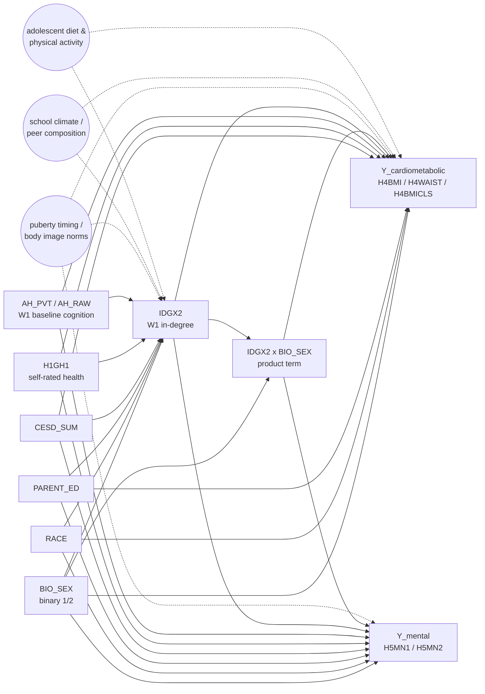

# DAG-EM-Sex v0.1 — `IDGX2 × BIO_SEX` effect modification

**Used by:** [em-sex-differential](README.md). **Date locked:** TBD (scaffold).

## Adjustment set

Per-outcome:

- **Cardiometabolic outcomes** (`H4BMI`, `H4WAIST`, `H4BMICLS`): inherit `DAG-CardioMet` (planned in [cardiometabolic-handoff](../cardiometabolic-handoff/)). Pending lock-in, the screening-style L0+L1+AHPVT set is used as a placeholder.
- **Mental-health outcomes** (`H5MN1`, `H5MN2`): inherit `DAG-Mental` (planned). Pending lock-in, L0+L1+AHPVT placeholder.

In **both** cases the design matrix adds one extra column: the explicit product `IDGX2 × male` (where `male = (BIO_SEX == 1)`). `BIO_SEX` is already in the adjustment set as L0, which is what makes the interaction coefficient identifiable.

## Estimand

> **Interaction coefficient β_{IDGX2 × male}.** Among Add Health respondents in saturated schools, conditional on the per-outcome adjustment set, β_{IDGX2 × male} is the additive change in the marginal effect of a one-unit increase in W1 in-degree (`IDGX2`) going from female (`male=0`) to male (`male=1`). Substantive prediction (status-policing of body weight is stronger for girls): for cardiometabolic "bad" outcomes (BMI, waist), β_{IDGX2} should be more negative for girls, so β_{IDGX2 × male} > 0.

The robustness contrast (matching) targets a **stratified estimand**:

> **Sex-stratified matching ATE.** Within each sex separately, the bias-corrected nearest-neighbour matching ATE of "top-quintile `IDGX2`" vs "bottom-quintile `IDGX2`" on the chosen outcome, matching on `{RACE dummies, PARENT_ED, CESD_SUM, H1GH1, AH_PVT}` (sex is held fixed by construction). Two ATEs reported per outcome (boys vs girls); their difference is the sex-stratified analogue of β_{IDGX2 × male}.

## Weak points (load-bearing assumptions)

1. **Linearity of the interaction.** Because sex is binary, this is automatic — the product term fully captures the modification. The only flexibility is in the *main* `IDGX2` term, where a non-linear sex-common dose-response could leak into the interaction estimate if it differs by sex. The sex-stratified quintile dose-response is the diagnostic.
2. **Unmeasured `PUBERTY`.** Pubertal timing differs sharply by sex and modifies both peer status (status-by-physical-development) AND adult cardiometabolic outcomes (early-puberty BMI track). A `BIO_SEX × PUBERTY` interaction in the latent DAG is a candidate confounder of the `BIO_SEX × IDGX2` interaction. Add Health public-use has limited puberty proxies (W1 pubertal-development index is partially observed); treat as a residual unmeasured-confounder concern.
3. **Per-outcome DAG inheritance not yet locked.** `DAG-CardioMet` and `DAG-Mental` are planned in their respective handoff experiments; placeholder L0+L1+AHPVT used here. Re-run when the per-outcome DAGs are finalised.
4. **Mental-health weight switch.** The current scaffold uses `GSWGT4_2` for mental-health outcomes (not strictly correct for W5 outcomes); switch to `GSW5` × IPAW(W4 → W5) once the IPAW utility lands.

## Variants

- `DAG-EM-Sex-CardioOnly` — cardiometabolic outcomes only, `DAG-CardioMet` adjustment.
- `DAG-EM-Sex-MentalOnly` — `H5MN1` / `H5MN2`, `DAG-Mental` adjustment.

## Index entry (in `reference/dag_library.md`)

> **DAG-EM-Sex v0.1** — `IDGX2 × BIO_SEX` effect modification on cardiometabolic + mental outcomes. Adjustment: per-outcome (`DAG-CardioMet` or `DAG-Mental`) + explicit product term. Estimand: interaction coefficient β_{IDGX2 × male}. Used by `em-sex-differential`. → [`experiments/em-sex-differential/dag.md`](../../experiments/em-sex-differential/dag.md)

## Changelog

- **TBD** — v0.1 scaffold drafted; per-outcome DAG inheritance pending lock-in of `DAG-CardioMet` and `DAG-Mental`.
