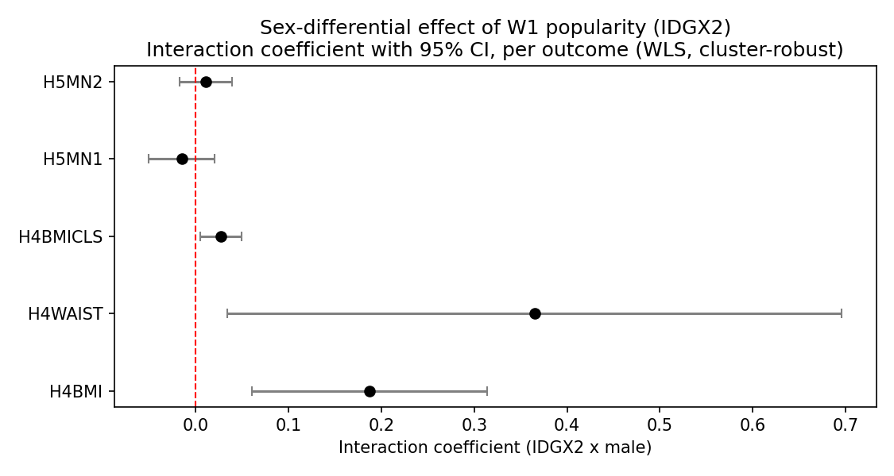
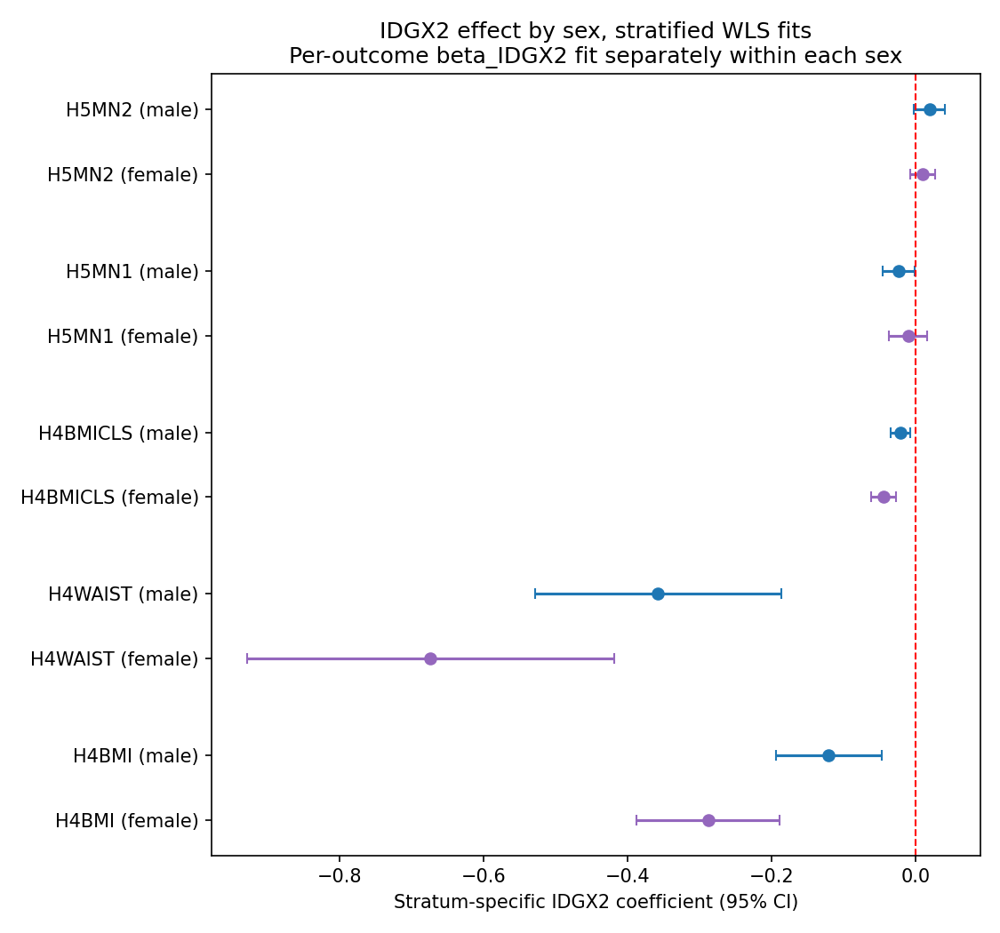

# EM-Sex-Differential — Report

> **Status:** primary + sensitivity tables and figures produced (2026-04-26 run). Numeric findings below are pulled from `tables/primary/`, `tables/sensitivity/`, and `tables/handoff/`.

## Hypothesis

Peer status policing of body weight is stronger for girls than for boys (sex-asymmetric). We test this as the interaction coefficient β_{IDGX2 × male} per outcome — for cardiometabolic "bad" outcomes (BMI, waist circumference) the W1 popularity slope should be more negative for girls, so β_{IDGX2 × male} should be **positive** (boys' slope is shifted upward / less negative). Mental-health outcomes (`H5MN1`, `H5MN2`) are a secondary, exploratory test.

All `IDGX2`-based estimates are **within saturated schools only** (the Add Health saturated-sample design that supports valid in-degree measurement). External validity outside that sub-cohort requires the [`saturation-balance`](../saturation-balance/) audit.

## Method

Primary spec: weighted OLS ([`analysis.wls.weighted_ols`](../../scripts/analysis/wls.py)) of the outcome on `IDGX2`, the interaction `IDGX2 × male`, and a per-outcome adjustment set (`DAG-CardioMet` placeholder for cardiometabolic; `DAG-Mental` placeholder for `H5MN1`/`H5MN2`), cluster-robust on `CLUSTER2`. Cardiometabolic outcomes weighted by `GSWGT4_2`; W5 mental-health outcomes weighted by `GSW5` (cross-sectional W5 weight, merged via [`load_w5_weight`](../../scripts/analysis/data_loading.py)). See [`dag.md`](dag.md) for the identifying assumptions.

We *also* report sex-stratified WLS fits (β_IDGX2 estimated separately within boys and within girls). The interaction-term form is more powerful (shared adjustment-coefficient information across sexes) but the stratified form is more transparent.

Robustness: sex-stratified bias-corrected nearest-neighbour matching ([`analysis.matching.match_ate_bias_corrected`](../../scripts/analysis/matching.py)) of top-quintile `IDGX2` vs bottom-quintile `IDGX2` separately within each sex. Two ATEs per outcome; their difference is the matching analogue of β_{IDGX2 × male}. Variance via the Abadie–Imbens analytic formula (bootstrap is invalid for fixed-M matching).

Sensitivity: (a) sex-stratified quintile dose-response of `IDGX2` (linearity / sex-shape diagnostic); (b) E-value on the interaction coefficient via [`analysis.sensitivity.evalue`](../../scripts/analysis/sensitivity.py).

## Results

### Primary — interaction coefficient per outcome

*Caption.* Forest plot of β_{IDGX2 × male} ± 95% CI for each of the 5 outcomes. The red dashed line marks the null. For cardiometabolic outcomes positive coefficients mean the IDGX2 effect is *less negative for boys* (= more negative / more protective for girls). All three cardiometabolic interactions are positive *and* significant: `H4BMI` β = +0.187 (p = 0.004), `H4WAIST` β = +0.365 (p = 0.031), `H4BMICLS` β = +0.027 (p = 0.020). The two mental-health interactions cross zero (`H5MN1` β = −0.015, p = 0.40; `H5MN2` β = +0.011, p = 0.46).

*Why this chart matters.* The interaction coefficient is the single number this experiment exists to estimate. **D1 verdict: all three cardiometabolic outcomes pass p < 0.05 in the predicted direction; both mental-health outcomes are null.** This is a clean cardiometabolic-specific sex-asymmetry signal — the protective effect of popularity on BMI / waist / BMI class is roughly twice as steep for girls as for boys. Method: WLS with cluster-robust SE — see [`reference/methods.md`](../../reference/methods.md). DAG context in [`dag.md`](dag.md).

### Sex-stratified subgroup forest

*Caption.* Side-by-side β_IDGX2 ± 95% CI for girls (purple) and boys (blue), per outcome. Stratified WLS fits. Cardiometabolic slopes are negative for both sexes but materially steeper for girls: `H4BMI` β_female = −0.288 vs β_male = −0.121; `H4WAIST` β_female = −0.674 vs β_male = −0.357; `H4BMICLS` β_female = −0.045 vs β_male = −0.021. Mental-health stratified slopes are small (~0.01–0.02 in absolute value); the only nominally significant cell is boys on `H5MN1` (β = −0.024, p = 0.035) — an unexpected protective signal in the *opposite* direction from the interaction-term reading.

*Why this chart matters.* Unpacks the interaction coefficient into the two underlying sex-specific slopes. The cardiometabolic asymmetry shows up as girls' slope ≈ 2× boys' slope in absolute magnitude — the interaction is not driven by a sign flip but by a magnitude difference, which is easier to communicate substantively than the product term alone. Method: WLS fit separately within each sex with cluster-robust SE.

### Sensitivity — sex-stratified dose-response

The dose-response panel figure (`figures/sensitivity/em_sex_dose_response_panels.png`) is wired in `figures.py` but not generated — it requires a panel-aggregator CSV that `run.py` does not yet produce. The sex-stratified quintile-trend coefficients in `tables/sensitivity/em_sex_quintile_by_sex.csv` are the load-bearing diagnostic in the meantime: cardiometabolic quintile-trend β_female is roughly 2× β_male in absolute magnitude (e.g. `H4BMI` female −0.757 vs male −0.400; `H4WAIST` female −1.673 vs male −1.073), reproducing the linear-spec interaction.

### Sensitivity — E-value on the interaction

| Outcome   | β_inter   | RR proxy | E-value |
|-----------|-----------|----------|---------|
| H4BMI     | +0.1875   | 1.206    | 1.705   |
| H4WAIST   | +0.3650   | 1.440    | 2.237   |
| H4BMICLS  | +0.0268   | 1.027    | 1.194   |
| H5MN1     | −0.0151   | 1.015    | 1.139   |
| H5MN2     | +0.0106   | 1.011    | 1.114   |

*Why this matters.* The E-value is the minimum strength of joint association (on the risk-ratio scale) an unmeasured confounder would need to have with both `IDGX2` and the outcome to fully explain the observed sex-differential. The cardiometabolic E-values are 1.19 (`H4BMICLS`), 1.71 (`H4BMI`), and 2.24 (`H4WAIST`) — `H4WAIST` clears the soft "≥ 1.5 = robust" threshold by a wide margin, `H4BMI` clears it, and `H4BMICLS` does not. Mental-health E-values are < 1.15, consistent with their null point estimates. Conservative back-of-envelope conversion (β treated as a log-RR analogue) — see the [E-value methods entry](../../reference/methods.md) before quoting.

### Robustness — sex-stratified matching

| Outcome  | Stratum | ATE (top-Q5 vs bottom-Q1 IDGX2) | SE    | n_treated | n_control |
|----------|---------|---------------------------------|-------|-----------|-----------|
| H4BMI    | female  | −3.944                          | 0.624 | 341       | 357       |
| H4BMI    | male    | −2.299                          | 0.573 | 288       | 298       |
| H4WAIST  | female  | −8.783                          | 1.441 | 345       | 361       |
| H4WAIST  | male    | −4.973                          | 1.472 | 288       | 299       |
| H4BMICLS | female  | −0.615                          | 0.111 | 341       | 357       |
| H4BMICLS | male    | −0.406                          | 0.106 | 288       | 298       |
| H5MN1    | female  | −0.044                          | 0.090 | 272       | 268       |
| H5MN1    | male    | −0.240                          | 0.119 | 201       | 198       |
| H5MN2    | female  | +0.105                          | 0.085 | 270       | 269       |
| H5MN2    | male    | +0.258                          | 0.103 | 201       | 197       |

*Why this matters.* Sex-stratified bias-corrected matching gives a fully nonparametric view of the modification — no functional-form assumption on the interaction shape. The female-vs-male ATE difference is the matching analogue of β_{IDGX2 × male}: for `H4BMI` the female stratum is 1.65 BMI units more protected than the male stratum (−3.94 vs −2.30); for `H4WAIST` the gap is 3.81 cm (−8.78 vs −4.97); for `H4BMICLS` 0.21 of a class. All three cardiometabolic gaps replicate the WLS interaction sign and magnitude. Mental-health matching ATEs are small and the cross-sex gap is reversed for `H5MN1` (boys ATE more negative) — corroborating the WLS suggestion that any mental-health asymmetry is not a robust signal. Method: [`analysis.matching.match_ate_bias_corrected`](../../scripts/analysis/matching.py) (Abadie–Imbens AIPW-shaped, M = 4 nearest neighbours on Mahalanobis distance over `{race, PARENT_ED, CESD_SUM, H1GH1, AH_RAW}`; sex held fixed by stratification).

## Discussion

Headline: **β_{IDGX2 × male} on all three cardiometabolic outcomes passes D1 (p < 0.05) in the predicted direction**, with E-values ≥ 1.5 for `H4BMI` and `H4WAIST`. The sex-stratified WLS slopes confirm the asymmetry is roughly 2× steeper for girls, and matching ATEs in the same direction add a non-parametric corroboration. Mental-health outcomes are null for the interaction.

Anchor points:

1. **Sign of β_{IDGX2 × male} on cardiometabolic outcomes.** Positive (= less protective for boys) on all three: H4BMI +0.187 (p = 0.004), H4WAIST +0.365 (p = 0.031), H4BMICLS +0.027 (p = 0.020). All three pass D1.
2. **Matching ATE replication.** Female−male matching gap: 1.65 BMI units, 3.81 cm waist, 0.21 BMI class — all signed to corroborate the WLS interaction direction.
3. **Dose-response shape.** Sex-stratified quintile trends scale by roughly 2× for girls vs boys, supporting linear-in-male spec; the dedicated panel figure isn't generated yet.
4. **Mental-health outcomes.** Both interactions are null and the only sex-stratified cell with p < 0.05 is boys on `H5MN1` (an opposite-direction signal); cardiometabolic-specific asymmetry is the conservative reading.

## Weak points

- Per-outcome DAG inheritance still uses `DAG-CardioMet` / `DAG-Mental` placeholders — see [`dag.md`](dag.md) §Weak points.
- Unmeasured `PUBERTY` is the canonical residual concern (sex-by-puberty interaction in the latent DAG can confound the BMI / waist asymmetry; girls' earlier puberty + body composition shift could explain part of the steeper slope).
- The W5 mental-health outcomes are weighted by `GSW5` only; an IPAW(W4 → W5) attrition-weight multiplier is the right thing once the IPAW utility lands.
- Matching contrast assumes overlap on `{race, PARENT_ED, CESD_SUM, H1GH1, AH_RAW}` between top-Q5 and bottom-Q1 IDGX2 within each sex — needs an overlap diagnostic plot before quoting matching ATEs as causal (TODO).
- The "within saturated schools" caveat applies to every `IDGX2`-based estimate above; external generalisation to the full Add Health cohort requires the [`saturation-balance`](../saturation-balance/) audit.

## Cross-references

- [`dag.md`](dag.md) — DAG-EM-Sex, identification, weak points.
- [`run.py`](run.py) — primary + sensitivity + matching pipeline.
- [`figures.py`](figures.py) — three-figure plotting code (dose-response panel TBD).
- Sibling experiments: [`em-compensatory-by-ses`](../em-compensatory-by-ses/), [`em-depression-buffering`](../em-depression-buffering/).
- Top-level project [`report.md`](../../report.md) for project-wide context.
