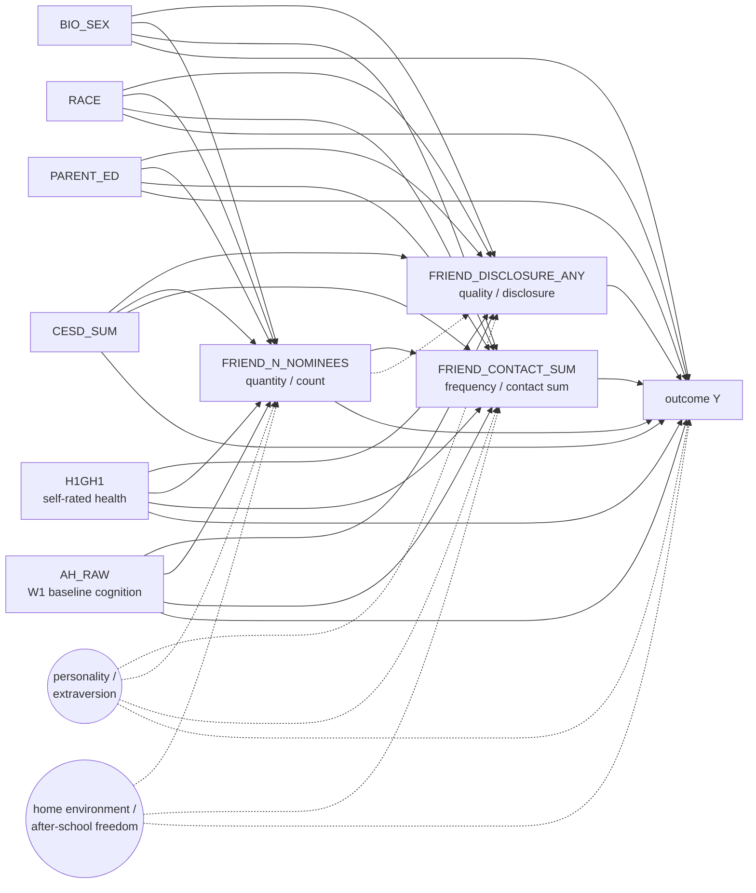

# DAG-QvQ v0.1 — friendship quality vs. quantity vs. frequency, sample-wide

**Used by:** [friendship-quality-vs-quantity](README.md). **Status:** planned (v0.1, 2026-04-26).

## Construct distinction

Three theoretically orthogonal friendship constructs from the W1 in-home interview's friendship-grid module:

- **`FRIEND_DISCLOSURE_ANY` = quality** (binary, "did you talk to any nominated friend about a problem this past week?"). Indicator of close-tie disclosure / confidant relationship.
- **`FRIEND_N_NOMINEES` = quantity** (count, 0–10). Sheer friend count.
- **`FRIEND_CONTACT_SUM` = frequency** (sum across nominees of contact items). Total interaction volume, dominated by the nominee count but with frequency-per-nominee weighting.

The hypothesis is **opposing-sign** by outcome domain: quality wins for mental-health (`H5MN1`, `H5MN2`); quantity wins for SES (`H5LM5`, `H5EC1`); frequency is a mostly-redundant alternative to quantity.

## DAG (per outcome — generic schematic)

**Why we fit all three exposures JOINTLY (same regression):** The three are theoretically distinct constructs but empirically correlated (more friends → more total contact; more friends → higher chance of having ≥1 confidant). The joint fit makes each β̂ the **marginal effect of its exposure conditional on the other two** — exactly the within-respondent decomposition the quality-vs-quantity hypothesis demands. The contrast "quality wins for mental health, quantity wins for SES" is then a sign-pattern check across the per-outcome `(β_qual, β_quan, β_freq)` triple.

## Per-outcome DAG inheritance (sample-wide variant)

Same per-outcome adjustment set as in `popularity-vs-sociability/dag.md`, but the sample frame is the **full W1 in-home cohort** (no within-saturated-schools restriction; the friendship-grid exposures are universal in W1 in-home).

| Outcome group | Outcomes | Source DAG | Adjustment set |
|---|---|---|---|
| Cognitive | `W4_COG_COMP` | [`DAG-Cog v1.0`](../cognitive-screening/dag.md) | L0 + L1 + AHPVT |
| Cardiometabolic | `H4BMI`, `H4WAIST`, `H4SBP`, `H4DBP`, `H4BMICLS` | `DAG-CardioMet` *(planned)* | L0 + L1 + AHPVT (provisional) |
| Mental health | `H5MN1`, `H5MN2` | `DAG-Mental` *(planned)* | L0 + L1 (with `CESD_SUM` per Option A) |
| Functional | `H5ID1`, `H5ID4`, `H5ID16` | `DAG-Functional` *(planned)* | L0 + L1 |
| SES | `H5LM5`, `H5EC1` | `DAG-SES` *(planned, see [ses-handoff/dag.md](../ses-handoff/dag.md))* | L0 + L1 (**no AHPVT** — mediator) |

## Estimand wording (use verbatim in reports)

> Among Add Health respondents in the full W1 in-home cohort, conditional on each outcome's per-DAG adjustment set, a one-unit increase in `FRIEND_DISCLOSURE_ANY` (resp. `FRIEND_N_NOMINEES`, resp. `FRIEND_CONTACT_SUM`) — **holding the other two friendship measures fixed** — is associated with a β-unit change in outcome *Y*. The sign pattern across the triple is the experiment's primary inferential target; the quality-vs-quantity hypothesis predicts (β_qual > β_quan, β_qual > β_freq) for mental-health outcomes and the reverse pattern for SES outcomes.

## Known weak points (load-bearing assumptions)

- **Personality / extraversion is unmeasured** (same caveat as `popularity-vs-sociability`).
- **Home environment / after-school freedom** is an unmeasured confounder driving both quantity/frequency (parental restrictiveness limits friend interaction) and several outcomes. Not separable in public-use data.
- **`FRIEND_CONTACT_SUM` is mechanically dominated by `FRIEND_N_NOMINEES`** (it's a sum *across* nominees). The joint fit handles this by giving β̂_freq the marginal-conditional-on-quantity interpretation, but if the variance ratio is too lopsided, β̂_freq may be unstable. Drop-one sensitivity flags this.
- **Sample-frame mismatch with network-derived experiments**: this experiment's full-cohort N (~4,700) is much larger than within-saturated-schools (~2,000). β estimates are *not* directly comparable to cognitive-screening / popularity-vs-sociability β estimates without explicit reweighting; do not put them in the same heatmap without a sample-frame annotation.

## Variants

- `DAG-QvQ-Separate` *(NOT used as primary)* — three separate regressions, one per exposure. Reported as a sensitivity-only contrast in the report; the primary estimand requires the joint-fit specification because the constructs are correlated.

## Index entry (for `reference/dag_library.md`)

> **DAG-QvQ v0.1** — Joint-fit head-to-head of three W1 friendship-grid exposures (`FRIEND_DISCLOSURE_ANY`, `FRIEND_N_NOMINEES`, `FRIEND_CONTACT_SUM`) → all 13 outcomes; per-outcome adjustment-set inheritance; sample-wide W1 in-home cohort (no saturation gate). Each β̂ is the marginal effect conditional on the other two friendship measures. → [`experiments/friendship-quality-vs-quantity/dag.md`](../../experiments/friendship-quality-vs-quantity/dag.md)

## Changelog
- **2026-04-26** — Created. v0.1 drafted from user's "Priority 1 — Type-of-tie" plan; joint-fit specification locked as the primary.
