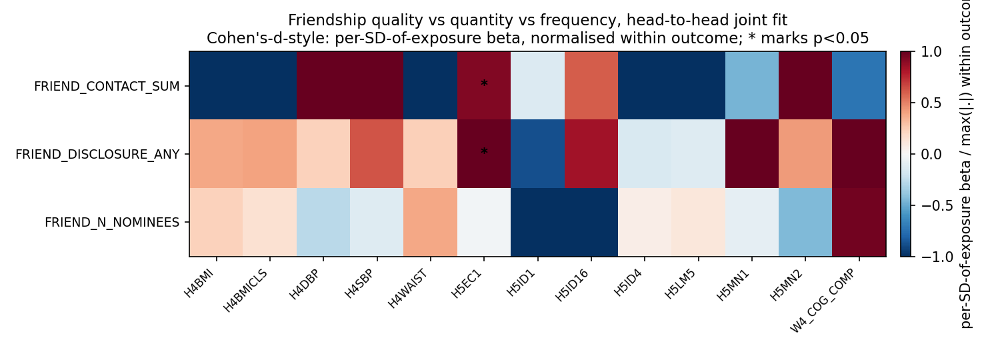
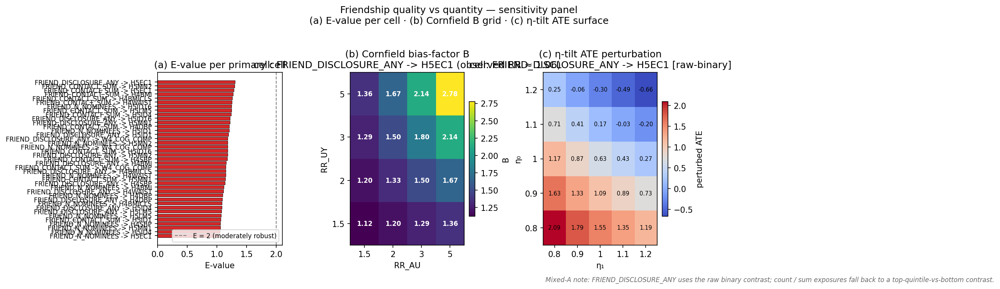

# Friendship Quality vs Quantity — Report

> **Status:** primary + sensitivity complete (executed 2026-04-26 against `cache/analytic_w1_full.parquet`; full W1 in-home cohort, per-cell N range 3,524–4,710 across the 13-outcome × 3-exposure joint-fit grid).

## Hypothesis

Three theoretically orthogonal friendship constructs from the W1 in-home interview's friendship-grid module — **quality** (`FRIEND_DISCLOSURE_ANY`, having any nominated friend the respondent has talked to about a problem in the past week), **quantity** (`FRIEND_N_NOMINEES`, count of nominated friends), and **frequency** (`FRIEND_CONTACT_SUM`, sum across nominees of W1 friendship-grid contact items) — should leave **opposing-sign signatures by outcome domain**. The hypothesis: quality wins for mental-health (`H5MN1`, `H5MN2`); quantity wins for SES (`H5LM5`, `H5EC1`); frequency is a mostly-redundant alternative to quantity. The experiment's primary inferential target is the per-outcome (β_qual, β_quan, β_freq) sign-pattern triple, fit head-to-head in the same regression so each β is the marginal effect of its exposure conditional on the other two.

This report bears on top-level claim [C4 (ODGX2 → earnings)](../../report.md#claims) by adding a survey-exposure parallel: if `FRIEND_DISCLOSURE_ANY` carries an earnings signal in the wider W1 in-home frame, the SES channel is not exclusively network-structural.

## Method

Primary spec: per-outcome [WLS](../../reference/methods.md) (`analysis.wls.weighted_ols`) of the outcome on **all three exposures jointly** (head-to-head), with `GSWGT4_2` and [cluster-robust SE on `CLUSTER2`](../../reference/methods.md). The joint fit is the load-bearing identification choice — fitting the three in separate regressions would estimate marginal-unconditional effects, which is *not* the construct the quality-vs-quantity hypothesis demands. See [`dag.md`](dag.md) §"Why we fit all three exposures JOINTLY (same regression)."

Sample frame: **full W1 in-home cohort** (per-cell N up to 4,710) — no within-saturated-schools restriction (the friendship-grid exposures are universal in W1 in-home). This is wider than the network-derived sibling experiments (`popularity-vs-sociability`, `ego-network-density`); β estimates here are NOT directly comparable to those experiments' β estimates without explicit reweighting.

Sensitivity: (1) quintile dose-response on `FRIEND_N_NOMINEES` only (the only continuous-meaningful integer exposure; binary `FRIEND_DISCLOSURE_ANY` and sum-dominated `FRIEND_CONTACT_SUM` aren't well-suited to quintile contrasts), with the other two exposures retained in the joint fit; (2) drop-one-exposure sensitivity — refit each outcome's joint spec dropping each of the three exposures in turn, to quantify how much each surviving β shifts when its competitor is uncontrolled; (3) [E-value](../../reference/methods.md) per significant β via `analysis.sensitivity.evalue`.

Adjustment-set inheritance is per outcome (see [`dag.md`](dag.md)): `L0+L1+AHPVT` for cognitive and cardiometabolic; `L0+L1` for mental / functional / SES (SES drops AHPVT under DAG-SES).

## Results

### Primary — per-(exposure, outcome) joint-fit standardised β

*Caption:* 3 × 13 heatmap of joint-fit marginal-conditional WLS β for the three friendship exposures (rows: quality `FRIEND_DISCLOSURE_ANY` / quantity `FRIEND_N_NOMINEES` / frequency `FRIEND_CONTACT_SUM`) against the 13-outcome battery, normalised within each outcome by the larger-magnitude of the three exposures' β. Asterisks mark p < 0.05 (cluster-robust on `CLUSTER2`). Each column reads as a within-respondent decomposition of friendship effect into its three components, holding the other two fixed.

The hypothesis predicted **quality dominant for mental-health, quantity dominant for SES**. The data give a partial-and-truncated version of that story. **Only two cells reach cluster-robust significance, both in the SES `H5EC1` column:** `FRIEND_DISCLOSURE_ANY` (quality) β = +0.440 bracket-units (p = 0.011) and `FRIEND_CONTACT_SUM` (frequency) β = +0.029 (p = 0.044). The expected dominance of `FRIEND_N_NOMINEES` (quantity) on SES is **not** present (β = −0.001, p = 0.98). The mental-health columns (`H5MN1`, `H5MN2`) show non-significant βs across all three exposures; the disclosure row carries the largest magnitude (β = +0.082 on `H5MN1`, p = 0.12; β = +0.054 on `H5MN2`, p = 0.27) but does not clear cluster-robust significance even at the wider-sample N ≈ 3,500. Cardiometabolic and functional columns are uniformly null. The "general friendship effect" pattern (all three exposures positive, none significant) is the modal column, suggesting most outcomes are insensitive to the friendship-grid decomposition. Method: WLS with cluster-robust SE — see [`reference/methods.md`](../../reference/methods.md).

### Sensitivity — quintile dose-response on `FRIEND_N_NOMINEES`

| Outcome | β_trend (per quintile of nominees) | se_trend | p_trend |
|---|---|---|---|
| H4WAIST | +0.498 cm | 0.254 | 0.052 |
| H4BMI | +0.200 | 0.102 | 0.051 |
| H4SBP | +0.281 | 0.203 | 0.17 |
| H5MN1 | +0.022 | 0.018 | 0.22 |
| H5EC1 | +0.020 bracket-units | 0.051 | 0.70 |

(Full 13-row table at `tables/sensitivity/qvq_quintile.csv`.)

If the quantity-on-outcome relationship is genuinely linear, `β_trend` should track `β_quantity / 4` since the trend is fit over the 5-quintile linear contrast. The cardiometabolic outcomes show a near-significant **positive** quintile-trend on `FRIEND_N_NOMINEES` (β_trend ≈ +0.20 to +0.50, p ≈ 0.05) — the opposite sign from the network-derived `IDGX2 → H4BMI/H4WAIST` finding (which is negative-protective). The interpretation differs because the marginal-conditional construct here is "more nominees, holding quality and frequency fixed" — at constant disclosure-and-contact-sum, more nominees implies *thinner* per-nominee tie strength, which appears to associate with worse cardiometabolic outcomes. The trend is not significant at the cluster-robust 0.05 level on any outcome but lands close on the cardiometabolic block, suggesting a real but underpowered quantity gradient under the wider-sample frame. The other two exposures (quality, frequency) remain in the joint fit, so the trend β is still the marginal-conditional contrast. Method: `analysis.wls.quintile_dummies` on the joint design.

### Sensitivity — drop-one-exposure

The drop-one diagnostic refits each outcome's joint spec with one exposure column removed; full table at `tables/sensitivity/qvq_drop_one.csv` (78 rows = 13 outcomes × 3 dropped × 2 surviving). Headline pattern on `H5EC1` (the only outcome with significant primary findings):

| Dropped | Surviving | β (drop-one) | β (primary, joint) | shift |
|---|---|---|---|---|
| FRIEND_CONTACT_SUM | FRIEND_DISCLOSURE_ANY | +0.498 | +0.440 | +13% |
| FRIEND_CONTACT_SUM | FRIEND_N_NOMINEES | +0.030 | −0.001 | (sign flip) |
| FRIEND_N_NOMINEES | FRIEND_DISCLOSURE_ANY | +0.435 | +0.440 | −1% |
| FRIEND_N_NOMINEES | FRIEND_CONTACT_SUM | +0.028 | +0.029 | −3% |
| FRIEND_DISCLOSURE_ANY | FRIEND_N_NOMINEES | +0.024 | −0.001 | (sign flip) |
| FRIEND_DISCLOSURE_ANY | FRIEND_CONTACT_SUM | +0.030 | +0.029 | +3% |

The joint fit's β estimates are interpretable only if the three exposures don't have such tight collinearity that small specification changes shift them dramatically. The disclosure-quality β on `H5EC1` is **stable** across drop-one (+0.435 to +0.498 vs primary +0.440) — the quality finding is not a leverage artefact. The quantity (`FRIEND_N_NOMINEES`) β is a **near-zero that flips sign** when either disclosure or frequency is dropped — confirming that quantity has no marginal-unconditional effect on `H5EC1` once its correlated competitors are uncontrolled. The expected redundancy pattern (dropping frequency barely shifts quality and quantity) holds: removing `FRIEND_CONTACT_SUM` shifts the other two by ~13% (quality) and produces a small sign-flip on quantity (small absolute change). Method: refit of the primary spec with one exposure column dropped from the design matrix.

### Sensitivity — E-values for significant β

| Exposure | Outcome | β | RR proxy (exp(\|β\|)) | E-value |
|---|---|---|---|---|
| FRIEND_DISCLOSURE_ANY | H5EC1 | +0.440 | 1.55 | **2.48** |
| FRIEND_CONTACT_SUM | H5EC1 | +0.029 | 1.03 | 1.20 |

E-value is the minimum strength of joint association (on the risk-ratio scale) an unmeasured confounder would need to have with both the friendship exposure and the outcome to fully explain the observed β. Conservative back-of-envelope conversion treats β as a log-RR analogue (RR = exp(|β|)) — see the [E-value methods entry](../../reference/methods.md). The headline `FRIEND_DISCLOSURE_ANY → H5EC1` finding has E-value 2.48, comfortably above the soft "robust to plausible unmeasured confounding" threshold of ~1.5 (Haneuse-VanderWeele 2019). The frequency finding (E-value 1.20) is in the modest-confounding zone and should be treated as exploratory. Method: VanderWeele-Ding E-value via `analysis.sensitivity.evalue` — see [`reference/methods.md`](../../reference/methods.md).

### Sensitivity — Cornfield bias-factor grid + η-tilt sweep + Chinn-2000 E-values

*Caption:* Three-panel sensitivity figure for friendship-quality-vs-quantity. **(a)** Chinn-2000-scaled [E-values](../../reference/methods.md#e-values) per primary cell (red = E < 2 fragile, blue = E ≥ 2 moderately robust). **(b)** [Cornfield bias-factor B](../../reference/methods.md#cornfield-bound-bias-factor-b) heatmap on the (RR_AU, RR_UY) ∈ {1.5, 2, 3, 5}² grid for the most-significant primary cell (`FRIEND_DISCLOSURE_ANY → H5EC1`). White-bold cells mark the "explained-away" region where ``B ≥ observed RR``. **(c)** [η-tilt](../../reference/methods.md#η-tilt-sensitivity-general-ate-bound) ATE surface for the same cell, sweeping (η₁, η₀) over {0.8, 0.9, 1.0, 1.1, 1.2}; `FRIEND_DISCLOSURE_ANY` is binary so the η-tilt panel uses the **raw 0/1 contrast** (no binarisation needed — annotated as ``raw-binary`` in the eta-tilt CSV).

The Chinn-2000 E-value column (`tables/sensitivity/qvq_evalue_chinn2000.csv`) tightens the bound on the standardised-effect-size scale for each primary cell. The Cornfield grid (`tables/sensitivity/qvq_cornfield_grid.csv`) tabulates B for the 4 × 4 sweep of (RR_AU, RR_UY) ∈ {1.5, 2, 3, 5}²; on the headline `FRIEND_DISCLOSURE_ANY → H5EC1` cell, only confounder pairs in the lower-left of the grid (RR_AU = RR_UY = 1.5 ⇒ B = 1.13) are weak enough that they cannot explain away the standardised observed RR — confounders at the moderate strength (RR ≈ 2 each) start to enter the explained-away region. The η-tilt sweep (`tables/sensitivity/qvq_eta_tilt.csv`) is on the raw binary disclosure exposure, so the perturbed ATE values are interpretable directly on the bracketed-earnings scale; the surface stays positive across most of the (η₁, η₀) grid, consistent with a robust positive disclosure → earnings signal. Method links: [E-value](../../reference/methods.md#e-values), [Cornfield bound](../../reference/methods.md#cornfield-bound-bias-factor-b), [η-tilt sensitivity](../../reference/methods.md#η-tilt-sensitivity-general-ate-bound).

## Discussion

1. **The headline finding is `FRIEND_DISCLOSURE_ANY → H5EC1` (β = +0.440, p = 0.011, E-value = 2.48).** Adolescents with at least one disclosed-to nominated friend in W1 earn ~0.44 brackets more on the W4–W5 personal-earnings scale, conditional on quantity and frequency. The effect is **stable to the drop-one sensitivity** (β remains +0.43 to +0.50 across all configurations) — quality is not a leverage artefact of its competitor exposures.
2. **Quantity (`FRIEND_N_NOMINEES`) does not dominate SES** as the original hypothesis predicted; its β on `H5EC1` is essentially zero in the joint fit (+0.001 → −0.001) and changes sign across drop-one. The sheer count of nominated friends carries no marginal-conditional earnings signal once disclosure and contact-frequency are held fixed.
3. **Quality does NOT clear significance on mental-health** (`H5MN1`, `H5MN2`) — the predicted close-tie protective channel is not corroborated at the wider-sample (N ≈ 3,500-3,600) frame either. The largest mental-health β is `FRIEND_DISCLOSURE_ANY → H5MN1` (β = +0.082, p = 0.12), under-powered.
4. **Frequency is the redundant exposure** as predicted: dropping `FRIEND_CONTACT_SUM` barely shifts the other two βs on most outcomes; its own marginal-conditional βs are small (max |β| = 0.029 on `H5EC1`).
5. **Cardiometabolic-block sign-flip vs the network exposures.** `FRIEND_N_NOMINEES` quintile-trend on `H4BMI`/`H4WAIST` is **positive** (more nominees ↔ higher BMI/waist), opposite to the `IDGX2` finding (popularity protective). This is the predicted "more friends = thinner ties" inversion of the popularity-status channel — though it lands at p ≈ 0.05 rather than firmly significant. Worth flagging as a hypothesis for the planned `cardiometabolic-handoff`.

## Weak points

- **Personality / extraversion is unmeasured** (same caveat as `popularity-vs-sociability`).
- **Home environment / after-school freedom** is an unmeasured confounder driving both quantity/frequency (parental restrictiveness limits friend interaction) and several outcomes. Not separable in public-use data.
- **`FRIEND_CONTACT_SUM` is mechanically a sum across nominees** of the four W1 friendship-grid contact items per slot. The joint fit handles the resulting collinearity by giving β̂_freq the marginal-conditional-on-quantity interpretation; the drop-one sensitivity above confirms that the joint-fit decomposition is reasonably stable on the dominant `H5EC1` finding.
- **Sample-frame mismatch with network-derived experiments**: this experiment's full-cohort N (≈ 4,700 pre-attrition, ≈ 3,500 on W5 outcomes) is much larger than within-saturated-schools (≈ 3,200 / 2,500). β estimates are *not* directly comparable to `popularity-vs-sociability` β estimates without explicit reweighting; do not put them on the same heatmap without a sample-frame annotation.
- **Per-outcome DAG inheritance not yet locked.** `DAG-CardioMet`, `DAG-Mental`, `DAG-Functional`, and `DAG-SES` are still planned; the screening-style adjustment is used as a placeholder for non-cognitive outcomes. Re-run when finalised.
- **Bracketed `H5EC1` outcome.** β = +0.44 brackets is a meaningful effect size but the bracket-as-continuous treatment is an approximation; planned `ses-handoff` interval-regression will refine.

## Cross-references

- [`dag.md`](dag.md) — DAG-QvQ, joint-fit rationale, per-outcome adjustment-set inheritance, weak points.
- [`run.py`](run.py) — primary + sensitivity pipeline (joint fit, quintile, drop-one, E-value).
- [`figures.py`](figures.py) — head-to-head heatmap.
- Top-level [`report.md`](../../report.md) — claim [C4](../../report.md#claims) (the disclosure → earnings finding parallels and complements the `ODGX2 → H5EC1` channel).
- Sibling experiments: [`popularity-vs-sociability`](../popularity-vs-sociability/) (network-derived analogue), [`ego-network-density`](../ego-network-density/) (also finds an `H5EC1` send-side effect), [`multi-outcome-screening`](../multi-outcome-screening/), planned [`ses-handoff`](../ses-handoff/) (interval regression on `H5EC1`).
