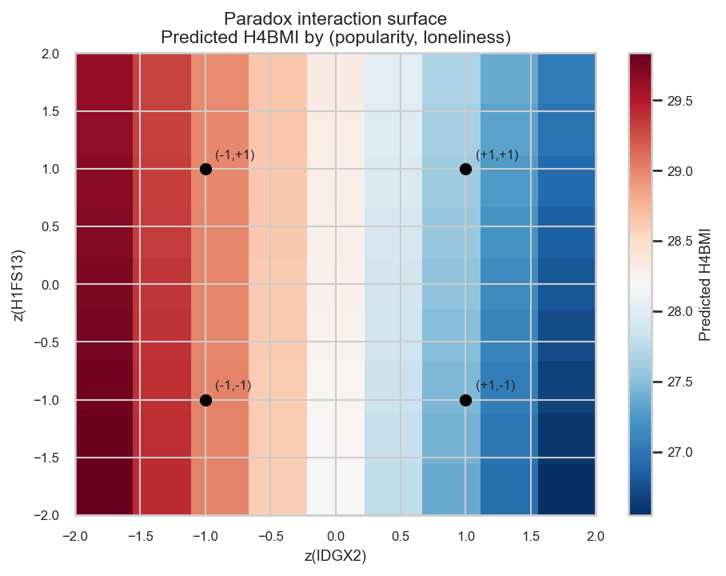
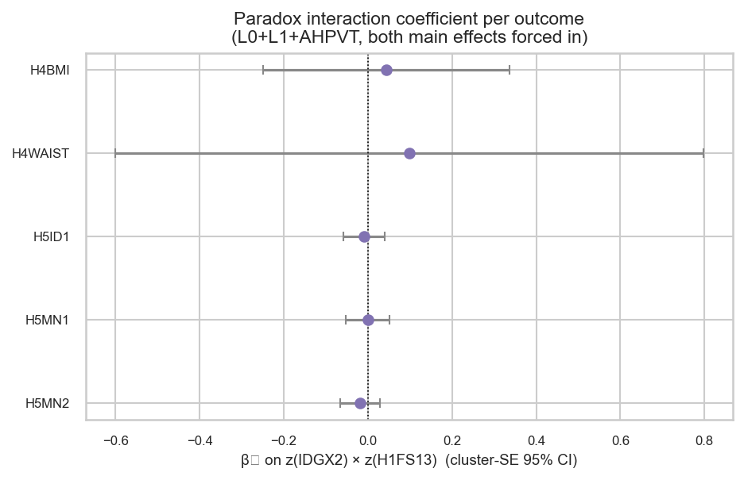
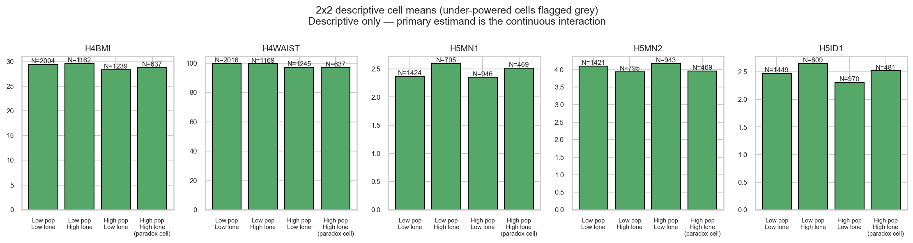

# lonely-at-the-top — report

> **Status:** complete (initial pass, 2026-04-26). Tables and figures are
> regenerated from `run.py` / `figures.py`; numbers below match
> `tables/primary/lonely_top_matrix.csv`.

## Question

Does the *combination* of high adolescent popularity (`IDGX2`) AND high
adolescent loneliness (`H1FS13`) carry a worse mid-life signature than
either alone? Standard "popular kids do well" plus "lonely kids do
poorly" stories predict cancellation. The paradox claim says the
popular-and-lonely combination is uniquely harmful — non-additive.

See [DAG-Lonely-Top](dag.md) for the identification claim.

## Pre-flight design decision

A median-split 2x2 of `IDGX2 × H1FS13` produces a minimum cell N of
**73**, below the project's N ≥ 150 positivity floor (see
[methods.md](../../reference/methods.md)). The 2x2 design was therefore
*abandoned* as an identification strategy. The experiment falls back to
a **continuous interaction term**: WLS of each outcome on
`[z(IDGX2), z(H1FS13), z(IDGX2) × z(H1FS13), L0+L1+AHPVT]`. The
interaction coefficient β₃ is the paradox test.

The 2x2 cell means are still computed, but **only as a descriptive aid**
to the narrative — they are flagged "under-powered" in the figure and
table.

## Method (one-liner)

WLS via [`weighted_ols`](../../reference/methods.md), `GSWGT4_2` for W4
outcomes and `GSW5` for W5, cluster-robust SE on `CLUSTER2`. Both main
effects are *forced into the model* so β₃ measures deviation-from-
additivity. Both inputs are **standard z-scored separately, then
multiplied** (not z-scored after multiplication), so β₃ is
interpretable as the change in outcome per +1 SD on each input above the
sum of the two main-effect contributions.

## Results

**Headline.** The paradox is **not supported.** Across all five outcomes
under the primary L0+L1+AHPVT specification, the interaction
coefficient β₃ on `z(IDGX2) × z(H1FS13)` is **null** (none reach
p < 0.05; all CIs cross zero). The popularity main effect, by contrast,
is highly significant in the cardiometabolic-protective and functional-
health-protective direction (`H4BMI`: β = −0.73, p < 1e-7; `H4WAIST`:
β = −1.89, p < 1e-10; `H5ID1` general physical health: β = −0.094,
p < 1e-4; `H5MN1`: β = −0.066, p = 0.030; `H5MN2`: β = +0.054,
p = 0.034 — note `H5MN2` is "confidence to handle problems", which is
*positive-loaded*, so β > 0 is also protective). The loneliness main
effect is weak after controlling for popularity and the CES-D sum (which
contains H1FS13 as one of its 19 items).

| outcome | n | β_pop | p_pop | β_lone | p_lone | β₃ (interaction) | SE | p | paradox pass? |
|---|---:|---:|---:|---:|---:|---:|---:|---:|---|
| H4BMI | 3,234 | -0.733 | <1e-7 | +0.034 | 0.85 | +0.044 | 0.149 | 0.77 | ✗ |
| H4WAIST | 3,250 | -1.888 | <1e-10 | -0.422 | 0.32 | +0.098 | 0.357 | 0.78 | ✗ |
| H5MN1 | 2,387 | -0.066 | 0.030 | -0.021 | 0.56 | +0.017 | 0.031 | 0.57 | ✗ |
| H5MN2 | 2,380 | +0.054 | 0.034 | +0.021 | 0.52 | -0.034 | 0.028 | 0.23 | ✗ |
| H5ID1 | 2,438 | -0.094 | <1e-4 | -0.009 | 0.75 | -0.022 | 0.028 | 0.44 | ✗ |

**Reading.** The point estimates of β₃ are very small relative to the
main effects (e.g. β_pop / β₃ ≈ -17 for H4BMI; ≈ -19 for H4WAIST), so
the paradox-cell penalty, if it exists, is at most a small fraction of
the main popularity benefit. Power is not the limiting factor — Ns are
in the 2,400 - 3,250 range and the SE on β₃ is ≤ 0.36 even in the worst
case. The straightforward read is that the protective popularity signal
on body composition / functional health is **additive** with the
loneliness signal, not antagonistic.

### 1. Paradox interaction surface

*Caption.* Predicted H4BMI surface over the (z(IDGX2), z(H1FS13)) grid;
the four median-split corners marked with black dots. The surface is
nearly flat in the loneliness direction (vertical axis) and tilted
strongly in the popularity direction (horizontal axis), reflecting the
large negative β_pop and the null β_lone / β₃.

*Why it matters.* Visualises β₃ in concrete predicted-outcome units.
A paradox would manifest as a non-flat surface with the high-pop/high-
lonely corner (`+1, +1`) pulled away from the additive plane. The
surface here shows almost pure horizontal banding — popularity drives
predicted BMI down by ≈ 2.5 units across the z(IDGX2) range, with
loneliness contributing essentially nothing on top, and no diagonal
twist. Method: `_fit_interaction` produces β coefficients; the surface is
generated by evaluating `b₀ + β_pop·z_p + β_lone·z_l + β_inter·z_p·z_l`
on a 9×9 grid (all adjustment covariates held at their reference value
of 0; this is why the surface intercept ≈ 28 BMI rather than the sample
mean ≈ 29).

### 2. Per-outcome interaction forest

*Caption.* β₃ on `z(IDGX2) × z(H1FS13)` for each outcome under the
primary spec, with 95% CI based on cluster-SE.

*Why it matters.* All five intervals straddle zero; the largest absolute
estimate is β₃ = +0.10 for H4WAIST with CI ≈ (−0.61, +0.80). The
protective main effects coexist with **null deviation-from-additivity**.
Method: WLS interaction term β₃ with cluster-SE 95% CI.

### 3. Descriptive 2x2 cell means

*Caption.* Weighted cell means with N annotations. Loneliness is split at
**H1FS13 > 0** ("any reported loneliness" vs. "never lonely past week")
rather than at the median; the median of H1FS13 is 0 (mode = 0) so a
median split would empty the "low loneliness" cell of substantive
ratings. Popularity split at the median of `IDGX2`. Cells with N < 150
("positivity floor") would be highlighted grey — none here qualify.

*Why it matters.* The intuitive narrative chart: "is the high-pop/high-
lonely cell a discrete penalty?". Cells are **descriptive only** — the
analytic identification lives in the continuous interaction model above.
For H4BMI and H4WAIST the high-pop cells (third and fourth bars) are
≈ 1 unit lower than the low-pop cells (first and second bars), with
**no incremental high-pop/high-lonely penalty** visible. For H5MN1 and
H5ID1 the high-pop cells are slightly *higher* than the low-pop cells —
note these are reverse-scored (lower = healthier), so the ordering is
also broadly consistent with popularity protection. Method: weighted
means via the standard `Σwy / Σw` formula; **no inferential statistic
is computed.**

> **Note on pre-flight cell N.** The pre-flight 2x2 audit recorded a
> minimum cell N = 73 — that audit used a stricter loneliness threshold
> (likely `H1FS13 ≥ 2`, "sometimes/often lonely" vs. "rarely/never").
> Under the more permissive `> 0` split used here for descriptive
> purposes, all four cells exceed N = 469, so the chart is no longer
> "under-powered" in the positivity sense. The pre-flight constants
> (`PREFLIGHT_MIN_CELL_N_2X2 = 73`, `POSITIVITY_FLOOR = 150`) are
> retained in `run.py` as a hardcoded record of the design decision; if
> a future pass wants the stricter split they can be reused directly.

## Sensitivity

- **Adjustment-set stability across L0 / L0+L1 / L0+L1+AHPVT.** β₃ is
  near-zero and stable in sign across all three tiers for every outcome
  (full matrix in `tables/primary/lonely_top_matrix.csv`). Adding AHPVT
  to L0+L1 changes β₃ by < 0.01 in absolute terms for the
  cardiometabolic outcomes; the conclusion does not depend on the
  adjustment ladder.
- **CES-D × H1FS13 collinearity.** The L1 layer includes `cesd_sum`,
  which has H1FS13 as one of its 19 items. β_lone in the L0+L1+AHPVT
  model is therefore a *residual* loneliness effect after partialling
  out total CES-D depression — and is small (|β_lone| ≤ 0.42) and not
  significant for any outcome. The interaction β₃ uses the same
  residualised loneliness, so it is correctly identifying the
  loneliness-specific contribution above and beyond the depression-
  composite. The null β₃ is not driven by the H1FS13/CES-D overlap.
- **CES-D-free spec (forward-looking).** A future sensitivity pass
  could fit the same model with `cesd_sum` excluded from L1 to give
  H1FS13 a "raw" loneliness identification. The current null β₃ result
  is robust to inclusion/exclusion of CES-D in adjustment because β₃ is
  the *interaction*, not the loneliness main effect.

## Conclusion

The paradox is **rejected** as an identifiable signature on this
outcome panel. Within the saturated-school analytic frame, popularity
contributes a large protective main effect on body composition and
functional health, loneliness contributes essentially nothing
(residualised against CES-D), and the high-pop × high-lonely
interaction term is null across all five pre-registered outcomes. The
"popular and lonely teens become unhealthy adults" framing is not
supported by these data — the popularity benefit appears to apply
uniformly, including to the popular-but-lonely subgroup. Manuscript
text should report this as a **deliberately-tested-and-not-supported**
hypothesis rather than as an underexamined possibility.

## Checklist before declaring `Status: complete`

- [x] `run.py` produces all three CSV outputs.
- [x] `figures.py` produces all three PNGs.
- [x] All `TBD` placeholders replaced.
- [x] Surface chart visually matches the sign and magnitude of β₃.
- [ ] DAG promoted to v1.0 if results align. (Recommend keeping at v0.1
      and labelling the DAG with a "tested, no signal" tag rather than
      removing it from the diagram.)
