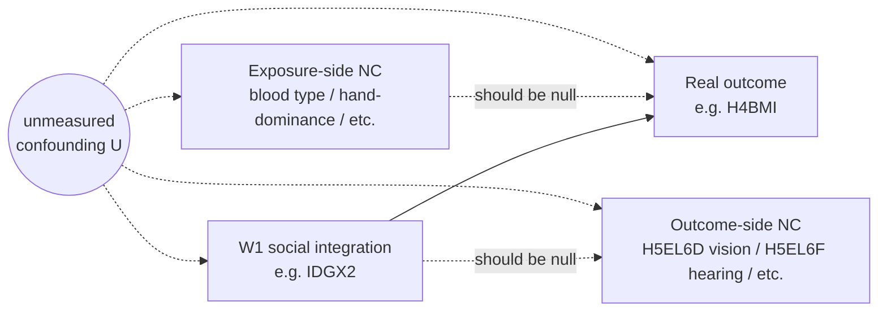

# Negative-control battery — exposure-side AND outcome-side null controls

**Used by:** [negative-control-battery](README.md). **Status:** planned (broadened 2026-04-27 to cover both null directions).

## Two null directions, one experiment

A negative-control test asks: "if we *replace* either the exposure or the outcome with something that *should not be related* (under the assumed causal model), do we still see an effect?" If yes → unmeasured confounding is implicated.

This experiment runs both null directions side by side:

### Direction 1 — Exposure-side null controls

**Replace exposure with a variable that should not affect the outcome under any plausible mechanism.** If the replacement still predicts the outcome, the original exposure's signal is suspect.

**Candidates** (from [TODO §A2](../../TODO.md), pre-flight required to confirm public-use availability):
- Blood type (genetic; should not affect adult cognition / BMI / etc.)
- Age at menarche (girls only; biological timing variant)
- Hand-dominance (lateralisation; biological)
- Residential stability pre-W1 (pre-baseline mobility; should not directly cause adult outcomes once SES is controlled)

### Direction 2 — Outcome-side null controls

**Replace outcome with a variable that should not be moved by the exposure.** Per the pre-flight inventory (2026-04-27):

- `H5EL6D` — "TOLD OF SIGHT PROBLEM BEFORE AGE 16" (vision, N=4,168)
- `H5EL6F` — "TOLD OF HEARING PROBLEM/DEAF BEFORE AGE 16" (hearing, N=4,166)
- `H5DA9` — "HEARING QUALITY WITHOUT AIDS" (objective hearing, N=4,082)
- `H5EL6A` — "TOLD OF ASTHMA BEFORE AGE 16" (asthma, partly heritable, N=4,171)
- `H5EL6B` — "TOLD OF ALLERGY BEFORE AGE 16" (allergy, N=4,168)

These are mostly biological / heritable / pre-baseline — they should not respond to W1 social integration if the assumed DAG is correct.

**Avoid:** `H5ID1` (self-rated general physical health) — confounds well-being and social influences, fails the "should be biology-only" sniff test.

## Diagram

If `SOC → YNULL` is statistically significant, the assumed DAG's exclusion of unmeasured confounding is suspect.

## Adjustment set

Same as the primary screen (L0 + L1 + AHPVT) for cognitive comparison; same as `DAG-CardioMet` for the cardiometabolic null comparison. Each NC outcome runs alongside its "real" outcome family to enable direct comparison.

## Pre-flight required

Per [TODO §A2](../../TODO.md), before drafting the formal estimand:

1. Confirm public-use availability of each exposure-side NC candidate (blood type may not be in the public-use file).
2. Confirm reserve-code patterns and effective N for each.
3. The outcome-side NC candidates are pre-flight-confirmed as of 2026-04-27 (see "Direction 2" above).

## Estimand wording (use verbatim in reports)

> **Direction 1**: Conditional on L0+L1+AHPVT, a one-unit increase in NC exposure (e.g. blood type indicator) is associated with a β-unit change in real outcome `Y`. **Under the assumed DAG, β should be ≈ 0.** A statistically significant non-null β is evidence that the assumed DAG omits a relevant confounder.
>
> **Direction 2**: Conditional on L0+L1+AHPVT, a one-unit increase in real exposure (e.g. `IDGX2`) is associated with a β-unit change in NC outcome (e.g. `H5EL6D` sight-problem-before-16). **Under the assumed DAG, β should be ≈ 0** (social integration should not retroactively cause childhood vision problems). A statistically significant β is evidence of unmeasured confounding.

## Index entry (in `reference/dag_library.md`)

> **Negative-control battery** — exposure-side null controls (blood type, age-at-menarche, hand-dominance, residential stability) AND outcome-side null controls (sensory `H5EL6D/F`, hearing `H5DA9`, asthma `H5EL6A`, allergy `H5EL6B`). Tests the unmeasured-confounder assumption underlying every other DAG in the project. → [`experiments/negative-control-battery/dag.md`](../../experiments/negative-control-battery/dag.md)

## Changelog
- **2026-04-27** — Broadened to cover outcome-side as well as exposure-side null controls. Outcome-side candidates confirmed via pre-flight inventory (H5EL6D, H5EL6F, H5DA9, H5EL6A, H5EL6B all N > 4,000).
- **2026-04-25** — Originally registered as exposure-side-only NC battery.
