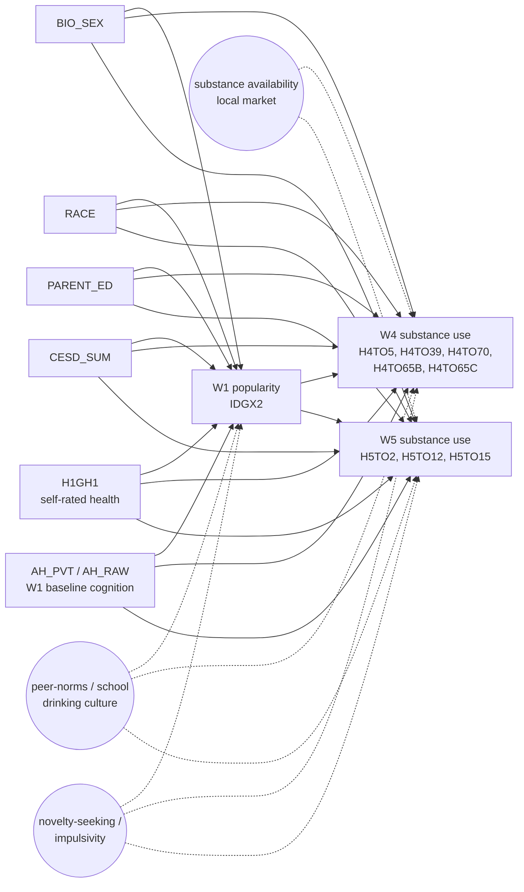

# DAG-DarkSide-Subst v0.1 — W1 popularity → W4/W5 substance use

**Used by:** [popularity-and-substance-use](README.md). **Date drafted:** 2026-04-26 (planned, not yet locked).

**Adjustment set (sufficient under back-door criterion, conditional on the
unmeasured-confounder assumption):** `{BIO_SEX, RACE, PARENT_ED, CESD_SUM,
H1GH1, AH_PVT}` = L0 + L1 + AHPVT. Inherited from `DAG-Cog` on the rationale
that the same demographic + W1 affective/somatic + baseline-cognition block
that closes back-door paths to cognition also closes them to substance use.

**Adjustment-set tiers used in the screen:**

| Tier | Variables | Identification role |
|---|---|---|
| L0 | `BIO_SEX`, `RACE`, `PARENT_ED` | Demographics; minimum acceptable |
| L0+L1 | + `CESD_SUM`, `H1GH1` | Blocks W1 affective / somatic state |
| L0+L1+AHPVT | + `AH_PVT` (or `AH_RAW`) | **Primary spec.** Trajectory-style adjustment for comparability with cognitive-screening |

**Why each measured covariate is in the set:**

| Variable | Closes which back-door |
|---|---|
| `BIO_SEX`, `RACE` | Demographic → both peer popularity AND adolescent/adult substance-use prevalence |
| `PARENT_ED` | Family SES → peer position AND parental supervision intensity → substance access |
| `CESD_SUM`, `H1GH1` | W1 affective and somatic state → both peer integration AND self-medication / risk-taking |
| `AH_PVT` | Baseline cognition; conditioning preserves comparability with cognitive-screening adjustment set |

**Predicted sign (inverse of cardiometabolic):**

> Under the project's "popularity is health-protective" reading of the
> cardiometabolic results, the standard prediction would be β ≤ 0 on
> substance-use outcomes too. **This experiment predicts the opposite:
> β > 0**, on the peer-influence-theory rationale that popular adolescents
> are differentially exposed to substance-use opportunities (parties,
> social drinking, etc.). A confirmed positive β would constitute an
> outcome-specificity inversion within the same exposure.

**Estimand wording (use verbatim in reports):**

> Among Add Health respondents in saturated schools, conditional on
> baseline W1 verbal IQ, demographics, and W1 affective/somatic state,
> a one-unit increase in `IDGX2` popularity is associated with a β-unit
> change in the substance-use outcome (frequency-of-use or
> ever-use scale per outcome label).

**Known weak points (load-bearing assumptions):**

- Unmeasured `PEER` (school-level drinking culture / peer-norm intensity):
  could confound popularity AND substance use. The within-saturated-schools
  restriction partially handles between-school PEER but not within-school
  PEER variation.
- Unmeasured `SENS` (novelty-seeking / impulsivity): the cleanest
  confounder candidate. AHPVT is a vocabulary measure and does not absorb
  this. **Sensitivity bound via E-value** (`analysis.sensitivity:evalue`)
  is the planned mitigation per [TODO §A7](../../TODO.md).
- Unmeasured `AVAIL` (local substance market): affects outcomes but should
  not affect popularity → not a back-door, more of an outcome-noise term.
- Reverse causation: heavy adolescent substance use could affect peer
  position. The W1 → W4/W5 temporal ordering is the principal defence;
  there is no plausible mechanism by which W4 cocaine use causes W1 in-degree.

**Variants:**

- A planned [`DAG-DarkSide-Subst-FrontDoor`](#) variant could try the
  three-equation front-door decomposition (`POP → "popularity-driven
  party-attendance proxy" → substance use`) once a usable mediator is
  identified in the codebook. Not yet attempted.

**Index entry (in `reference/dag_library.md` — to add):**

> **DAG-DarkSide-Subst v0.1** — W1 popularity (`IDGX2`) → W4/W5 substance
> use (smoking, drinking, marijuana, cocaine). Adjustment: L0+L1+AHPVT;
> predicts β > 0 (outcome-inversion of cardiometabolic protection). Used
> by `popularity-and-substance-use`. → [`experiments/popularity-and-substance-use/dag.md`](../../experiments/popularity-and-substance-use/dag.md)

## Changelog

- **2026-04-26** — Drafted v0.1 alongside the experiment scaffold. Not yet locked.
