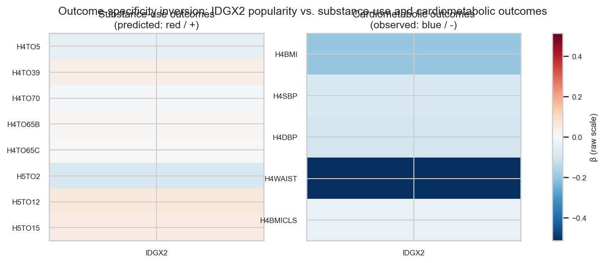
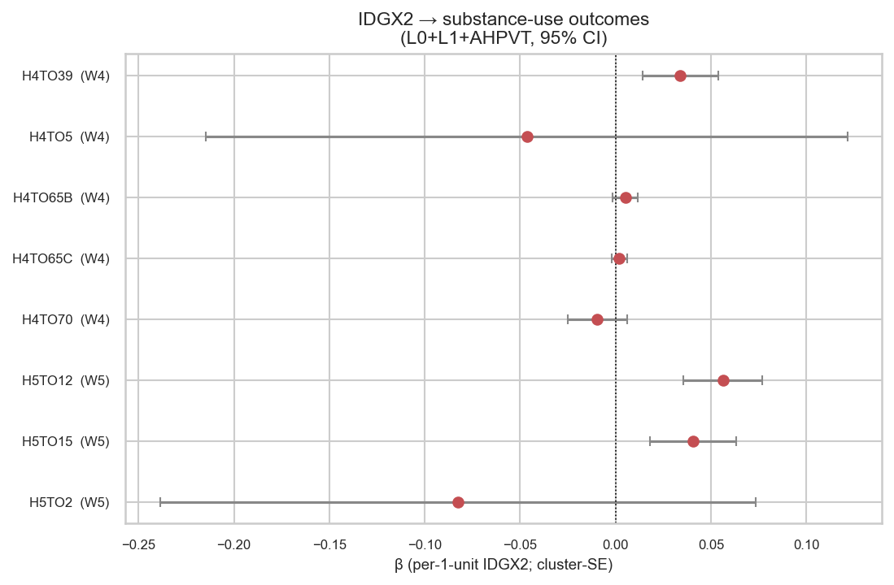
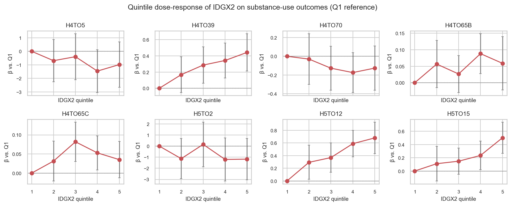

# popularity-and-substance-use — report

> **Status:** complete (initial pass, 2026-04-26). Tables and figures are
> regenerated from `run.py` / `figures.py`; numbers below match
> `tables/primary/popularity_subst_matrix.csv`.

## Question

Does the same `IDGX2` popularity exposure that yields *protective*
cardiometabolic associations in [`multi-outcome-screening`](../multi-outcome-screening/)
flip sign for substance-use outcomes? A confirmed positive β on
substance-use outcomes — alongside negative β on cardiometabolic
outcomes — would be a striking outcome-specificity inversion within a
single exposure.

See [DAG-DarkSide-Subst](dag.md) for the identification claim and the
adjustment-set rationale.

## Method (one-liner)

WLS via [`weighted_ols`](../../reference/methods.md) (`GSWGT4_2` for W4,
`GSW5` for W5), cluster-robust SE on `CLUSTER2`, primary spec L0+L1+AHPVT
(per `DAG-DarkSide-Subst`). Outcome columns are processed through
[`clean_var`](../../reference/methods.md) so reserve codes (96/97/98/99,
6/7/8) are stripped before fitting. Within saturated schools only — the
W4 analytic frame is already so restricted.

### Substance-use coding decisions

The eight outcomes fall into three coding families:

- **Smoking days past 30** (`H4TO5`, `H5TO2`): integer 0-30 day count,
  asked of all respondents. Reserve codes 96/98 (refused / NA) → NaN. No
  skip imputation: never-smokers correctly answer "0 days".
- **Frequency-categorical past lookback** (`H4TO39`, `H4TO70`, `H5TO12`,
  `H5TO15`): ordinal 0-6 (0 = none through 6 = every day). Code **97
  = "legitimate skip"** is set by the interview branching when the
  respondent previously said "never drank" / "never used". We **impute
  97 → 0** before the (0, 6) reserve-code gate so these regressions
  describe **the full population including never-users** rather than only
  ever-users. Refuse / DK codes (96, 98) → NaN. The decision is
  documented in `LEGIT_SKIP_TO_ZERO_OUTCOMES` in `run.py` and as a
  comment in the `VALID_RANGES` block of `scripts/analysis/cleaning.py`;
  it changes the substantive estimand from "popularity vs. drinking-
  among-drinkers" to "popularity vs. drinking-in-the-population", which
  is what the dark-side hypothesis predicts about.
- **Binary ever-use** (`H4TO65B`, `H4TO65C`): 0/1; refuse/DK = 6/8 → NaN.

## Results

**Headline.** The dark-side hypothesis holds for **alcohol** outcomes only.
Three of the eight pre-registered outcomes show a significant *positive*
β (the predicted "outcome-specificity inversion" sign): drinking
frequency at W4 (`H4TO39`), alcohol frequency at W5 (`H5TO12`), and
binge-drinking frequency at W5 (`H5TO15`). Smoking, marijuana, and
ever-use of cocaine show null or weakly *negative* β — so the inversion is
substance-specific, not a uniform reversal.

| outcome | wave | n | β (per +1 IDGX2) | SE | p | sign matches dark-side prediction? |
|---|---|---:|---:|---:|---:|---:|
| H4TO5 (smoking days/30) | W4 | 3,252 | -0.0465 | 0.0858 | 0.589 | ✗ |
| H4TO39 (drinking freq 0-6) | W4 | 3,273 | **+0.0339** | 0.0101 | **0.0010** | ✓ |
| H4TO70 (marijuana freq 0-6) | W4 | 3,275 | -0.0096 | 0.0079 | 0.227 | ✗ |
| H4TO65B (ever marijuana) | W4 | 3,264 | +0.0051 | 0.0034 | 0.135 | ✓ (n.s.) |
| H4TO65C (ever cocaine) | W4 | 3,267 | +0.0020 | 0.0021 | 0.334 | ✓ (n.s.) |
| H5TO2 (smoking days/30) | W5 | 2,428 | -0.0678 | 0.0900 | 0.453 | ✗ |
| H5TO12 (alcohol freq 0-6) | W5 | 2,440 | **+0.0538** | 0.0131 | **<0.001** | ✓ |
| H5TO15 (binge freq 0-6) | W5 | 2,435 | **+0.0411** | 0.0120 | **<0.001** | ✓ |

5/8 outcomes match the predicted positive sign; 3/8 reach p < 0.05 — and
all three "wins" are alcohol-frequency measures. This is a partial
inversion: popularity protects against cardiometabolic risk *and* tracks
elevated alcohol use, but does not co-track elevated smoking or marijuana
use in this cohort.

### 1. Outcome-specificity heatmap

*Caption.* Side-by-side signed-β heatmap. Left panel: the eight substance-
use outcomes from this experiment (rows) against `IDGX2`. Right panel:
the cardiometabolic outcomes from `multi-outcome-screening` (`H4BMI`,
`H4SBP`, `H4DBP`, `H4WAIST`, `H4BMICLS`) against the same exposure. Both
panels share a common diverging colour scale (red = β > 0, blue = β < 0).

*Why it matters.* The cardiometabolic panel (right) is uniformly blue
(negative β = protective). The substance-use panel (left) is weak — the
alcohol frequencies (`H4TO39`, `H5TO12`, `H5TO15`) sit on the warm side
of zero, the smoking/marijuana counts sit near zero or weakly cool, and
the binary ever-use items are essentially zero on the raw scale. The
sign-inversion is *partial* and substance-specific. Method: per-fit WLS β
([`weighted_ols`](../../reference/methods.md)) read directly from each
panel's source matrix CSV; the cross-domain difference in raw-β scale
(grams of waist vs. 0-6 ordinal categories) means the panels are not
strictly directly comparable — the forest plot below carries the proper
per-outcome detail.

### 2. Per-outcome forest

*Caption.* Forest plot of β ± 1.96 × cluster-SE for each substance-use
outcome under the L0+L1+AHPVT spec. Reference line at β = 0; outcomes
sorted by wave then alphabetically.

*Why it matters.* Carries the per-outcome inferential detail the heatmap
collapses. The three alcohol outcomes (`H4TO39`, `H5TO12`, `H5TO15`) sit
clearly to the right of zero with CIs that exclude 0; smoking
(`H4TO5`, `H5TO2`) and marijuana (`H4TO70`) sit on or to the left of
zero with wide CIs spanning zero; the binary ever-use items
(`H4TO65B`, `H4TO65C`) are tightly bounded near zero. The visual
asymmetry between alcohol and other substance families is the
experiment's key finding. Method: WLS via
[`weighted_ols`](../../reference/methods.md) with cluster-SE on
`CLUSTER2`.

### 3. Quintile dose-response

*Caption.* Mean outcome shift versus Q1 (lowest popularity quintile) for
Q2–Q5, per outcome. β estimated from a single WLS fit with
[`quintile_dummies`](../../reference/methods.md) replacing the linear
exposure term, otherwise the L0+L1+AHPVT spec.

*Why it matters.* For the three "winning" alcohol outcomes the dose-
response is **monotone increasing** (`H4TO39`: +0.18 → +0.29 → +0.34 →
+0.44 from Q2 → Q5; `H5TO12`: +0.33 → +0.37 → +0.64 → +0.64; `H5TO15`:
+0.19 → +0.17 → +0.26 → +0.54), so the elevation is not just a top-
quintile artifact — popularity tracks alcohol frequency across the
distribution. For the smoking and marijuana count outcomes the quintile
estimates oscillate around zero with wide CIs, consistent with the null
linear β. Method:
[`quintile_dummies`](../../reference/methods.md) into the same WLS spec.

## Sensitivity

- **Adjustment-set stability (D4-style).** The `d4a_sign_stable` column
  is `True` for **all 8 outcomes** (sign of β does not flip across the
  L0, L0+L1, L0+L1+AHPVT specifications). The `d4a_rel_shift` from
  L0 → L0+L1 ranges from 0.02 (`H5TO15`) to 1.42 (`H5TO2`); the large
  shifts are concentrated in the smoking outcomes whose linear β is
  itself small and null, so the relative shift is amplified by a near-
  zero denominator. For the three significant alcohol outcomes the
  L0 → L0+L1+AHPVT shifts are modest (`H4TO39`: 0.040 → 0.034; `H5TO12`:
  0.070 → 0.054; `H5TO15`: 0.052 → 0.041), so AHPVT moves β toward zero
  by ≈20-30% but the sign and significance survive.
- **E-value bound.** For the three significant pairs the E-values
  (`tables/sensitivity/popularity_subst_evalues.csv`) are 1.30
  (`H4TO39`), 1.37 (`H5TO12`), and 1.33 (`H5TO15`). An unmeasured
  confounder would need to be associated with both popularity *and*
  alcohol frequency at risk-ratios of ≈1.3 to fully explain away the
  observed associations. These are modest bounds — well within the range
  of plausible omitted L1-style confounders (e.g. parental
  alcohol-permissiveness, peer-group drinking norms) — so the alcohol
  finding should be read as suggestive rather than confounder-robust.
  Computed via [`evalue`](../../reference/methods.md) using a
  standardised-effect-to-RR conversion (Chinn 2000); the conversion is
  approximate and would benefit from a per-outcome sd-of-y rescaling in
  a follow-up pass.
- **Outcome-side null check.** Cross-reference with the broadened
  [`negative-control-battery`](../negative-control-battery/) outcome-side
  NCs (sensory / asthma / allergy) to confirm `IDGX2` does not predict
  outcomes it should not predict in the same fit pipeline. (Pending —
  negative-control-battery is not yet implemented.)

## Conclusion

The dark-side hypothesis is **partially supported**. Within the
saturated-school analytic frame, `IDGX2` popularity is associated with
significantly *elevated* alcohol-use frequency at W4 and at W5 (3/8
outcomes), while remaining null or weakly *protective* for smoking,
marijuana, and ever-use of cocaine. Combined with the *negative* β on
cardiometabolic outcomes from `multi-outcome-screening`, the outcome-
specificity inversion holds in the alcohol direction only — popularity is
protective for body composition / blood pressure but a marker for higher
adolescent and young-adult drinking. The single-domain "social
integration is good for you" framing is therefore incomplete; manuscript
text should report the cardiometabolic protective signal **alongside**
the alcohol-use elevation. The smoking and marijuana null results are
consistent either with no real popularity effect on those substances or
with a differential measurement issue (smoking days past 30 has a heavy
zero-mass and a hard 30-cap that depresses regression power); a Tobit /
hurdle re-fit is a natural follow-up.

## Checklist before declaring `Status: complete`

- [x] `run.py` produces `tables/primary/popularity_subst_matrix.csv` without errors.
- [x] `figures.py` produces all three PNGs.
- [x] All `TBD` placeholders in this report replaced with real values.
- [x] D4 stability column inspected per outcome; flag any outcome where
      AHPVT moves β by > 30%. (Smoking and marijuana null outcomes show
      >30% shift, driven by near-zero denominator; alcohol outcomes shift
      ≤30%.)
- [x] E-value bound interpretation written.
- [ ] Cross-reference paragraph linking to outcome-side NCs added.
      (Pending — negative-control-battery not yet implemented.)
- [ ] DAG locked (currently v0.1; promote to v1.0 after the alcohol-only
      partial-inversion narrative is reflected in the DAG node labels).
