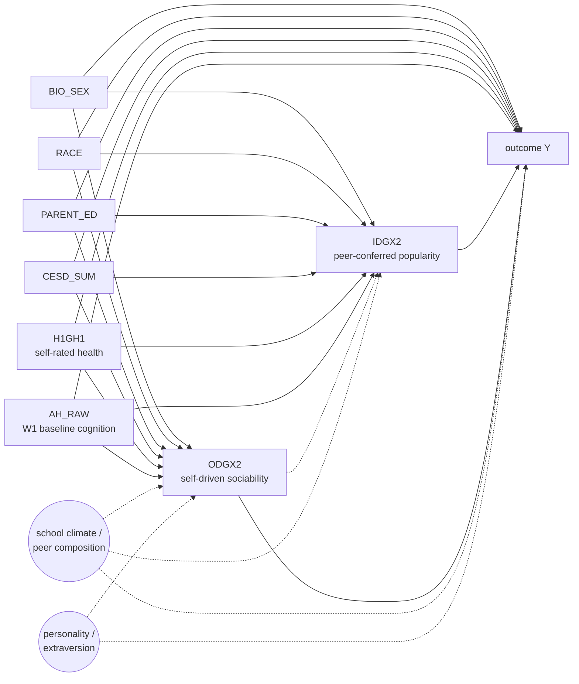

# DAG-Pop-vs-Soc v0.1 — popularity vs. sociability across all 13 outcomes

**Used by:** [popularity-vs-sociability](README.md). **Status:** planned (v0.1, 2026-04-26).

## Construct distinction

The two W1 network exposures encode different social constructs:

- **`IDGX2` = in-degree, peer-conferred popularity.** A high `IDGX2` is awarded by peers; the respondent has limited control. Theoretically a status / standing variable.
- **`ODGX2` = out-degree, self-driven sociability.** A high `ODGX2` reflects the respondent's own nominations; under the respondent's control. Theoretically an agency / outreach variable.

The hypothesis is that these two constructs have **different effect signatures** by outcome domain: status outcomes (earnings, BMI, waist) load on `IDGX2`; agency outcomes (mental health, sleep) load on `ODGX2`.

## DAG (per outcome — generic schematic)

**Why we fit each exposure in a SEPARATE regression** (not joint): The two exposures are structurally correlated (the dashed `ODG -.-> IDG` arrow — your sociability shapes your popularity, but not the reverse, on the W1 timeline). Fitting jointly yields β̂_in = "popularity-above-and-beyond-sociability," which is *not* the construct we want to compare. The marginal effect (separate fits) is the construct-faithful estimand. The cross-exposure contrast `Δβ = β_in − β_out` is then computed via paired cluster-bootstrap on `CLUSTER2` (200 iterations, `np.random.default_rng(20260427)`).

## Per-outcome DAG inheritance

The screen reuses each outcome's DAG-specific adjustment set rather than applying `DAG-Cog` uniformly (the multi-outcome-screening shortcut). Per-outcome DAGs and their adjustment sets:

| Outcome group | Outcomes | Source DAG | Adjustment set |
|---|---|---|---|
| Cognitive | `W4_COG_COMP` | [`DAG-Cog v1.0`](../cognitive-screening/dag.md) | L0 + L1 + AHPVT = `{BIO_SEX, RACE, PARENT_ED, CESD_SUM, H1GH1, AH_RAW}` |
| Cardiometabolic | `H4BMI`, `H4WAIST`, `H4SBP`, `H4DBP`, `H4BMICLS` | `DAG-CardioMet` *(planned, see [cardiometabolic-handoff/dag.md](../cardiometabolic-handoff/dag.md))* | L0 + L1 + AHPVT (provisional; final from `DAG-CardioMet`) |
| Mental health | `H5MN1`, `H5MN2` | `DAG-Mental` *(planned, see [multi-outcome-screening/dag.md](../multi-outcome-screening/dag.md#dag-mental-planned-stub))* | L0 + L1 (with the `CESD_SUM` retention decision per `DAG-Mental` Option A) |
| Functional | `H5ID1`, `H5ID4`, `H5ID16` | `DAG-Functional` *(planned, see [multi-outcome-screening/dag.md](../multi-outcome-screening/dag.md#dag-functional-planned-stub))* | L0 + L1 (no AHPVT until partner's W1 self-rated-fitness proxy is available) |
| SES | `H5LM5`, `H5EC1` | `DAG-SES` *(planned, see [ses-handoff/dag.md](../ses-handoff/dag.md))* | L0 + L1 (**drop AHPVT** — it sits on the SOC → AHPVT → educational credentialism → earnings path; conditioning on it under-estimates the total effect) |

## Estimand wording (use verbatim in reports)

> Among Add Health respondents in saturated schools, conditional on each outcome's per-DAG adjustment set, a one-unit increase in `IDGX2` (resp. `ODGX2`) is associated with a β-unit change in outcome *Y*. The cross-exposure contrast `Δβ = β_in − β_out` per outcome is the experiment's primary inferential target; its sign indicates whether the outcome is dominated by peer-conferred status (`Δβ > 0`) or self-driven sociability (`Δβ < 0`). Significance of `Δβ` is from a paired cluster-bootstrap on `CLUSTER2` (200 iterations).

## Known weak points (load-bearing assumptions)

- **Personality / extraversion is unmeasured.** It is a plausible upstream driver of both `ODGX2` and most outcomes (and arguably `IDGX2` via reflected attractiveness). Its absence biases both β estimates upward. The contrast `Δβ` is partially robust because both estimates are biased in the same direction; the *difference* nets out the common-personality component if extraversion's effect on the outcome runs through both exposures equally. This is a strong assumption; flag in report.
- **Reflexive measurement.** `IDGX2` is the count of W1 nominations *received* — it is mechanically the same construct as the sum of in-school peers' `ODGX2` directed at the respondent. There is no causally clean separation at the construct level; only the analytic separation by exposure-of-record works.
- **Polysocial-PCA-PC1 sensitivity is a robustness check, not a substitute.** PC1 captures shared variance across the 24 W1 exposures; if it explains most of the per-exposure β, that is evidence the per-exposure estimates are not picking up `IDGX2`-specific or `ODGX2`-specific signal.

## Variants

- `DAG-Pop-vs-Soc-Joint` *(NOT used as primary)* — joint-fit specification with both `IDGX2` and `ODGX2` in the regression. β̂_in then estimates "popularity above and beyond sociability." Reported as a sensitivity-only contrast in the report; the primary estimand requires the separate-regression specification.

## Index entry (for `reference/dag_library.md`)

> **DAG-Pop-vs-Soc v0.1** — `IDGX2` and `ODGX2` (separate-regression marginal effects) → all 13 outcomes; per-outcome adjustment-set inheritance from `DAG-Cog`, `DAG-CardioMet`, `DAG-Mental`, `DAG-Functional`, `DAG-SES`. Cross-exposure contrast `Δβ = β_in − β_out` via paired cluster-bootstrap on `CLUSTER2`. → [`experiments/popularity-vs-sociability/dag.md`](../../experiments/popularity-vs-sociability/dag.md)

## Changelog
- **2026-04-26** — Created. v0.1 drafted from user's "Priority 1 — Type-of-tie" plan; per-outcome DAG inheritance documented; separate-regression + paired-bootstrap design locked.
