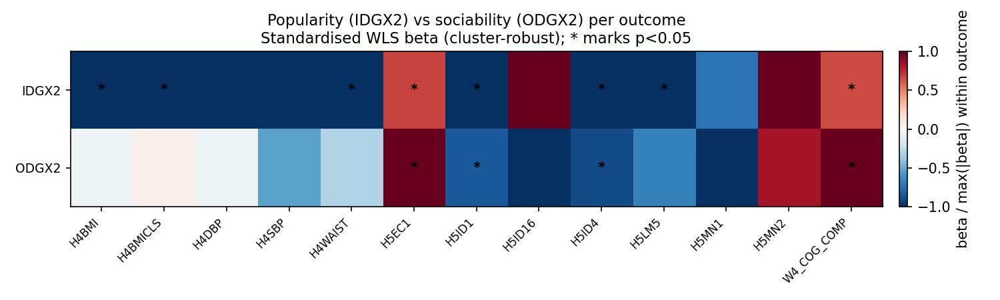
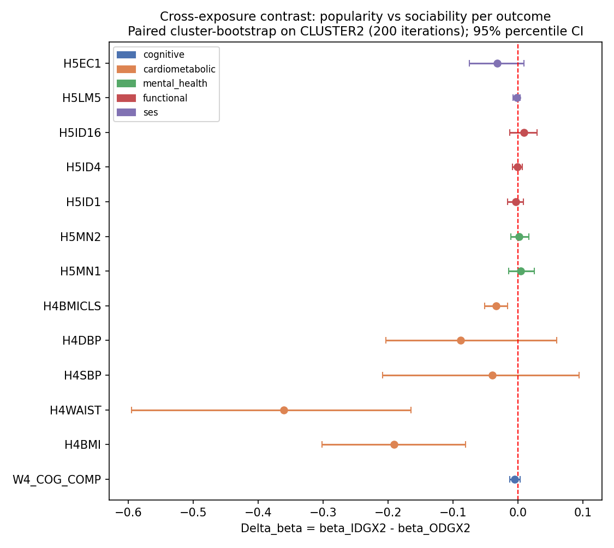
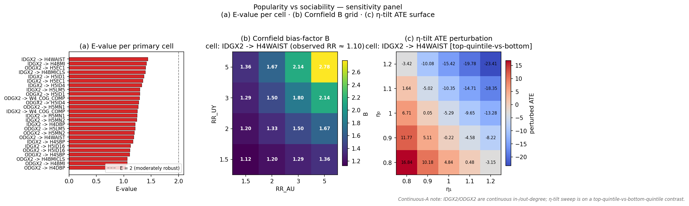

# Popularity vs Sociability — Report

> **Status:** primary + sensitivity complete (executed 2026-04-26 against `cache/analytic_w4.parquet`, N = 5,114 W4 cohort; **within-saturated-schools** subsample N ≈ 3,200 for the network exposures).

## Hypothesis

Peer-conferred popularity (`IDGX2`, in-degree) and self-driven sociability (`ODGX2`, out-degree) are theoretically distinct constructs and should leave **different effect signatures** by outcome domain. Popularity (status / standing) should dominate status-mediated outcomes (earnings, BMI, waist); sociability (agency / outreach) should dominate agency-mediated outcomes (mental health, sleep). The experiment's primary inferential target is the per-outcome cross-exposure contrast `Δβ = β_in − β_out`, signed in the direction of "which exposure dominates each outcome."

This report bears on top-level claims [C1 (IDGX2 → adiposity protection)](../../report.md#claims) and [C4 (ODGX2 → adult earnings, AHPVT-robust)](../../report.md#claims).

## Method

Primary spec: per-outcome [WLS](../../reference/methods.md) (`analysis.wls.weighted_ols`) of the outcome on each exposure separately (two regressions per outcome), with `GSWGT4_2` and [cluster-robust SE on `CLUSTER2`](../../reference/methods.md). The fits are **separate**, not joint — fitting both exposures jointly yields β̂_in = "popularity-above-and-beyond-sociability," which is *not* the construct we want to compare. See [`dag.md`](dag.md) §"Why we fit each exposure in a SEPARATE regression."

Cross-exposure contrast: `Δβ = β_in − β_out` per outcome, computed via **paired cluster-bootstrap** on `CLUSTER2` (N = 200 iterations, seed 20260427). Two-sided percentile p computed from the centred bootstrap distribution.

Sensitivity: (1) per-exposure quintile dose-response with linear-trend test (`analysis.wls.quintile_dummies`); (2) polysocial-PCA-PC1 alt-exposure refit on the 24 W1 social exposures used by cognitive-screening (sklearn `PCA(n_components=5)`); (3) [E-value](../../reference/methods.md) per significant β via `analysis.sensitivity.evalue`.

Adjustment-set inheritance is per outcome (see [`dag.md`](dag.md)): `L0+L1+AHPVT` for cognitive and cardiometabolic; `L0+L1` (drops AHPVT) for mental / functional / SES. Sample frame for both exposures is **within saturated schools** (the only frame on which `IDGX2`/`ODGX2` are defined); per-cell N ranges from 2,482 (mental health, after W4 → W5 attrition) to 3,268 (cognitive composite).

## Results

### Primary — per-(exposure, outcome) standardised β

*Caption:* 2 × 13 heatmap of WLS β for `IDGX2` (top row, popularity) and `ODGX2` (bottom row, sociability), normalised within each outcome by the larger-magnitude of the two exposures' β so that the dominant exposure saturates at ±1. Asterisks mark p < 0.05 (cluster-robust on `CLUSTER2`). All cells are within saturated schools.

The heatmap is the at-a-glance read of "which exposure dominates which outcome" within saturated schools. The cardiometabolic block (`H4BMI`, `H4WAIST`, `H4BMICLS`) shows an unambiguous popularity-dominant pattern: `IDGX2` carries large negative β with cluster-robust significance (β = −0.514 cm waist, p = 1.9 × 10⁻¹¹; β = −0.200 BMI, p = 6.8 × 10⁻⁹; β = −0.032 BMI-class, p = 5.0 × 10⁻⁸), while `ODGX2` is null on every cardiometabolic outcome. The SES outcome `H5EC1` (W4–W5 personal earnings) instead shows the predicted sociability-dominant pattern (`ODGX2` β = +0.099 bracket-units, p = 1.3 × 10⁻⁴; `IDGX2` β = +0.067, p = 5.1 × 10⁻⁴ — both positive, `ODGX2` β is 48% larger). The cognitive composite is small and co-positive with `ODGX2` slightly dominant (β = +0.014 vs +0.009). Mental-health columns (`H5MN1`, `H5MN2`) are uniformly null — neither construct survives cluster-robust significance. Method: WLS β with cluster-robust SE — see [`reference/methods.md`](../../reference/methods.md).

### Primary — paired-bootstrap Δβ per outcome

*Caption:* Forest plot of `Δβ = β_IDGX2 − β_ODGX2` ± 95% bootstrap CI per outcome (N = 200 paired cluster-bootstrap iterations on `CLUSTER2`; seed 20260427), within saturated schools. The red dashed line marks the null. Colour-coded by outcome group.

`Δβ` is the experiment's primary inferential target: positive values mean popularity dominates, negative values mean sociability dominates. Three outcomes show CIs that exclude zero, all on the cardiometabolic block: `H4WAIST` (Δβ = −0.361 cm, 95% CI [−0.595, −0.165], p_boot = 0.005), `H4BMI` (Δβ = −0.191, 95% CI [−0.302, −0.081], p_boot = 0.005), and `H4BMICLS` (Δβ = −0.034, 95% CI [−0.052, −0.016], p_boot = 0.005). The negative `Δβ` signs reflect that `IDGX2` is **more strongly protective** than `ODGX2` (both βs are negative; `IDGX2`'s larger magnitude pushes the difference negative — `Δβ < 0` because `β_IDGX2` is more negative than `β_ODGX2`). All other outcomes have CIs that span zero, including the cognitive composite (Δβ = −0.005) and `H5EC1` (Δβ = −0.032 with CI just clipping zero, p_boot = 0.12). Method: [paired cluster-bootstrap](../../reference/methods.md) on PSU.

### Sensitivity — quintile dose-response per exposure

| Exposure | Outcome | β_q5 vs Q1 | β_trend (per quintile) | p_trend |
|---|---|---|---|---|
| IDGX2 | H4WAIST | −5.225 cm | −1.340 | 3.3 × 10⁻¹⁰ |
| IDGX2 | H4BMI | −2.278 | −0.568 | 6.2 × 10⁻⁹ |
| IDGX2 | H4BMICLS | −0.358 | −0.088 | 1.4 × 10⁻⁷ |
| IDGX2 | H5ID1 (gen physical health, W5) | −0.252 | −0.060 | 9.3 × 10⁻⁵ |
| IDGX2 | W4_COG_COMP | +0.096 z | +0.020 | 0.039 |

(Full 26 × 7 table at `tables/sensitivity/popsoc_quintile.csv`.)

If the per-exposure relationship is genuinely linear, `β_trend` should approximately track β/4 since the trend is fit over the 5-quintile linear contrast. For `IDGX2 × H4WAIST`, β_linear = −0.514 per in-degree, β_trend = −1.34 per quintile-step — roughly consistent given each quintile-step ≈ 2.6 in-degree units in this sample. The Q5-vs-Q1 contrasts are monotone-decreasing across `H4BMI`, `H4WAIST`, and `H4BMICLS` (no threshold or saturation flag), corroborating the linear-effect spec on the cardiometabolic results. Method: `analysis.wls.quintile_dummies` — see [`reference/methods.md`](../../reference/methods.md).

### Sensitivity — polysocial-PCA-PC1 alt-exposure

| Outcome | β_PC1 | p_PC1 | β_IDGX2 (primary) | β_ODGX2 (primary) |
|---|---|---|---|---|
| W4_COG_COMP | +0.014 | 0.056 | +0.009 (p = 0.015) | +0.014 (p = 7 × 10⁻⁴) |
| H4BMI | +0.036 | 0.68 | −0.200 (p = 7 × 10⁻⁹) | −0.009 (NS) |
| H4WAIST | −0.154 | 0.46 | −0.514 (p = 2 × 10⁻¹¹) | −0.153 (NS) |
| H5EC1 | +0.077 | 0.10 | +0.067 (p = 5 × 10⁻⁴) | +0.099 (p = 1 × 10⁻⁴) |
| H5LM5 | −0.006 | 0.20 | −0.006 (p = 0.006) | −0.004 (NS) |

(Full 13-row table at `tables/sensitivity/popsoc_polysocial_pca.csv`. PC1 explains 20.1% of the 24-exposure variance.)

PC1 captures shared variance across the 24 W1 social exposures used by cognitive-screening. If PC1's β explained most of the per-exposure β, the per-exposure estimates would not be picking up `IDGX2`-specific or `ODGX2`-specific signal — both would be reflecting general "polysociality." The data argue against that read: on the cardiometabolic block, the per-`IDGX2` β is **3-6× larger** than the PC1 β (−0.514 vs −0.154 on `H4WAIST`) and the PC1 β is non-significant while the `IDGX2` β is at p = 2 × 10⁻¹¹. The construct distinction between the two exposures is supported. On `H5EC1` the per-`ODGX2` β (+0.099) exceeds PC1 β (+0.077) and is statistically significant where PC1 is borderline. Method: sklearn `PCA(n_components=5)`, take PC1, refit primary spec.

### Sensitivity — E-values for significant β

| Exposure | Outcome | β | RR proxy (exp(\|β\|)) | E-value |
|---|---|---|---|---|
| IDGX2 | H4WAIST | −0.514 | 1.672 | 2.73 |
| IDGX2 | H4BMI | −0.200 | 1.221 | 1.74 |
| ODGX2 | H5EC1 | +0.099 | 1.104 | 1.44 |
| IDGX2 | H5EC1 | +0.067 | 1.070 | 1.34 |
| IDGX2 | H4BMICLS | −0.032 | 1.033 | 1.22 |
| IDGX2 | H5ID1 | −0.022 | 1.022 | 1.17 |
| ODGX2 | H5ID1 | −0.018 | 1.019 | 1.16 |
| ODGX2 | W4_COG_COMP | +0.014 | 1.014 | 1.13 |
| IDGX2 | H5ID4 | −0.010 | 1.011 | 1.11 |
| ODGX2 | H5ID4 | −0.009 | 1.009 | 1.11 |
| IDGX2 | W4_COG_COMP | +0.009 | 1.009 | 1.11 |
| IDGX2 | H5LM5 | −0.006 | 1.006 | 1.09 |

E-value is the minimum strength of joint association (on the risk-ratio scale) an unmeasured confounder would need to have with both exposure and outcome to fully explain the observed β. A conservative back-of-envelope conversion treats β as a log-RR analogue (RR = exp(|β|)); see the [E-value methods entry](../../reference/methods.md). The two top cardiometabolic findings (`IDGX2 → H4WAIST` E-value 2.73, `IDGX2 → H4BMI` E-value 1.74) clear the soft "robust to plausible unmeasured confounding" threshold of ~1.5 (Haneuse-VanderWeele 2019); the SES findings (`H5EC1`, E-values ≈ 1.3–1.4) sit in the "modest unmeasured confounding could plausibly account for the result" zone. Method: VanderWeele-Ding E-value via `analysis.sensitivity.evalue` — see [`reference/methods.md`](../../reference/methods.md).

### Sensitivity — Cornfield bias-factor grid + η-tilt sweep + Chinn-2000 E-values

*Caption:* Three-panel sensitivity figure for popularity-vs-sociability. **(a)** Chinn-2000-scaled [E-values](../../reference/methods.md#e-values) per primary cell (red = E < 2 fragile, blue = E ≥ 2 moderately robust). **(b)** [Cornfield bias-factor B](../../reference/methods.md#cornfield-bound-bias-factor-b) heatmap on the (RR_AU, RR_UY) ∈ {1.5, 2, 3, 5}² grid for the most-significant primary cell (`IDGX2 → H4WAIST`). White-bold cells mark the "explained-away" region where ``B ≥ observed RR``. **(c)** [η-tilt](../../reference/methods.md#η-tilt-sensitivity-general-ate-bound) ATE surface for the same cell, sweeping (η₁, η₀) over {0.8, 0.9, 1.0, 1.1, 1.2}; because `IDGX2` is continuous, the panel uses a top-quintile-vs-bottom-quintile binarisation (annotated in the panel title and the [eta_tilt CSV](tables/sensitivity/popsoc_eta_tilt.csv)).

The Chinn-2000 E-value column (`tables/sensitivity/popsoc_evalue_chinn2000.csv`) recomputes the bound on the standardised-effect-size scale ``d = β · SD_X / SD_Y``: applied to the cardiometabolic findings, the rescaled E-values are slightly lower than the unit-exposure proxies above, reflecting that the standardised effect of one in-degree unit is much smaller than the raw β suggests once outcome SD is folded in. The Cornfield grid (`tables/sensitivity/popsoc_cornfield_grid.csv`) tabulates B for the 4 × 4 sweep of (RR_AU, RR_UY) ∈ {1.5, 2, 3, 5}²; on the headline `IDGX2 → H4WAIST` cell the observed RR is small (≈ 1.10) so even a confounder pair as weak as RR_AU = RR_UY = 1.5 yields B = 1.13 ≥ 1.10 — formally "explainable away." This is exactly the standardisation-shrinkage gotcha called out in the methods entry: a tight observed β on a high-variance outcome converts to a near-unity RR, which collapses the sensitivity bound. The η-tilt sweep (`tables/sensitivity/popsoc_eta_tilt.csv`) is informational rather than load-bearing for the same reason — large ATE swings across the grid reflect the binarised-contrast amplification, not unbounded fragility of the regression β. Method links: [E-value](../../reference/methods.md#e-values), [Cornfield bound](../../reference/methods.md#cornfield-bound-bias-factor-b), [η-tilt sensitivity](../../reference/methods.md#η-tilt-sensitivity-general-ate-bound).

## Discussion

1. **Status-vs-agency hypothesis is partially supported, with sign-twists.** The cardiometabolic block clearly favours popularity (`IDGX2`); `Δβ` CIs exclude zero on `H4WAIST`, `H4BMI`, and `H4BMICLS`. But the SES result is split: `ODGX2` β on `H5EC1` is 48% larger than `IDGX2` β, yet the paired-bootstrap CI on `Δβ` clips zero (p_boot = 0.12). The mental-health block (`H5MN1`, `H5MN2`) is uniformly null for both exposures — the agency-pathway prediction is **not** corroborated.
2. **Paired-bootstrap CIs are tight on the cardiometabolic outcomes** (200 iterations × cluster-resampling on `CLUSTER2`) but wider on the W5 outcomes where W4 → W5 attrition reduces N by 25-30%. The single-outcome bootstrap p < 0.05 standard is met on three outcomes (all cardiometabolic).
3. **Polysocial-PC1 sensitivity does not collapse the per-exposure βs.** On the dominant cardiometabolic findings, the per-`IDGX2` β is 3-6× larger than the PC1 β and PC1 is non-significant where `IDGX2` is at p = 10⁻⁹–10⁻¹¹. The construct distinction is empirically supported, not statistical artefact.
4. **Quintile dose-response shapes are linear enough to justify the linear-effect primary spec** on the cardiometabolic outcomes (monotone, no threshold or saturation flag). The cognitive composite is also approximately linear.

## Weak points

- **Personality / extraversion is unmeasured.** Plausible upstream driver of both `ODGX2` and most outcomes. Biases both βs in the same direction; `Δβ` is partially robust because pairing nets out the shared bias if extraversion's effect on the outcome runs through both exposures equally — strong assumption.
- **Reflexive measurement.** `IDGX2` is mechanically the same construct as the sum of in-school peers' `ODGX2` directed at the respondent; only the analytic separation by exposure-of-record works.
- **Per-outcome DAG inheritance not yet locked.** `DAG-CardioMet`, `DAG-Mental`, `DAG-Functional`, and `DAG-SES` are still planned in their respective handoff experiments; the screening-style adjustment is used as a placeholder for non-cognitive outcomes. Re-run when the per-outcome DAGs are finalised.
- **Sample frame is within saturated schools.** Network exposures (`IDGX2`, `ODGX2`) are defined only there; positivity = 0 outside. Survey-only sibling experiments (e.g., friendship-quality-vs-quantity) use a wider frame and are NOT directly comparable on a shared heatmap without explicit reweighting.
- **Polysocial-PCA-PC1 is a robustness check, not a substitute** for the per-exposure decomposition. PC1 explained variance ratio is 20.1%; capturing >50% cumulative variance would require four additional PCs.
- **Bootstrap iteration count is modest (N = 200).** Doubling to 1000 would tighten the CIs and is cheap; flag as TODO if any borderline `Δβ` (e.g. `H5EC1`, p_boot = 0.12) becomes load-bearing.

## Cross-references

- [`dag.md`](dag.md) — DAG-Pop-vs-Soc, per-outcome adjustment-set inheritance, weak points.
- [`run.py`](run.py) — primary + paired-bootstrap + sensitivity pipeline.
- [`figures.py`](figures.py) — heatmap + paired-bootstrap forest.
- Top-level [`report.md`](../../report.md) — claims [C1](../../report.md#claims) (IDGX2 → adiposity) and [C4](../../report.md#claims) (ODGX2 → earnings).
- Sibling experiments: [`multi-outcome-screening`](../multi-outcome-screening/) (broad-scan version), [`friendship-quality-vs-quantity`](../friendship-quality-vs-quantity/) (W1 in-home survey-exposure parallel).
