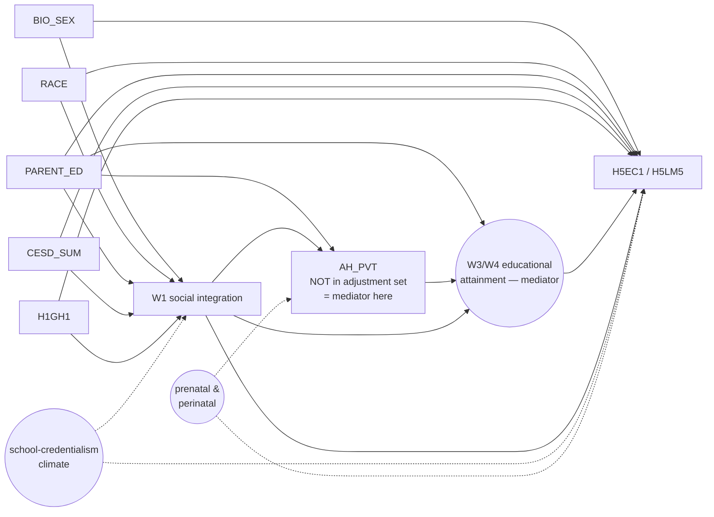

# DAG-SES — W1 social integration → W5 socioeconomic outcomes

**Used by:** [ses-handoff](README.md) (`ODGX2 → H5EC1`); SES outcomes column of [multi-outcome-screening](../multi-outcome-screening/README.md). **Status:** planned (Task 16 formal estimation); to be locked before estimation runs.

## Distinguishing arrows from `DAG-Cog v1.0`

The base structure is the same as [`DAG-Cog v1.0`](../cognitive-screening/dag.md), with one critical difference:

**`AH_PVT` is DROPPED from the adjustment set.** Verbal IQ is on the causal path from social integration to attainment via the educational-credentialism mechanism (`SOC → AHPVT → educational attainment → adult earnings`), so adjusting for it would block the target effect.

Instead, condition on parental cognitive achievement (proxied by `PARENT_ED`) as the SES-specific confounder.

## Diagram

## Adjustment set

`{BIO_SEX, RACE, PARENT_ED, CESD_SUM, H1GH1}` = L0 + L1. **AHPVT excluded** (mediator). EDU excluded (mediator).

## Estimation specifics

- **`H5EC1` (bracketed earnings 1–13)**: use **interval regression** on bracket midpoints — see [methods.md §3 Ordered logit and interval regression](../../reference/methods.md#ordered-logit-and-interval-regression).
- **`H5LM5` (3-level employment status)**: ordered logit (with caveat that "no, temporarily absent from job" is its own meaningful category, not necessarily ordinal between "working" and "not employed").
- **W4 → W5 attrition**: layer **IPAW** on top of `GSW5` — fit logistic model for "remained at W5 in mode-eligible cell" on L0+L1+AHPVT + exposure, compute the inverse fitted probability, multiply into `GSW5`. See [methods.md §3 Inverse-probability-of-attrition weighting](../../reference/methods.md#inverse-probability-of-attrition-weighting-ipaw) and [TODO §A3](../../TODO.md). Implementation lives in `scripts/analysis/ipw.py` (currently a stub).

## Estimand wording (use verbatim in reports)

> Among Add Health respondents in saturated schools who were W5-mode-eligible (in-person + telephone), conditional on demographics, parental education, and W1 affective/somatic state — and reweighted via IPAW on top of `GSW5` to recover the W5-retained population — a one-unit increase in `ODGX2` (out-degree) is associated with a β-bracket change in adult `H5EC1` personal earnings.

## E-value sensitivity

Per [TODO §A7](../../TODO.md), each handoff pair reports an E-value column. Computed via `scripts/analysis/sensitivity.py:evalue` once that module is implemented.

## Index entry (in `reference/dag_library.md`)

> **DAG-SES** *(planned)* — W1 social integration → W5 SES outcomes (`H5EC1` earnings, `H5LM5` employment). Adjustment: L0 + L1, with AHPVT **dropped** as mediator. Used by `ses-handoff` and SES columns of `multi-outcome-screening`. → [`experiments/ses-handoff/dag.md`](../../experiments/ses-handoff/dag.md)

## Changelog
- **2026-04-27** — Migrated stub from `reference/dag_library.md` and elaborated. Diagram drafted; locking session pending.
