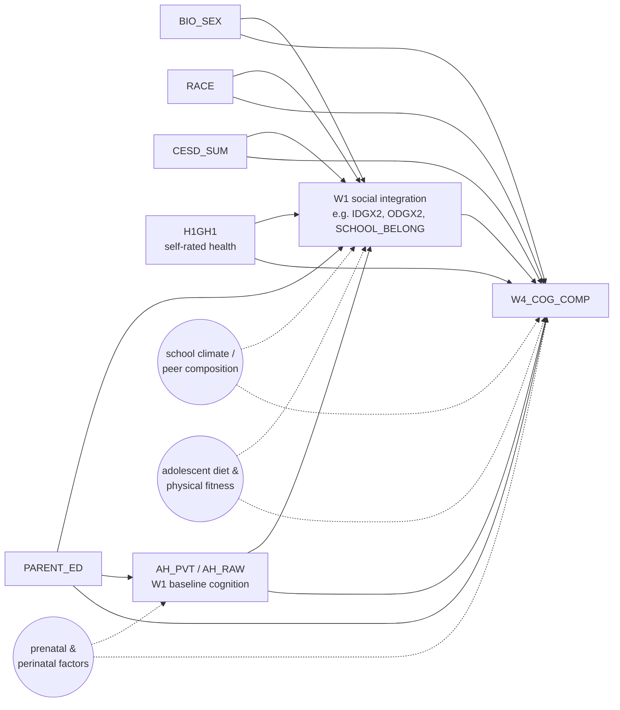

# DAG library

A versioned catalogue of the causal directed-acyclic graphs (DAGs) used in this project. Each DAG specifies (i) the variables, (ii) the assumed arrows among them, and (iii) the explicitly-unmeasured set whose absence is the load-bearing assumption. The [experiments register](experiments_register.md) maps every analytical experiment in the project to one of these DAGs by ID.

**Conventions:**

- DAGs are named `DAG-<short-name>`, version-tagged in their header (`v0.1`, `v1.0`, etc.). Bump the version when arrows change.
- Solid arrows = assumed-causal directed edges among **measured** variables. Dashed arrows = arrows from **unmeasured** confounders. A bidirected arrow is short-hand for "shared unmeasured cause exists; we do not name it."
- Each DAG is rendered as a Mermaid `flowchart LR` block so it lives in version-controlled markdown rather than as a binary asset. Anyone editing the DAG edits the source.
- "Adjustment set" = the variables you must condition on under back-door criterion to identify the X → Y total effect (or, for cognitive outcomes, the trajectory-adjusted effect). Listed beneath each DAG.
- "Estimand wording" = the exact one-sentence interpretation that should appear in any report or plot caption that uses this DAG. Cuts down on framing drift between a chart and its prose.

For plain-language definitions of *back-door path*, *positivity*, *negative control*, and *confounder vs. mediator*, see the [synthesis Glossary](addhealth_synthesis.md#glossary).

---

## DAG-Cog (v1.0) — W1 social integration → W4 cognitive outcome

**Used by:** task14 cognition screen (24 exposures × `W4_COG_COMP`); the cognitive-outcome column of task15. **Date locked:** 2026-04-25 (DAG drafted with the user; iterations in conversation log).

**Adjustment set (sufficient under back-door criterion):** `{BIO_SEX, RACE, PARENT_ED, CESD_SUM, H1GH1, AH_PVT}` = L0 + L1 + AHPVT. Conditioning on this set closes every back-door path from `SOC` to `Y` *that runs through measured variables*; the dashed arrows from `SCHOOL`, `PRENATAL`, `DIET` are the explicit unmeasured-confounder set whose absence is assumed.

**Why each measured covariate is in the set:**

| Variable | Closes which back-door |
|---|---|
| `BIO_SEX`, `RACE` | Demographic → both adolescent peer position AND adult cognition (well-established literatures) |
| `PARENT_ED` | Family SES → both adolescent social integration AND adult cognition; also feeds AHPVT (parental education raises childhood verbal exposure) |
| `CESD_SUM`, `H1GH1` | W1 affective and somatic state confounds peer position AND cognitive trajectory |
| `AH_PVT` | **Baseline cognition.** Conditioning on it converts the regression into an approximate change-from-baseline estimand. See the [trajectory caveats in synthesis §5.6](addhealth_synthesis.md#56-identification-assumptions-and-target-estimand). |

**Estimand wording (use verbatim in reports):**

> Among Add Health respondents in saturated schools (for network-derived exposures) or the full W1 in-home cohort (for non-network exposures), conditional on baseline W1 verbal IQ, demographics, and W1 affective/somatic state, a one-unit increase in *X* is associated with a β-unit change in W4 cognition relative to its baseline-predicted level.

**Known weak points (load-bearing assumptions):**

- Construct mismatch: AHPVT is *vocabulary*, `W4_COG_COMP` is fluid memory + working memory. Trajectory-β is "trajectory under a vocabulary-anchored baseline."
- Unmeasured `SCHOOL`: school climate / peer composition could confound network position AND cognitive outcomes. Sensitivity tested via Task-16 saturation-balance table.
- Unmeasured `PRENATAL` and `DIET`: feed both the AHPVT baseline and adult cognition; partly absorbed by AHPVT itself. Cannot be cleanly separated in public-use data.
- The cleaner Task-16 NC battery (blood type, age at menarche, hand-dominance, residential stability pre-W1) is the planned test of the unmeasured-confounder assumption. The current `HEIGHT_IN` D2 is contaminated and not load-bearing.

**Variants planned (Task 16):**

- `DAG-Cog-FrontDoor` — adds the strict-mediator-of-AHPVT alternative (`SOC → AHPVT → Y` direct), used to *quantify the trajectory caveat* via a front-door decomposition. **Sensitivity check, not primary.**
- `DAG-Cog-Saturated` — same DAG, restricted population to within-saturated-schools; used to make the within-saturated estimand explicit in plots.

---

## Planned DAGs (Task 16)

The following entries are stubs; arrows + adjustment sets get drawn during Task 16 with the same structure as `DAG-Cog`. Each will be locked in a working session before any formal estimation runs against it.

### DAG-CardioMet (planned)

**Used by:** task15 cardiometabolic outcomes (`H4BMI`, `H4SBP`, `H4DBP`, `H4WAIST`, `H4BMICLS`); Task-16 handoff pairs (`IDGX2 → H4WAIST`, `IDGX2 → H4BMI`, `IDGX2 → H4BMICLS`).

**Distinguishing arrows from `DAG-Cog`:** must add W1 self-reported weight (`H1GH28` — codebook label not yet verified, see [variable_dictionary.md](variable_dictionary.md)) into L1; AHPVT becomes a general-ability confounder (no longer "baseline") since the outcome is not cognitive; possible `SCHOOL` arrow to BMI (school food environment) added as unmeasured.

### DAG-SES (planned)

**Used by:** `H5EC1` (earnings), `H5LM5` (employment).

**Distinguishing arrows:** **drops AHPVT from the adjustment set** — verbal IQ is on the causal path from social integration to attainment via the educational-credentialism mechanism, so adjusting for it would block the target effect. Adds parental cognitive achievement (proxied by `PARENT_ED`) as the SES-specific confounder.

### DAG-Mental (planned)

**Used by:** `H5MN1`, `H5MN2` (Perceived Stress Scale items at W5).

**Distinguishing arrows:** `CESD_SUM` becomes an outcome-side construct, not a confounder, since W1 depressive symptoms predict W5 perceived-stress through the construct itself. Decision pending: condition on it (closes confounding from W1 affective state), or drop it (avoids over-adjusting for an outcome-similar W1 variable). Worked in Task 16.

### DAG-Functional (planned)

**Used by:** `H5ID1` (self-rated physical health), `H5ID4` (stair-climbing limitation), `H5ID16` (sleep trouble).

**Distinguishing arrows:** add W1 self-rated health (`H1GH1`) as both confounder and possible outcome-construct precursor; consider adding adolescent-fitness proxy if any public-use measure is identifiable.

### DAG-Cog-FrontDoor (planned, Task 16 sensitivity)

**Used by:** Task-16 front-door decomposition for the AHPVT-cognition path.

**Distinguishing arrows:** explicitly draws `SOC → AHPVT → Y` as a candidate causal mechanism (the strict mediator reading); estimates the indirect effect via the mediator formula. Output is a **sensitivity bound** — how much the `DAG-Cog` trajectory-β would shift if you accepted the mediator interpretation. If the bound is small, the trajectory framing wins; if large, both estimates should be reported.

---

## Changelog

- **2026-04-25** — File created. `DAG-Cog v1.0` locked with the user; planned-DAG stubs drafted for `DAG-CardioMet`, `DAG-SES`, `DAG-Mental`, `DAG-Functional`, `DAG-Cog-FrontDoor`.
