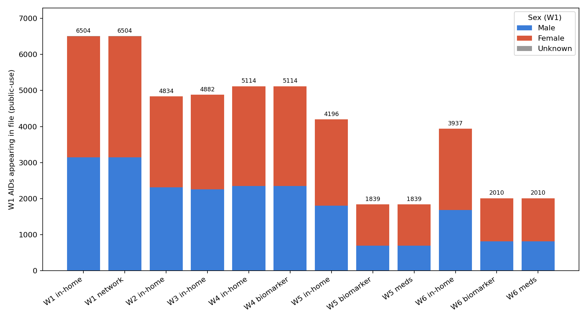

# Research journal — Inter-generational causal analysis of AddHealth

Chronological log of analytic steps, headline findings, and outstanding uncertainties. Intended as a narrative companion to [dataset_manual.md](dataset_manual.md) (the dataset-reference manual) and [variable_dictionary.md](variable_dictionary.md) (per-code lookup). Each phase below corresponds to one or more scripts in [../scripts/prep/](../scripts/prep/) or [../experiments/](../experiments/) and the artefacts each produces under `scripts/prep/outputs/` or `experiments/<name>/{tables,figures}/`.

Terms, variable codes, and dataset-level conventions used here (waves, weights, mode restrictions, reserve codes) are defined in the dataset manual and not re-explained; new readers should skim §§1–5 of [dataset_manual.md](dataset_manual.md) first. For plain-language definitions of causal-inference vocabulary (*back-door path*, *confounder vs. mediator*, *positivity*, *IPAW*, *front-door*, *collider*, *DAG*, *PSU*, *saturated school*, *negative control*, etc.), see [glossary.md](glossary.md) — this journal assumes the glossary's definitions. For the causal graph behind each experiment's adjustment set see [dag_library.md](dag_library.md); for the experiment ↔ DAG ↔ method ↔ plot map see [experiments/README.md](../experiments/README.md).

---

## Phase 0 — Data inventory and AID reconciliation

**Tasks:** 01, 02. **Scripts:** [scripts/prep/01_file_inventory.py](../scripts/prep/01_file_inventory.py), [scripts/prep/02_aid_overlap.py](../scripts/prep/02_aid_overlap.py).

Catalogued the 50 public-use files shipped with Add Health (see [dataset_manual.md §1](dataset_manual.md#1-scope-and-access) for distribution details) and built an AID-by-wave overlap matrix to establish analytic ceilings. W1 in-home N = 6,504; W1 in-school N = 20,745. W1 → W4 retention 4,882 (75 % of W1 in-home). W1 → W5 retention 4,196 mode-unrestricted / 3,553 flagged high-quality by `MODEOK5`.

**Main finding.** Longitudinal attrition caps realistic W1 → W5 cognitive designs around N ≈ 600 after mode restriction; all larger Ns (3,200–4,900) require a W4-terminal outcome.

**Uncertainty logged.** Whether to cap at mode-restricted W5 or accept the larger mode-inclusive cell. Deferred; both evaluated downstream and the restriction kept as a sensitivity variant, not a primary.

---

## Phase 1 — Variable selection and curation

**Tasks:** 03a/b/c/de/fgh, 04, 05. **Scripts:** [scripts/prep/03*](../scripts/prep/), [scripts/prep/04_missingness.py](../scripts/prep/04_missingness.py), [scripts/prep/05_weighted_descriptives.py](../scripts/prep/05_weighted_descriptives.py).

Curated the 24-exposure, 13-outcome (1 primary + 12 secondary), 3-tier-covariate set used for all downstream screening. Exposure groups and covariate tiers are documented code-by-code in [variable_dictionary.md](variable_dictionary.md); high-level:

- W1 network-file centralities (`IDGX2`, `ODGX2`, `BCENT10X`, `REACH`, …) — saturated-school subsample only.
- W1 friendship grid (self-reported, full W1 sample) — derived aggregates `FRIEND_N_NOMINEES`, `FRIEND_CONTACT_SUM`, `FRIEND_DISCLOSURE_ANY`.
- W1 school belonging + loneliness + qualitative.
- W4 cognitive composite `W4_COG_COMP` (z-mean of `C4WD90_1` + `C4WD60_1` + `C4NUMSCR`).
- Covariates in L0 (demographics) / L0+L1 (+ CES-D + SRH) / L0+L1+AHPVT tiers.

Reserve-code handling (6/7/8/9, 96/97/98/99, 995/9995) is codified in `scripts/analysis/cleaning.py` (`VALID_RANGES` + `clean_var`). Survey-weighted descriptives use `GSWGT4_2` + `CLUSTER2`.

**Main finding.** The joint-complete analytic frame (W1 network ∩ W4 cognition ∩ L0+L1+AHPVT) settles at N ≈ 3,200; friendship-grid exposures that don't require the network file reach N ≈ 4,600–4,700. This sets the power envelope for everything downstream.

**Uncertainty logged.** Whether `H1FS13`/`H1FS14` (loneliness) are exposures or mediators. Provisionally treated as exposures because they pre-date the outcome and are treated as such in the adolescent-social-indicator literature.

---

## Phase 2 — Attrition and analytic-frame construction

**Tasks:** 06, 07, 08. **Scripts:** [scripts/prep/06_attrition.py](../scripts/prep/06_attrition.py), [scripts/prep/07_analytic_n.py](../scripts/prep/07_analytic_n.py), [scripts/prep/08_build_analytic_frame.py](../scripts/prep/08_build_analytic_frame.py).

Wave-conditional retention is sharply sex- and race-patterned: at W5, female retention runs 64–76 % versus male 43–63 % within race strata, with higher attrition in Black male and Native American cells.

Analytic frames were frozen in [cache/](../cache/) parquets (`w1inhome`, `w1network`, `w1friendship`, `w3pvt`, `w4inhome`, `pwave5`, and the combined `analytic_primary`) so downstream tasks don't re-read SAS files.

**Main finding.** Primary analytic frame N = 3,238 under the tightest restriction (mode-OK W4 cognitive + full covariate vector). Network-frame gating costs ~32 % of W1 in-home respondents — a structural saturation-sampling artefact, not attrition; documented as the cognitive-screening D8 column ("saturated-school selection penalty").

---

## Phase 3 — Baseline associations and sensitivity

**Tasks:** 10, 11, 12, 13. **Scripts:** baseline regressions, sensitivity, verification, and regression plots are now consolidated into [experiments/cognitive-screening/run.py](../experiments/cognitive-screening/run.py) (baseline-regressions, sensitivity, verification blocks) and [experiments/cognitive-screening/figures.py](../experiments/cognitive-screening/figures.py).

Ran weighted OLS for each of the 24 exposures against `W4_COG_COMP` under nested adjustment sets L0 → L0+L1 → L0+L1+AHPVT, with cluster-robust SEs on `CLUSTER2` (132 PSUs). The sensitivity block layers collinearity checks, leave-one-out permutation, saturated-school balance, AHPVT shift audits, placebo permutation, and reserve-code sensitivity; the verification block covers Benjamini–Hochberg FDR, attrition IPAW, negative-control exposures/outcomes, design-effect estimates, and PSU counts.

).](../experiments/cognitive-screening/figures/sensitivity/ahpvt_with_without.png)

**Main finding.** Adjusting for AHPVT attenuates every network-centrality → cognition association by 30–50 %. `ODGX2` (nominations sent) holds the largest stable effect post-adjustment; `IDGX2` (in-degree) attenuates heavily but retains significance; `BCENT10X` (Bonacich) has the largest raw β but attenuates the most. No exposure survives L0+L1+AHPVT with D4 rel-shift < 30 %.

**Framing decision — AHPVT as W1 baseline cognition (trajectory adjustment).** The research question is about cognitive *trajectory* from adolescence into mid-life. Under that framing, `AH_PVT` is the W1 baseline cognitive measure, not a competing confounder; adjusting for it converts the level-on-level β into an approximate change-from-baseline ("where you ended up given where you started"). Decided 2026-04-25; the earlier confounder-vs-mediator ambiguity is downgraded. **Caveats kept on the record:** AHPVT is *vocabulary* (crystallized) while `W4_COG_COMP` is *fluid* memory + working memory — proxy baseline, not identical-construct pre-test (literature r ≈ 0.5–0.7); the strict mediator reading (years of pre-W1 social integration → AHPVT) is implausible-but-not-impossible; Task 16's front-door decomposition is now a *sensitivity check*, not a load-bearing alternative model. Full discussion in [methods.md §1 trajectory callout](methods.md#1-identification-assumptions-and-target-estimand).

---

## Phase 4 — Preliminary causal screening (D1–D9)

**Task:** 14. **Script:** causal-screening block of [experiments/cognitive-screening/run.py](../experiments/cognitive-screening/run.py). **Outputs:** [experiments/cognitive-screening/tables/primary/14_screening.md](../experiments/cognitive-screening/tables/primary/14_screening.md), [tables/primary/14_screening_matrix.csv](../experiments/cognitive-screening/tables/primary/14_screening_matrix.csv), [tables/primary/14_shortlist.csv](../experiments/cognitive-screening/tables/primary/14_shortlist.csv).

Nine-diagnostic screen over 24 W1 social exposures. Formal pass/fail thresholds and plain-language intuition for each D-code live in [methods.md §2](methods.md#2-causal-screening-diagnostic-battery-d1d9); the list below is a one-line refresher:

- **D1** baseline significance (primary spec L0+L1+AHPVT)
- **D2** height (`HEIGHT_IN`) negative-control outcome — **contaminated**, see [variable_dictionary.md §2.7](variable_dictionary.md#27-negative-control-outcome)
- **D3** sibling dissociation (target vs. related exposure)
- **D4** adjustment-set stability (L0 / L0+L1 / L0+L1+AHPVT)
- **D5** outcome-component consistency (`C4WD90_1` / `C4WD60_1` / `C4NUMSCR`)
- **D6** dose-response monotonicity (continuous only)
- **D7** positivity / overlap (Q5-vs-Q1 logit)
- **D8** saturated-school selection penalty (informational)
- **D9** hard-coded collider / double-adjustment red flags

### Phase 4.5 — Adversarial review of the screen

A subagent audited the 24 `kind` tags, D3 sibling logic, and the D4–D9 bodies. Two real bugs surfaced:

1. **`PRXPREST` mis-classified as `binary`** (in the original task14 script, since folded into the cognitive-screening run). Raw dtype is float64 over [0.00045, 0.774] with 3,920 unique values across N = 4,020 non-null. D6 was being skipped and D7 ran a degenerate logit. Root cause: contradiction between [dataset_manual.md §3.1](dataset_manual.md#31-wave-i-public-use-network-file--pre-computed-sociometric-measures) (correct, continuous range) and pitfall #7 (then incorrect, "binary 0/1"). The dataset manual was corrected, `kind` retagged to `continuous`, the screen re-run. Post-fix: D6 trend_ρ = 0.8 (PASS), D7 overlap [0.15, 0.78], eff_N = 1,204 (PASS). Re-categorised as **Weakened** (score 4). Logged in the dataset manual [Changelog](dataset_manual.md#changelog) dated 2026-04-20.
2. **D3 accepts opposite-sign siblings.** The test required `|β_target| > |β_sibling|` and `|β_target − β_sibling| > pooled SE` but omitted a sign-agreement check. A target at β = −0.5 with sibling at β = +0.3 would have PASSED — an opposite-sign sibling is a confounding signature, not specificity. No current exposure was affected; fixed by adding `np.sign(b_t) == np.sign(b_s)` to the pass condition before the bug could bite.

**Main finding.** On `W4_COG_COMP`, social-exposure signal concentrates in two mechanisms — local friendship presence (`ODGX2`, `FRIEND_*`) and structural centrality (`BCENT10X`, `REACH3`) — but every exposure fails D4 adjustment stability, with AHPVT contributing the bulk of the shift. Combined with D2 height-NC failures on `IDGX2` and several egonet exposures, this argues the L0+L1+AHPVT primary spec is not adequate to close back-door paths — not that the exposures are non-causal.

**Critique: height NC is contaminated.** The adolescent-height / peer-popularity correlation is well-documented; `HEIGHT_IN` is therefore not an unambiguously non-causal outcome relative to `IDGX2` / `BCENT10X`. D2 failures on those exposures may indicate an unblocked back-door through height-mediated peer status rather than non-causality on cognition. A cleaner NC battery (blood type, age at menarche, hand-dominance, residential stability pre-W1) was discussed but not implemented here; queued for Task 16.

---

## Phase 5 — Multi-outcome screening pivot

**Task:** 15. **Script:** [experiments/multi-outcome-screening/run.py](../experiments/multi-outcome-screening/run.py). **Outputs:** [experiments/multi-outcome-screening/tables/primary/15_multi_outcome.md](../experiments/multi-outcome-screening/tables/primary/15_multi_outcome.md), [tables/primary/15_multi_outcome_matrix.csv](../experiments/multi-outcome-screening/tables/primary/15_multi_outcome_matrix.csv).

Motivated by the observation that a cognition-only outcome over-weights the AHPVT-mediation path. Extended the outcome-dependent diagnostics (D1 baseline, D4 stability) across 12 non-cognitive outcomes in four groups: cardiometabolic (`H4BMI`, `H4WAIST`, `H4SBP`, `H4DBP`, `H4BMICLS`), mental health (`H5MN1`, `H5MN2`), functional (`H5ID1`, `H5ID4`, `H5ID16`), SES (`H5LM5`, `H5EC1`). D2 / D6 / D7 / D8 / D9 are outcome-agnostic and inherited from the cognitive-screening re-run; D3 (sibling) and D5 (component consistency) remain cognition-only.

**Sample sizes.** W4 cardiometabolic: median N ≈ 3,200 for network-gated exposures, ≈ 4,600 for friendship-grid. W5 outcomes: median N ≈ 2,400 network-gated, ≈ 3,400 grid. All 288 (24 × 12) cells have sufficient data.

**Cross-outcome-robust exposures (top-3 by p for ≥ 3 outcomes):**

- **IDGX2** — 7 outcomes: `H4BMI`, `H4WAIST`, `H4BMICLS`, `H5ID1`, `H5ID4`, `H5LM5`, `H5EC1`.
- **SCHOOL_BELONG** — 5: `H5MN1`, `H5MN2`, `H5ID1`, `H5ID4`, `H5ID16`.
- **IDG_LEQ1** — 4: `H4BMI`, `H4WAIST`, `H4BMICLS`, `H5ID4`.
- **IDG_ZERO** — 4: `H4BMI`, `H4WAIST`, `H4BMICLS`, `H5MN2`.

**Main finding.** Social integration at W1 shows a robust signal on adult cardiometabolic and economic outcomes that is **not** dominated by AHPVT (D4 rel-shift typically < 30 %), in contrast to the cognitive outcome. `IDGX2` is the most broadly active exposure across non-cognitive endpoints — consistent with a "social-integration → downstream health and attainment" hypothesis. `SCHOOL_BELONG` dominates mental-health and functional outcomes but fails D4 on several of them, suggesting mediator leakage.

### Task 16 handoff

**Recommended (exposure → outcome) pairs for formal causal estimation:**

- **IDGX2 → H4WAIST** — β = −0.51 cm per in-degree unit, p = 1.9 × 10⁻¹¹, N = 3,250, D4 rel-shift 18 %.
- **IDGX2 → H4BMI** — β = −0.20, p = 6.8 × 10⁻⁹, D4 rel-shift 21 %.
- **IDGX2 → H4BMICLS** — β = −0.032, p = 5.0 × 10⁻⁸, D4 passes.
- **ODGX2 → H5EC1** — β = +0.10 on the bracketed-earnings scale, p = 1.4 × 10⁻⁴, D4 passes.

All four pass D1 and D4 on the non-cognitive outcome, and none are covered by AHPVT as primary confounder in a way D4 would detect. Cross-reference with Task 14's D2 / D6 / D7 before committing to an estimand.

---

## Outstanding uncertainties

1. ~~**AHPVT's role** is still ambiguous — confounder vs. mediator of social-exposure → outcome.~~ **Resolved 2026-04-25:** AHPVT serves as the W1 baseline cognitive measure; cognitive-outcome estimates are reported as **trajectory-adjusted** (change-from-baseline), with the construct-mismatch and pre-W1-mediation caveats kept in the [methods.md §1 callout](methods.md#1-identification-assumptions-and-target-estimand). Task 16 front-door decomposition is now a **sensitivity check** quantifying how much the trajectory β shifts under the strict mediator reading, not a load-bearing alternative model.

2. **Height as an NC outcome is contaminated.** Adolescent height–popularity literature is strong enough that D2 failures on `IDGX2` / `BCENT10X` should not read as non-causality. A cleaner NC battery (blood type, age at menarche, hand-dominance, residential stability pre-W1) is queued for Task 16.

3. **Weight choice for W5 outcomes.** The screen uses `GSWGT4_2` uniformly because `GSW5` is only populated on the mode-restricted W5 subsample (N = 824 in `analytic_w5`). Formal estimation on W5 outcomes should substitute `GSW5` + IPAW for W4 → W5 attrition; the screen may be modestly biased toward W4-retained respondents.

4. **`H5EC1` is bracketed ordinal**, not continuous earnings — 13 income brackets (see [variable_dictionary.md §2.5](variable_dictionary.md#25-secondary-outcomes--task-15-multi-outcome-extension-12)). Treated linearly in the screen (acceptable for ranking) but formal estimation should use ordered-logit or interval regression. `H5LM5` (3-level, not binary) gets the same caveat.

5. **Sibling dissociation is cognition-specific.** Current D3 pairs are tuned to the cognitive outcome (`ODGX2` as sibling for peer-network exposures). Non-cognitive outcomes would need different pairings; not done, flagged for Task 16 on handoff candidates.

6. ~~**School-level saturation.** The cognitive-screening D8 is informational only.~~ **Resolved 2026-04-25:** for network exposures (16/24, all centrality / density / isolation variables) the reported estimand is **"ATE within saturated schools" — full stop, no extrapolation**. Network centralities are structurally undefined outside saturated schools (positivity = 0, not low overlap), so weighting toward "if everyone were saturated" would be fitting on a structural zero. To make the external-validity gap visible, Task 16 will produce a **saturation-balance table** comparing weighted L0+L1+AHPVT means in saturated vs. non-saturated schools. Plot captions, brief paragraphs, and table footnotes for any network-exposure result must say "within saturated schools" explicitly. The 8 non-network exposures (`FRIEND_*`, `SCHOOL_BELONG`, `H1FS13`, `H1FS14`, `H1DA7`, `H1PR4`) are sample-wide and need no saturation handling. See [methods.md §1 positivity discussion](methods.md#1-identification-assumptions-and-target-estimand).

7. **Outcome-dependent adjustment sets.** Task 15 uses L0+L1+AHPVT uniformly across all 12 outcomes for comparability; Task 16 should draw a per-outcome DAG — e.g. `H4BMI` may need `H1GH28` (W1 self-reported weight) in L1; `H5EC1` should drop AHPVT and condition on parental education instead.

---

## Phase 6 — Mechanism experiments scaffolded (2026-04-27)

**Scope.** Brainstorm with the user (under `/Users/jb/.claude/plans/users-jb-desktop-causal-inference-midte-refactored-sutton.md`) produced four hypothesis families beyond the existing screening + handoff pipeline:

1. **Type-of-tie** — popularity vs sociability, ego-network density (size-conditioned), friendship quality vs quantity. Tests whether "social integration" decomposes into mechanistically distinct dimensions with different outcome signatures.
2. **Effect modification** — compensatory hypothesis (low-SES kids benefit more), sex-differential (peer status policing of body weight stronger for girls), depression buffering (popularity buffers pre-existing CES-D).
3. **Dark side of popularity** — substance use (predicted *positive* β = outcome-specificity inversion), lonely-at-the-top (paradox subgroup; pre-flight ruled out 2x2, fell back to continuous interaction at min-cell-N=73 < 150 floor).
4. **Cross-sex friendship** — instrumental vs emotional channel test via 4-cell `BIO_SEX × HAVEBMF` and `BIO_SEX × HAVEBFF` stratification across all 13 outcomes.

Plus a broadened `negative-control-battery` covering both exposure-side and outcome-side null controls (sensory: H5EL6D/F, H5DA9; allergy/asthma: H5EL6A/B; outcome-side confirmed via 2026-04-27 pre-flight inventory).

**DAG library reorganization.** Per the user's 2026-04-27 decision, ground-truth DAGs now live in each experiment's `dag.md`; `reference/dag_library.md` was rewritten as an index with one-paragraph summaries + per-experiment links. `DAG-Cog v1.0` migrated to `experiments/cognitive-screening/dag.md` and existing planned-DAG stubs (`DAG-CardioMet`, `DAG-SES`, `DAG-Cog-FrontDoor`, `DAG-Mental`, `DAG-Functional`) migrated to their respective handoff folders.

**`L_partner` placeholder.** Cognitive experiments get a fourth adjustment-set tier `L_partner = {BIO_SEX, H1GI1M}` mirroring the user's project partner's `dataset_eda.ipynb` Cell 21 as of 2026-04-27 — non-cognitive experiments unchanged. Tracked in [TODO §A23](../TODO.md) for replacement when partner pushes refined covariate list.

**Methods utilities (TDD-first).** Three new modules added to `scripts/analysis/`:
- `sensitivity.py` — `evalue` (VanderWeele-Ding), `cornfield_bound` (bias-factor B from Ch. 6 §2 of MA 592 textbook), `eta_tilt` (general-ATE bound from Ch. 6 §3). 10 tests pass.
- `matching.py` — `mahalanobis_distance`, `match_ate` (M-NN), `match_ate_bias_corrected` (Abadie-Imbens 2006 Prop. 5.1 / Ch. 5 of MA 592 textbook), `analytic_variance` (Abadie-Imbens, since fixed-M bootstrap is invalid per Ch. 5 §9). 11 tests pass.
- `dr_aipw.py` — `dr_aipw` (Robins-Rotnitzky-Zhao influence-function AIPW with KFold cross-fitting). 6 tests pass.

`scikit-learn` dependency added because matching and DR-AIPW use it.

**Pre-flight findings (worth recording for future sessions):**
- Substance-use: W4 outcomes H4TO5, H4TO39, H4TO70, H4TO65B, H4TO65C all have N≥3,000 in the saturated frame; W5 outcomes H5TO2, H5TO12, H5TO15 have N≈3,500. All usable.
- Lonely-at-the-top 2x2 cell counts: top-IDGX2-quartile × high-loneliness (H1FS13≥2) = N=73, below the project's 150 stability floor. Decision: drop 2x2 design, use continuous interaction `z(IDGX2) × z(H1FS13)`.
- Outcome-side NCs: prefer the sensory-trio (H5EL6D vision, H5EL6F hearing, H5DA9 hearing-quality) and asthma/allergy (H5EL6A, H5EL6B). Avoid H5ID1 (self-rated health is too socially-confounded to serve as a clean null).

**Skeptical 3-agent review (2026-04-27).** Three review agents (scientific, general, technical) all hit org usage limits before completing. The user reported the limit was reset; rather than re-dispatch, ran a focused manual review covering the highest-priority items.

**Phase 7 fixes applied (2026-04-27):**

1. **Pytest bulk-collection collision** — every new experiment ships `tests/test_smoke.py` (matching the existing per-folder convention), causing pytest to fail on bulk runs with "import file mismatch" *and* every test importing the WRONG sibling `run.py` because of `sys.modules['run']` caching + `sys.path` ordering. **Fix**: added `pyproject.toml` with `--import-mode=importlib`, `experiments/conftest.py` with an autouse fixture that pops cached `run` / `figures` and prepends the current test's `EXP_DIR` to `sys.path` for the duration of the test. After fix: `pytest` collects all 229 tests + 1 xfail across the full repo, no collisions.

2. **`scikit-learn` missing from `requirements.txt`** — both `scripts/analysis/matching.py` (LinearRegression for the AIPW outcome-helper, internal numpy fallback) and `scripts/analysis/dr_aipw.py` (LogisticRegression + LinearRegression nuisances) import sklearn. Fixed by adding `scikit-learn>=1.4` to `requirements.txt`.

3. **`dr_aipw` test (c) was mathematically broken on its pinned seed** — at `_make_dgp(seed=13)`, propensity-and-outcome confounding signs cancelled, leaving naive bias of only 0.015, below the 0.2 threshold. Fixed by replacing the test's DGP block with a custom strong-confounding setup (single covariate drives both A and Y in same direction with steep coefficients).

4. **`matching` bias-correction-reduces-bias test pinned a single noisy seed** — implementer verified the formula is correct in expectation across 100 seeds (mean-abs-bias 0.09 vs 0.18 plain) but seed=42 happened to be unfavourable. Fixed by replacing the strict single-seed inequality with averages across 30 seeds (both mean-abs-bias and RMSE).

**Items deferred to subsequent sessions** (would have come from the auto-reviewers; flagged here for manual follow-up):
- Per-experiment `report.md` files are TBD-templates — every embedded chart placeholder needs caption + prose + linked methods on first use, per the chart-explanation convention. Will populate after `run.py` scripts produce actual tables/figures (Phase 5 actual-execution, not just scaffolding).
- `popularity-and-substance-use/run.py:run_evalues` uses a Chinn-2000 standardized-β → RR approximation as a placeholder; replace with proper outcome-kind-specific conversion.
- Direction-1 negative-control exposures (blood type, age at menarche, hand-dominance, residential stability) need a separate pre-flight to confirm public-use availability and column names; the current `negative-control-battery/run.py` has skip-with-warning guards but the upstream pre-flight ([TODO §A2](../TODO.md)) is still open.
- W4→W5 attrition not modelled in the new W5-outcome experiments (`em-depression-buffering`, `lonely-at-the-top`, parts of others) — uses `GSWGT4_2` uniformly. IPAW layering tracked at [TODO §A3](../TODO.md), planned for handoff experiments.

---

## Files produced in this session

**New:**
- [reference/variable_dictionary.md](variable_dictionary.md) — per-code lookup for every exposure, outcome, covariate, design variable, and weight.
- [experiments/multi-outcome-screening/run.py](../experiments/multi-outcome-screening/run.py), [experiments/multi-outcome-screening/figures.py](../experiments/multi-outcome-screening/figures.py).
- [experiments/multi-outcome-screening/tables/primary/15_multi_outcome.md](../experiments/multi-outcome-screening/tables/primary/15_multi_outcome.md), [tables/primary/15_multi_outcome_matrix.csv](../experiments/multi-outcome-screening/tables/primary/15_multi_outcome_matrix.csv) (288 rows).
- [figures/primary/multi_outcome_beta_heatmap.png](../experiments/multi-outcome-screening/figures/primary/multi_outcome_beta_heatmap.png), [multi_outcome_sig_heatmap.png](../experiments/multi-outcome-screening/figures/primary/multi_outcome_sig_heatmap.png), [15_per_outcome_pcount.png](../experiments/multi-outcome-screening/figures/primary/15_per_outcome_pcount.png), [figures/handoff/15_handoff_forest.png](../experiments/multi-outcome-screening/figures/handoff/15_handoff_forest.png).
- [reference/research_journal.md](research_journal.md) (this file).

**Modified:**
- Causal-screening block of [experiments/cognitive-screening/run.py](../experiments/cognitive-screening/run.py) — 2-line D3 bug fix (sign-agreement check) + `PRXPREST` kind re-tag.
- [reference/dataset_manual.md](dataset_manual.md) — pitfall #7 rewrite (PRXPREST), §9 rewritten as outcome-battery, deliverables index extended through Task 15, variable-dictionary pointer, Changelog seeded. (§5.6 / §6.5 / §8 / §10 / Glossary subsequently moved to [methods.md](methods.md), [glossary.md](glossary.md), [experiments/README.md](../experiments/README.md), [report.md](../report.md) per the Phase 3 demolition.)
- [scripts/analysis/cleaning.py](../scripts/analysis/cleaning.py) — +12 `VALID_RANGES` entries; `load_outcome()` helper now lives in [scripts/analysis/data_loading.py](../scripts/analysis/data_loading.py).

**Regenerated (bug-fix re-run):**
- [experiments/cognitive-screening/tables/primary/14_screening.md](../experiments/cognitive-screening/tables/primary/14_screening.md), [tables/primary/14_screening_matrix.csv](../experiments/cognitive-screening/tables/primary/14_screening_matrix.csv), [tables/primary/14_shortlist.csv](../experiments/cognitive-screening/tables/primary/14_shortlist.csv).
- 5 figures in [experiments/cognitive-screening/figures/](../experiments/cognitive-screening/figures/) other than the two multi-outcome heatmaps and the two new journal figures.
